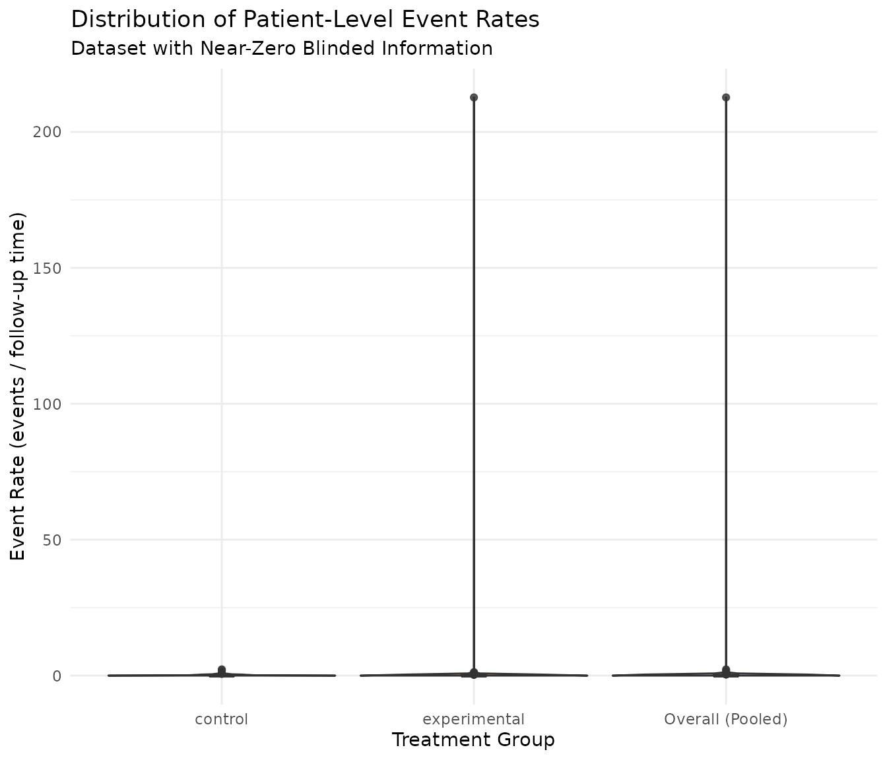

# Diagnosing Blinded Information Calculation Issues

## Overview

This vignette examines two problematic datasets where the blinded
information calculation produced extreme values. Understanding these
edge cases helps inform potential improvements to the
[`calculate_blinded_info()`](https://keaven.github.io/gsDesignNB/reference/calculate_blinded_info.md)
function.

We examine two scenarios:

1.  **Near-zero blinded information**: Cases where `blinded_info` is
    essentially 0 despite reasonable `unblinded_info`
2.  **Extreme high blinded information**: Cases where `blinded_info` is
    astronomically large (10^38)

Both scenarios arise from instability in the negative binomial model
fitting on blinded (pooled) data.

``` r
library(gsDesignNB)
library(data.table)
library(ggplot2)
library(MASS)
```

## Dataset 1: Near-Zero Blinded Information

This dataset was identified from simulations where `blinded_info = 0.02`
while `unblinded_info = 48.6` — a ratio of 0.0004.

``` r
# Load the problematic dataset
# Try package location first, fall back to relative path for development
data_path <- system.file("extdata", "problematic_dataset.rds", package = "gsDesignNB")
if (data_path == "") {
  # During development, find the package root
  data_path <- file.path("..", "inst", "extdata", "problematic_dataset.rds")
}
cut_data <- readRDS(data_path)
dt <- as.data.table(cut_data)
```

### Event Counts Summary

``` r
# Overall summary
cat("Total subjects:", nrow(dt), "\n")
#> Total subjects: 360
cat("Total events:", sum(dt$events), "\n")
#> Total events: 209
cat("Mean events per subject:", round(mean(dt$events), 3), "\n")
#> Mean events per subject: 0.581
cat("Variance of events:", round(var(dt$events), 3), "\n")
#> Variance of events: 0.79
cat("Variance/Mean ratio:", round(var(dt$events) / mean(dt$events), 3), "\n")
#> Variance/Mean ratio: 1.361

# By treatment
dt[, .(
  n = .N,
  total_events = sum(events),
  mean_events = round(mean(events), 3),
  var_events = round(var(events), 3),
  pct_zero_events = round(100 * mean(events == 0), 1)
), by = treatment]
#>       treatment     n total_events mean_events var_events pct_zero_events
#>          <char> <int>        <int>       <num>      <num>           <num>
#> 1:      control   180          132       0.733      0.979            55.6
#> 2: experimental   180           77       0.428      0.559            68.3
```

### Event Distribution

``` r
# Event count distribution
event_dist <- dt[, .(count = .N), by = .(treatment, events)]
event_dist[order(treatment, events)]
#>        treatment events count
#>           <char>  <int> <int>
#>  1:      control      0   100
#>  2:      control      1    45
#>  3:      control      2    19
#>  4:      control      3    15
#>  5:      control      4     1
#>  6: experimental      0   123
#>  7: experimental      1    44
#>  8: experimental      2     7
#>  9: experimental      3     5
#> 10: experimental      4     1
```

A key observation is the high proportion of subjects with zero events,
particularly in the experimental arm.

### Event Rates by Patient

We calculate the event rate as events divided by follow-up duration
(`tte`).

``` r
dt[, event_rate := events / tte]

# Summary of event rates
dt[, .(
  n = .N,
  mean_rate = round(mean(event_rate), 4),
  median_rate = round(median(event_rate), 4),
  sd_rate = round(sd(event_rate), 4),
  pct_zero_rate = round(100 * mean(event_rate == 0), 1)
), by = treatment]
#>       treatment     n mean_rate median_rate sd_rate pct_zero_rate
#>          <char> <int>     <num>       <num>   <num>         <num>
#> 1:      control   180    0.1624           0  0.2847          55.6
#> 2: experimental   180    1.2725           0 15.8474          68.3
```

### Violin Plot of Event Rates

``` r
# Add overall group for comparison
dt_plot <- rbind(
  dt[, .(treatment = treatment, event_rate = event_rate)],
  dt[, .(treatment = "Overall (Pooled)", event_rate = event_rate)]
)

ggplot(dt_plot, aes(x = treatment, y = event_rate, fill = treatment)) +
  geom_violin(alpha = 0.7, scale = "width") +
  geom_boxplot(width = 0.1, fill = "white", alpha = 0.8) +
  labs(
    title = "Distribution of Patient-Level Event Rates",
    subtitle = "Dataset with Near-Zero Blinded Information",
    x = "Treatment Group",
    y = "Event Rate (events / follow-up time)"
  ) +
  theme_minimal() +
  theme(legend.position = "none") +
  scale_fill_brewer(palette = "Set2")
```



The violin plot shows that many subjects have zero event rates, creating
a spike at zero. The control arm has higher event rates than the
experimental arm, as expected given the simulation parameters.

### What Happened with the Information Calculations

``` r
# Blinded information calculation
blinded_res <- calculate_blinded_info(
  cut_data,
  ratio = 1,
  lambda1_planning = 1.5/12,
  lambda2_planning = 1.0/12
)

cat("Blinded Information Results:\n")
#> Blinded Information Results:
cat("  blinded_info:", blinded_res$blinded_info, "\n")
#>   blinded_info: 0.0201878
cat("  dispersion_blinded:", blinded_res$dispersion_blinded, "\n")
#>   dispersion_blinded: 4454.477
cat("  lambda_blinded:", blinded_res$lambda_blinded, "\n")
#>   lambda_blinded: 0.6791599

# Unblinded calculation via mutze_test
mutze_res <- mutze_test(cut_data)

cat("\nUnblinded (Mutze Test) Results:\n")
#> 
#> Unblinded (Mutze Test) Results:
cat("  method:", mutze_res$method, "\n")
#>   method: Poisson Wald (fallback)
cat("  SE:", round(mutze_res$se, 4), "\n")
#>   SE: 0.1434
cat("  unblinded_info (1/SE^2):", round(1/mutze_res$se^2, 2), "\n")
#>   unblinded_info (1/SE^2): 48.63
cat("  dispersion:", mutze_res$dispersion, "\n")
#>   dispersion: Inf
```

#### Root Cause Analysis

The issue stems from the blinded `glm.nb` fit:

``` r
df <- as.data.frame(cut_data)
df <- df[df$tte > 0, ]

# Blinded fit (no treatment effect)
fit_blinded <- suppressWarnings(MASS::glm.nb(events ~ 1 + offset(log(tte)), data = df))

cat("Blinded glm.nb fit:\n")
#> Blinded glm.nb fit:
cat("  theta:", fit_blinded$theta, "\n")
#>   theta: 0.0002244933
cat("  1/theta (dispersion):", 1/fit_blinded$theta, "\n")
#>   1/theta (dispersion): 4454.477

# Unblinded fit (with treatment effect)
fit_unblinded <- suppressWarnings(MASS::glm.nb(events ~ treatment + offset(log(tte)), data = df))

cat("\nUnblinded glm.nb fit:\n")
#> 
#> Unblinded glm.nb fit:
cat("  theta:", fit_unblinded$theta, "\n")
#>   theta: 0.000138869
cat("  1/theta (dispersion):", 1/fit_unblinded$theta, "\n")
#>   1/theta (dispersion): 7201.033
```

**The Problem**: The blinded `glm.nb` fit returns an extremely small
`theta` (≈ 0.0002), which translates to
`dispersion_blinded = 1/theta ≈ 4454`.

The blinded information formula is: \\w_j = p_j \sum_i
\frac{\mu\_{ij}}{1 + k \cdot \mu\_{ij}}\\

where \\k\\ is the dispersion and \\\mu\_{ij} = \lambda_j \cdot t_i\\.

When \\k\\ is very large (4454), the denominator becomes huge: \\1 +
4454 \times 0.5 \approx 2228\\

This makes \\w_j\\ approximately 2000 times smaller than it should be,
causing the information to collapse to near-zero.

## Dataset 2: Extreme High Blinded Information

This dataset was identified from simulation 630 in the group-sequential
simulation, where `blinded_info = 1.84 × 10^38` — an astronomically
large value indicating numerical overflow.

``` r
# Load the extreme high dataset (reproduced from simulation 630)
data_path_2 <- system.file("extdata", "extreme_high_dataset.rds", package = "gsDesignNB")
if (data_path_2 == "") {
  data_path_2 <- file.path("..", "inst", "extdata", "extreme_high_dataset.rds")
}
cut_data_2 <- readRDS(data_path_2)
dt2 <- as.data.table(cut_data_2)
```

### Event Counts Summary

``` r
# Overall summary
cat("Total subjects:", nrow(dt2), "\n")
#> Total subjects: 313
cat("Total events:", sum(dt2$events), "\n")
#> Total events: 116
cat("Mean events per subject:", round(mean(dt2$events), 3), "\n")
#> Mean events per subject: 0.371
cat("Variance of events:", round(var(dt2$events), 3), "\n")
#> Variance of events: 0.458
cat("Variance/Mean ratio:", round(var(dt2$events) / mean(dt2$events), 3), "\n")
#> Variance/Mean ratio: 1.237

# By treatment
dt2[, .(
  n = .N,
  total_events = sum(events),
  mean_events = round(mean(events), 3),
  var_events = round(var(events), 3),
  pct_zero_events = round(100 * mean(events == 0), 1)
), by = treatment]
#>       treatment     n total_events mean_events var_events pct_zero_events
#>          <char> <int>        <int>       <num>      <num>           <num>
#> 1: Experimental   156           42       0.269      0.314            78.2
#> 2:      Control   157           74       0.471      0.584            66.2
```

### What Happened with the Information Calculations

``` r
# Blinded information calculation
blinded_res_2 <- calculate_blinded_info(
  cut_data_2,
  ratio = 1,
  lambda1_planning = 1.5/12,
  lambda2_planning = 1.0/12
)

cat("Blinded Information Results:\n")
#> Blinded Information Results:
cat("  blinded_info:", format(blinded_res_2$blinded_info, scientific = TRUE), "\n")
#>   blinded_info: 1.826963e+38
cat("  dispersion_blinded:", format(blinded_res_2$dispersion_blinded, scientific = TRUE), "\n")
#>   dispersion_blinded: 5.875129e-42
cat("  lambda_blinded:", round(blinded_res_2$lambda_blinded, 4), "\n")
#>   lambda_blinded: 6.078207e+35

# Unblinded calculation via mutze_test
mutze_res_2 <- mutze_test(cut_data_2)

cat("\nUnblinded (Mutze Test) Results:\n")
#> 
#> Unblinded (Mutze Test) Results:
cat("  method:", mutze_res_2$method, "\n")
#>   method: Poisson Wald (fallback)
cat("  SE:", round(mutze_res_2$se, 4), "\n")
#>   SE: 0.1932
cat("  unblinded_info (1/SE^2):", round(1/mutze_res_2$se^2, 2), "\n")
#>   unblinded_info (1/SE^2): 26.79
cat("  dispersion:", mutze_res_2$dispersion, "\n")
#>   dispersion: Inf
```

#### Root Cause Analysis

``` r
df2 <- as.data.frame(cut_data_2)
df2 <- df2[df2$tte > 0, ]

# Blinded fit (no treatment effect)
fit_blinded_2 <- tryCatch(
  suppressWarnings(MASS::glm.nb(events ~ 1 + offset(log(tte)), data = df2)),
  error = function(e) NULL
)

if (!is.null(fit_blinded_2)) {
  cat("Blinded glm.nb fit:\n")
  cat("  theta:", format(fit_blinded_2$theta, scientific = TRUE), "\n")
  cat("  1/theta (dispersion):", format(1/fit_blinded_2$theta, scientific = TRUE), "\n")
} else {
  cat("Blinded glm.nb fit FAILED\n")
}
#> Blinded glm.nb fit:
#>   theta: 1.70209e+41 
#>   1/theta (dispersion): 5.875129e-42

# Unblinded fit (with treatment effect)
fit_unblinded_2 <- tryCatch(
  suppressWarnings(MASS::glm.nb(events ~ treatment + offset(log(tte)), data = df2)),
  error = function(e) NULL
)

if (!is.null(fit_unblinded_2)) {
  cat("\nUnblinded glm.nb fit:\n")
  cat("  theta:", round(fit_unblinded_2$theta, 4), "\n")
  cat("  1/theta (dispersion):", round(1/fit_unblinded_2$theta, 4), "\n")
} else {
  cat("\nUnblinded glm.nb fit FAILED - this explains the Poisson fallback\n")
}
#> 
#> Unblinded glm.nb fit FAILED - this explains the Poisson fallback
```

**The Problem**: The blinded `glm.nb` returns an astronomically large
`theta` (≈ 1.7 × 10^41), which translates to
`dispersion_blinded ≈ 5.9 × 10^-42` — essentially zero.

The information formula depends on: \\w_j = p_j \sum_i
\frac{\mu\_{ij}}{1 + k \cdot \mu\_{ij}}\\

When \\k \to 0\\: \\w_j \approx p_j \sum_i \mu\_{ij}\\

This makes \\w_j\\ very large, and since variance = \\1/w_1 + 1/w_2\\,
the variance approaches zero, causing information = 1/variance to
overflow to infinity.

### Why the Mutze Test Falls Back to Poisson

Note that `mutze_test` reports `dispersion = Inf` and uses the “Poisson
Wald (fallback)” method. This happens because `glm.nb` with the
treatment effect also struggles with this dataset — the theta estimate
becomes unstable, and the function falls back to a simpler Poisson
model.

## Summary of Issues

| Issue         | Blinded Info | Cause                               | Dispersion (blinded) |
|---------------|--------------|-------------------------------------|----------------------|
| Near-zero     | 0.02         | Extremely large dispersion estimate | 4454                 |
| Near-infinite | 1.84×10^38   | Extremely small dispersion estimate | ~0                   |

Both issues arise from instability in `glm.nb` when fitting to pooled
(blinded) data. The pooling can create artificial variance patterns that
don’t represent the true data-generating process.

## Recommendations

1.  **Bound the dispersion estimate**: Cap `dispersion_blinded` to a
    reasonable range (e.g., 0.01 to 100)

2.  **Use assumed dispersion**: Consider using the planned/assumed
    dispersion from the design rather than estimating from blinded data

3.  **Add sanity checks**: Flag cases where blinded info differs from
    unblinded info by more than a factor of 2-3

4.  **Fallback to unblinded**: When blinded estimation produces extreme
    values, fall back to the unblinded information

``` r
sessionInfo()
#> R version 4.5.2 (2025-10-31)
#> Platform: x86_64-pc-linux-gnu
#> Running under: Ubuntu 24.04.3 LTS
#> 
#> Matrix products: default
#> BLAS:   /usr/lib/x86_64-linux-gnu/openblas-pthread/libblas.so.3 
#> LAPACK: /usr/lib/x86_64-linux-gnu/openblas-pthread/libopenblasp-r0.3.26.so;  LAPACK version 3.12.0
#> 
#> locale:
#>  [1] LC_CTYPE=C.UTF-8       LC_NUMERIC=C           LC_TIME=C.UTF-8       
#>  [4] LC_COLLATE=C.UTF-8     LC_MONETARY=C.UTF-8    LC_MESSAGES=C.UTF-8   
#>  [7] LC_PAPER=C.UTF-8       LC_NAME=C              LC_ADDRESS=C          
#> [10] LC_TELEPHONE=C         LC_MEASUREMENT=C.UTF-8 LC_IDENTIFICATION=C   
#> 
#> time zone: UTC
#> tzcode source: system (glibc)
#> 
#> attached base packages:
#> [1] stats     graphics  grDevices utils     datasets  methods   base     
#> 
#> other attached packages:
#> [1] MASS_7.3-65       ggplot2_4.0.1     data.table_1.18.0 gsDesignNB_0.2.5 
#> 
#> loaded via a namespace (and not attached):
#>  [1] gt_1.2.0            sass_0.4.10         future_1.68.0      
#>  [4] generics_0.1.4      tidyr_1.3.2         xml2_1.5.1         
#>  [7] r2rtf_1.3.0         lattice_0.22-7      listenv_0.10.0     
#> [10] digest_0.6.39       magrittr_2.0.4      evaluate_1.0.5     
#> [13] grid_4.5.2          RColorBrewer_1.1-3  iterators_1.0.14   
#> [16] mvtnorm_1.3-3       fastmap_1.2.0       Matrix_1.7-4       
#> [19] foreach_1.5.2       simtrial_1.0.2      jsonlite_2.0.0     
#> [22] survival_3.8-3      purrr_1.2.1         scales_1.4.0       
#> [25] codetools_0.2-20    textshaping_1.0.4   jquerylib_0.1.4    
#> [28] cli_3.6.5           rlang_1.1.7         parallelly_1.46.1  
#> [31] future.apply_1.20.1 splines_4.5.2       withr_3.0.2        
#> [34] cachem_1.1.0        yaml_2.3.12         gsDesign_3.8.0     
#> [37] tools_4.5.2         parallel_4.5.2      doFuture_1.1.3     
#> [40] dplyr_1.1.4         globals_0.18.0      vctrs_0.6.5        
#> [43] R6_2.6.1            lifecycle_1.0.5     fs_1.6.6           
#> [46] htmlwidgets_1.6.4   ragg_1.5.0          pkgconfig_2.0.3    
#> [49] desc_1.4.3          pkgdown_2.2.0       pillar_1.11.1      
#> [52] bslib_0.9.0         gtable_0.3.6        glue_1.8.0         
#> [55] Rcpp_1.1.1          systemfonts_1.3.1   xfun_0.55          
#> [58] tibble_3.3.1        tidyselect_1.2.1    knitr_1.51         
#> [61] farver_2.1.2        xtable_1.8-4        htmltools_0.5.9    
#> [64] labeling_0.4.3      rmarkdown_2.30      compiler_4.5.2     
#> [67] S7_0.2.1
```
