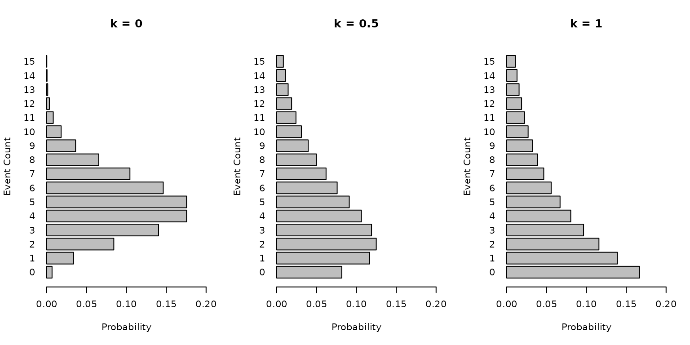
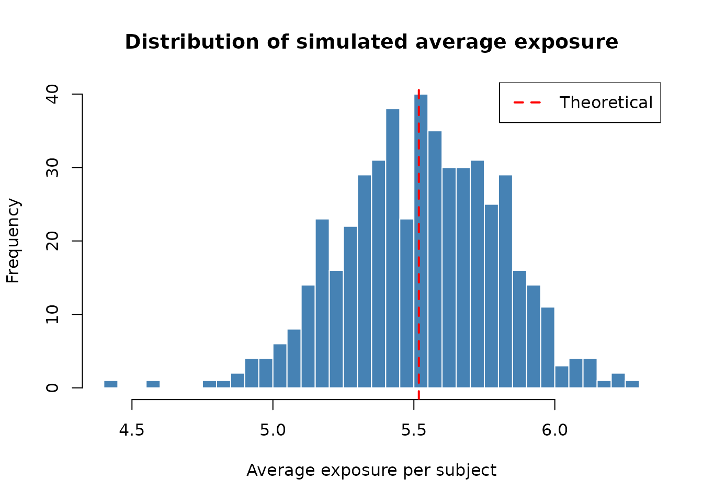

# Sample size calculation for negative binomial outcomes

``` r
library(gsDesignNB)
```

This vignette describes the methodology used in the
[`sample_size_nbinom()`](https://keaven.github.io/gsDesignNB/reference/sample_size_nbinom.md)
function for calculating sample sizes when comparing two treatment
groups with negative binomial outcomes. We present the notation, compare
the underlying methods from the literature, derive the average exposure
calculations, discuss statistical information, and provide simulation
verification.

## Notation

We use the following notation throughout this vignette and the package
documentation.

| Symbol                                            | Description                                                                                                    |
|:--------------------------------------------------|:---------------------------------------------------------------------------------------------------------------|
| \lambda_g                                         | Event rate (events per unit time) for group g (g = 1 for control, g = 2 for treatment)                         |
| k (or k_g)                                        | Dispersion parameter such that \mathrm{Var}(Y) = \mu + k \mu^2; equivalent to 1/\texttt{size} in R’s `rnbinom` |
| t_i                                               | Exposure (follow-up) time for subject i                                                                        |
| \bar{t}\_g                                        | Average exposure time for group g: \bar{t}\_g = \mathrm{E}\[t_i \mid \text{group } g\]                         |
| \mu\_{g} = \lambda_g \bar{t}\_g                   | Expected event count per subject in group g                                                                    |
| \theta = \log(\lambda_2 / \lambda_1)              | Log rate ratio (treatment effect)                                                                              |
| \theta_0 = \log(\text{rr}\_0)                     | Log rate ratio under the null hypothesis                                                                       |
| p_g = n_g / n\_{\text{total}}                     | Allocation proportion for group g                                                                              |
| r = n_2 / n_1                                     | Allocation ratio                                                                                               |
| Q_g = \mathrm{E}\[t^2_g\] / (\mathrm{E}\[t_g\])^2 | Variance inflation factor for variable follow-up in group g                                                    |
| \mathcal{I}                                       | Statistical information: \mathcal{I} = 1 / \mathrm{Var}(\hat\theta)                                            |
| z\_\alpha, z\_\beta                               | Standard normal quantiles at levels \alpha and \beta                                                           |

## Methodology

We wish to test for differences in rates of recurrent events between two
treatment groups using a negative binomial model to account for
overdispersion. The underlying test evaluates the log rate ratio \theta
= \log(\lambda_2 / \lambda_1) between the two groups. The usual null
hypothesis is H_0\\: \theta \ge \theta_0 with \theta_0 = 0 (i.e., equal
rates) and a one-sided alternative H_1\\: \theta \< 0 (treatment reduces
the event rate). Non-inferiority or super-superiority tests can also be
performed by specifying \theta_0 \ne 0.

### Negative binomial distribution

We assume the outcome Y for a subject with exposure time t follows a
negative binomial distribution with mean \mu = \lambda t and dispersion
parameter k, such that the variance is:

\mathrm{Var}(Y) = \mu + k \mu^2

Note that in R’s `rnbinom` parameterization, k = 1/\texttt{size}. When k
= 0, the negative binomial reduces to the Poisson distribution.

### Gamma-Poisson mixture motivation

The negative binomial distribution arises naturally as a Gamma-Poisson
mixture. For each subject i, suppose the subject-specific event rate
\Lambda_i follows a Gamma distribution: \Lambda_i \sim
\text{Gamma}\\\left(\text{shape} = \frac{1}{k},\\ \text{rate} =
\frac{1}{k\lambda}\right) so that \mathrm{E}\[\Lambda_i\] = \lambda and
\mathrm{Var}(\Lambda_i) = k\lambda^2.

Given \Lambda_i, the event count over exposure time t_i is Poisson: Y_i
\mid \Lambda_i \sim \text{Poisson}(\Lambda_i\\ t_i)

Marginalizing over \Lambda_i, the unconditional distribution of Y_i is
negative binomial with: \mathrm{Var}(Y_i) = \mathrm{E}\[\Lambda_i
t_i\] + \mathrm{Var}(\Lambda_i t_i) = \lambda t_i + k\lambda^2 t_i^2 =
\mu_i + k\mu_i^2

This connects the event rate \lambda (hypothesis testing framework) with
the expected count \mu (negative binomial parameterization).

### Graphical illustration

The following panel illustrates the distribution of event counts with
mean \mu = 5 for dispersion parameters k \in \\0, 0.5, 1\\. As k
increases, the variance increases and the distribution becomes more
spread out.

``` r
par(mfrow = c(1, 3))
k_values <- c(0, 0.5, 1)
for (k in k_values) {
  mu <- 5
  x <- 0:15
  if (k == 0) {
    probs <- dpois(x, lambda = mu)
  } else {
    size <- 1 / k
    probs <- dnbinom(x, size = size, mu = mu)
  }
  barplot(probs,
    names.arg = x, horiz = TRUE, main = paste("k =", k),
    xlab = "Probability", ylab = "Event Count", las = 1, xlim = c(0, 0.2)
  )
}
```



### Sample size formula

The sample size formula is based on the asymptotic normality of the
maximum likelihood estimator of the log rate ratio \hat\theta, using a
Wald test. The required sample size for group 1 is:

n_1 = \frac{(z\_{\alpha/s} + z\_{\beta})^2 \cdot \tilde{V}}{(\theta -
\theta_0)^2}

where n_2 = r \cdot n_1, n\_{\text{total}} = n_1 + n_2, and \tilde{V} is
the per-subject variance factor:

\tilde{V} = \left(\frac{1}{\mu_1} + k_1\right) +
\frac{1}{r}\left(\frac{1}{\mu_2} + k_2\right)

Here \mu_g = \lambda_g \bar{t}\_g is the expected event count per
subject in group g, and k_g is the (possibly inflated) dispersion
parameter for group g.

In the simplest case where both groups share a common dispersion k and a
common average exposure \bar{t}, with equal allocation (r = 1, p_1 = p_2
= 1/2), this simplifies to:

n\_{\text{total}} = \frac{(z\_{\alpha/s} + z\_{\beta})^2
\left\[\left(\frac{1}{\mu_1} + k\right) + \left(\frac{1}{\mu_2} +
k\right)\right\]}{(\theta - \theta_0)^2}

### Relationship between Zhu-Lakkis, Friede-Schmidli, and Mutze et al.

The sample size formula implemented in
[`sample_size_nbinom()`](https://keaven.github.io/gsDesignNB/reference/sample_size_nbinom.md)
corresponds to **Method 3** of Zhu and Lakkis (2014), which is the Wald
test for the log rate ratio under a negative binomial model with a log
link and an exposure offset. This same test statistic and variance
formula are used by Friede and Schmidli (2010) in the context of blinded
sample size reestimation and by Mütze et al. (2019) for group sequential
designs.

**What the three references share:**

All three references use the same underlying asymptotic result for the
variance of the MLE of the log rate ratio. For a single subject i in
group g with exposure t_i and expected count \mu_i = \lambda_g t_i, the
Fisher information contribution is:

\mathcal{I}\_i = \frac{\mu_i}{1 + k\\\mu_i}

The total information for the log rate ratio is:

\mathcal{I} = \frac{1}{1/W_1 + 1/W_2}, \quad W_g = \sum\_{i \in
\text{group } g} \frac{\mu_i}{1 + k\\\mu_i}

When all subjects in a group have the same exposure \bar{t}, this
simplifies to W_g = n_g \cdot \mu_g / (1 + k\\\mu_g), giving the
familiar formula above.

**How the references differ:**

| Aspect               | Zhu and Lakkis (2014)                           | Friede and Schmidli (2010)                                            | Mütze et al. (2019)                                   |
|:---------------------|:------------------------------------------------|:----------------------------------------------------------------------|:------------------------------------------------------|
| **Focus**            | Fixed sample size calculation                   | Blinded sample size reestimation                                      | Group sequential designs                              |
| **Methods compared** | Five different test statistics (Methods 1–5)    | One method (equivalent to Zhu Method 3)                               | One method (same Wald test)                           |
| **Dispersion**       | Common k across groups                          | Common k; estimated from blinded data                                 | Common k                                              |
| **Exposure**         | Fixed \bar{t} for all subjects                  | Fixed \bar{t}                                                         | Fixed \bar{t}                                         |
| **Key contribution** | Systematic comparison of NB sample size methods | Blinded estimation of nuisance parameters (k, \lambda) during a trial | Extension to interim analyses with spending functions |

The
[`sample_size_nbinom()`](https://keaven.github.io/gsDesignNB/reference/sample_size_nbinom.md)
function extends these methods by allowing:

- **Group-specific dispersion** (k_1 \ne k_2),
- **Variable exposure** across subjects (piecewise accrual, dropout, max
  follow-up),
- **Variance inflation** (Q factor) to account for non-constant
  exposure, following the approach in Zhu and Lakkis (2014), and
- **Event gaps** that reduce effective exposure.

### Non-inferiority and super-superiority

The parameter `rr0` (\theta_0) allows for testing non-inferiority or
super-superiority hypotheses. The null hypothesis is H_0\\: \lambda_2 /
\lambda_1 \ge \text{rr}\_0 (assuming lower rates are better).

- **Superiority (default):** \text{rr}\_0 = 1 (\theta_0 = 0). We test if
  the treatment rate is lower than the control rate.
- **Non-inferiority:** \text{rr}\_0 \> 1 (e.g., 1.1). We test if the
  treatment rate is not worse than the control rate by more than a
  specified margin.
- **Super-superiority:** \text{rr}\_0 \< 1 (e.g., 0.8). We test if the
  treatment rate is better than the control rate by at least a specified
  margin.

## Average exposure

In practice, subjects have variable follow-up times due to staggered
enrollment, administrative censoring at the end of the study, dropout,
and maximum follow-up caps. The sample size formula requires the
*expected* exposure \bar{t}\_g = \mathrm{E}\[t_i \mid \text{group } g\]
for each group. This section derives the average exposure computation
implemented in
[`sample_size_nbinom()`](https://keaven.github.io/gsDesignNB/reference/sample_size_nbinom.md).

### Setup

Let T denote the total trial duration. Suppose recruitment occurs in J
segments, where segment j has accrual rate R_j and duration D_j. The
start time of segment j is S_j = \sum\_{i=1}^{j-1} D_i (with S_0 = 0).
The expected number of patients in segment j is N_j = R_j D_j.

A patient enrolled at calendar time s has a *potential* follow-up time
of u = T - s before administrative censoring. For patients in segment j,
the potential follow-up ranges from u\_{\min} = T - (S_j + D_j) to
u\_{\max} = T - S_j.

### Calendar exposure without dropout

When there is no dropout (\delta = 0), a patient enrolled at time s is
followed for exactly u = T - s time units (or until `max_followup`,
whichever comes first). Under uniform enrollment within each segment,
the average follow-up for segment j is:

E_j = \frac{u\_{\min} + u\_{\max}}{2} = T - S_j - \frac{D_j}{2}

This is simply the midpoint of the follow-up range for that segment.

### Calendar exposure with dropout

When the dropout rate \delta \> 0 (modeled as an exponential hazard),
the expected exposure for a patient with potential follow-up u is:

m(u) = \mathrm{E}\[\min(u, \text{dropout time})\] = \frac{1 - e^{-\delta
u}}{\delta}

The average exposure for segment j is obtained by averaging m(u) over
the uniform distribution of enrollment times within the segment. This
yields:

\bar{t}\_j = \frac{1}{D_j}\int\_{u\_{\min}}^{u\_{\max}} m(u)\\ du =
\frac{1}{\delta} - \frac{e^{-\delta u\_{\min}} - e^{-\delta
u\_{\max}}}{\delta^2 D_j}

Note that as \delta \to 0, this reduces to (u\_{\min} + u\_{\max})/2,
consistent with the no-dropout case.

### Maximum follow-up

If `max_followup` (F) is specified, the follow-up time is capped at F
for each patient. The expected exposure for a patient with potential
follow-up u becomes:

m^\*(u) = \mathrm{E}\[\min(u, F, \text{dropout time})\]

For segment j, three cases arise:

1.  **No truncation** (u\_{\max} \le F): All patients have potential
    follow-up \le F. The calculation is as above.
2.  **Full truncation** (u\_{\min} \ge F): All patients have potential
    follow-up \ge F, so each patient’s exposure is \min(F, \text{dropout
    time}), giving m^\*(F) = (1 - e^{-\delta F})/\delta (or simply F
    when \delta = 0).
3.  **Partial truncation** (u\_{\min} \< F \< u\_{\max}): Patients
    enrolled earlier (with u \ge F) are capped, while later enrollees
    are not. The average is a weighted combination:

\bar{t}\_j = \frac{(u\_{\max} - F)\\ m^\*(F) + \int\_{u\_{\min}}^{F}
m(u)\\ du}{D_j}

### Weighted average across segments

The overall average exposure for group g is:

\bar{t}\_g = \frac{\sum\_{j=1}^{J} N_j\\ \bar{t}\_{j,g}}{\sum\_{j=1}^{J}
N_j}

When dropout rates are the same for both groups, \bar{t}\_1 =
\bar{t}\_2. When they differ, each group has its own average exposure.

### Group-specific parameters

The function supports specifying `dropout_rate` and `max_followup` as
vectors of length 2, corresponding to the control and treatment groups
respectively. When these differ, the average exposure \bar{t}\_g, the
second moment \mathrm{E}\[t_g^2\], and the variance inflation factor Q_g
are all computed separately for each group.

### Variance inflation for variable follow-up (Q factor)

When follow-up times vary across subjects, using \bar{t} alone in the
variance formula underestimates the true variance. This is because the
negative binomial variance depends *non-linearly* on exposure through
the k\mu^2 = k\lambda^2 t^2 term.

Zhu and Lakkis (2014) derive a correction factor:

Q_g = \frac{\mathrm{E}\[t_g^2\]}{(\mathrm{E}\[t_g\])^2} \ge 1

by Jensen’s inequality. The effective dispersion used in the sample size
formula is k\_{g,\text{adj}} = k_g \cdot Q_g.

When exposure is constant (t_i = \bar{t} for all i), Q = 1 and no
adjustment is needed. Variable follow-up inflates Q above 1, increasing
the required sample size.

**Computing \mathrm{E}\[t^2\]:** The second moment is computed
analogously to \mathrm{E}\[t\] by integrating m_2(u) =
\mathrm{E}\[\min(u, \text{dropout time})^2\] over the enrollment
distribution. Without dropout, m_2(u) = u^2. With dropout rate \delta:

m_2(u) = \frac{2}{\delta^2}\left(1 - e^{-\delta u}(1 + \delta u)\right)

The average of m_2(u) across enrollment segments (with appropriate
handling of `max_followup` truncation) gives \mathrm{E}\[t^2_g\].

### Event gaps

In some recurrent event trials, there is a mandatory “dead time” or gap
of duration g after each event, during which no new events can occur
(e.g., a recovery period). This reduces the effective time at risk.

**Naive approximation.** For a *single subject* with fixed event rate
\lambda and gap g, the long-run effective rate from renewal theory is:

\lambda\_{\text{naive}} = \frac{\lambda}{1 + \lambda g}

**Jensen’s inequality correction.** In the negative binomial model,
subjects do not share the same rate. Each subject’s rate \Lambda_i is
drawn from a Gamma distribution with mean \lambda and variance
k\lambda^2 (the Gamma-Poisson mixture). The population-level effective
rate is \mathrm{E}\[\Lambda_i / (1 + \Lambda_i g)\], which by Jensen’s
inequality is strictly less than \lambda / (1 + \lambda g) because f(x)
= x/(1+xg) is concave.

The naive formula overestimates the effective rate (and thus the
expected event count), leading to underestimated variance and slightly
underpowered designs. The bias scales with both the dispersion k and the
gap g.

To correct for this,
[`sample_size_nbinom()`](https://keaven.github.io/gsDesignNB/reference/sample_size_nbinom.md)
applies a second-order Taylor expansion of f(\Lambda) around
\mathrm{E}\[\Lambda\] = \lambda:

\mathrm{E}\\\left\[\frac{\Lambda}{1+\Lambda g}\right\] \approx
\frac{\lambda}{1+\lambda g} +
\frac{f''(\lambda)}{2}\\\mathrm{Var}(\Lambda) = \frac{\lambda}{1+\lambda
g} \left(1 - \frac{k\lambda g}{(1+\lambda g)^2}\right)

where f''(\lambda) = -2g/(1+\lambda g)^3 and \mathrm{Var}(\Lambda) =
k\lambda^2. This corrected effective rate is used in the sample size
formula:

\mu_g = \lambda\_{g,\text{eff}} \cdot \bar{t}\_g

The function also reports the *at-risk exposure*, which is the calendar
exposure reduced by the expected gap time:

\bar{t}\_{g,\text{risk}} = \frac{\bar{t}\_g}{1 + \lambda_g \cdot g}

Since the gap correction depends on \lambda_g, the at-risk exposure
differs between groups even when the calendar exposure is the same.

**Magnitude of the correction.** The following table illustrates the
correction factor 1 - k\lambda g / (1+\lambda g)^2 for selected
parameter combinations. The correction is negligible when k or g is
small, but can reach 5–10% for high-dispersion, high-rate, large-gap
scenarios.

``` r
# Show correction magnitude for various parameter combos
params <- expand.grid(
  lambda = c(0.3, 0.5, 1.0, 2.0),
  k = c(0.1, 0.3, 0.5, 1.0),
  gap = c(0.25, 0.5, 1.0)
)
params$naive_eff <- params$lambda / (1 + params$lambda * params$gap)
params$correction <- 1 - params$k * params$lambda * params$gap /
  (1 + params$lambda * params$gap)^2
params$corrected_eff <- params$naive_eff * params$correction
params$pct_reduction <- round(100 * (1 - params$correction), 2)

# Show a subset
subset_df <- params[params$pct_reduction > 0.5, ]
subset_df <- subset_df[order(-subset_df$pct_reduction), ]
knitr::kable(
  head(subset_df[, c("lambda", "k", "gap", "naive_eff", "corrected_eff", "pct_reduction")], 12),
  digits = 4, row.names = FALSE,
  col.names = c("lambda", "k", "gap", "Naive eff. rate", "Corrected eff. rate", "Reduction (%)")
)
```

| lambda |   k |  gap | Naive eff. rate | Corrected eff. rate | Reduction (%) |
|-------:|----:|-----:|----------------:|--------------------:|--------------:|
|    2.0 | 1.0 | 0.50 |          1.0000 |              0.7500 |         25.00 |
|    1.0 | 1.0 | 1.00 |          0.5000 |              0.3750 |         25.00 |
|    2.0 | 1.0 | 0.25 |          1.3333 |              1.0370 |         22.22 |
|    1.0 | 1.0 | 0.50 |          0.6667 |              0.5185 |         22.22 |
|    0.5 | 1.0 | 1.00 |          0.3333 |              0.2593 |         22.22 |
|    2.0 | 1.0 | 1.00 |          0.6667 |              0.5185 |         22.22 |
|    0.3 | 1.0 | 1.00 |          0.2308 |              0.1898 |         17.75 |
|    1.0 | 1.0 | 0.25 |          0.8000 |              0.6720 |         16.00 |
|    0.5 | 1.0 | 0.50 |          0.4000 |              0.3360 |         16.00 |
|    2.0 | 0.5 | 0.50 |          1.0000 |              0.8750 |         12.50 |
|    1.0 | 0.5 | 1.00 |          0.5000 |              0.4375 |         12.50 |
|    0.3 | 1.0 | 0.50 |          0.2609 |              0.2313 |         11.34 |

### Simulation verification of average exposure

We verify the average exposure computation by simulating trials with
known parameters and comparing the simulated average exposure to the
theoretical prediction.

``` r
set.seed(42)

# Design parameters
lambda1 <- 0.5
lambda2 <- 0.3
dispersion <- 0.3
dropout_rate_val <- 0.05
max_followup_val <- 8
trial_duration <- 12

# Piecewise accrual: 5/month for 4 months, then 15/month for 4 months
accrual_rate_vec <- c(5, 15)
accrual_duration_vec <- c(4, 4)

# Theoretical calculation
design <- sample_size_nbinom(
  lambda1 = lambda1, lambda2 = lambda2, dispersion = dispersion,
  power = 0.8,
  accrual_rate = accrual_rate_vec,
  accrual_duration = accrual_duration_vec,
  trial_duration = trial_duration,
  dropout_rate = dropout_rate_val,
  max_followup = max_followup_val
)

theo_exposure <- design$exposure[1] # Same for both groups (same dropout)

# Simulate many trials and compute average exposure
enroll_rate <- data.frame(rate = design$accrual_rate, duration = accrual_duration_vec)
fail_rate <- data.frame(
  treatment = c("Control", "Experimental"),
  rate = c(lambda1, lambda2),
  dispersion = dispersion
)
dropout <- data.frame(
  treatment = c("Control", "Experimental"),
  rate = rep(dropout_rate_val, 2),
  duration = rep(100, 2)
)

n_sims <- 500
sim_exposures <- numeric(n_sims)

for (i in seq_len(n_sims)) {
  sim_data <- nb_sim(
    enroll_rate = enroll_rate,
    fail_rate = fail_rate,
    dropout_rate = dropout,
    max_followup = max_followup_val,
    n = design$n_total
  )
  cut <- cut_data_by_date(sim_data, cut_date = trial_duration)
  sim_exposures[i] <- mean(cut$tte_total)
}

cat("Theoretical average exposure:", round(theo_exposure, 4), "\n")
#> Theoretical average exposure: 5.5176
cat("Simulated average exposure (mean over", n_sims, "trials):", round(mean(sim_exposures), 4), "\n")
#> Simulated average exposure (mean over 500 trials): 5.526
cat("Simulation SE:", round(sd(sim_exposures) / sqrt(n_sims), 4), "\n")
#> Simulation SE: 0.0123
cat("Relative difference:", round(100 * (mean(sim_exposures) - theo_exposure) / theo_exposure, 2), "%\n")
#> Relative difference: 0.15 %

# Histogram of simulated average exposures
hist(sim_exposures,
  breaks = 30, col = "steelblue", border = "white",
  main = "Distribution of simulated average exposure",
  xlab = "Average exposure per subject"
)
abline(v = theo_exposure, col = "red", lwd = 2, lty = 2)
legend("topright", legend = c("Theoretical"), col = "red", lty = 2, lwd = 2)
```



The theoretical prediction from
[`sample_size_nbinom()`](https://keaven.github.io/gsDesignNB/reference/sample_size_nbinom.md)
closely matches the simulation average, confirming the correctness of
the average exposure computation under piecewise accrual, dropout, and
maximum follow-up truncation.

## Statistical information

The *statistical information* \mathcal{I} for the log rate ratio \theta
is the inverse of the variance of the MLE \hat\theta. It plays a central
role in sample size calculation, group sequential design, and
information monitoring during a trial.

### Per-subject Fisher information

For a single subject i in group g with exposure t_i and expected count
\mu_i = \lambda_g t_i, the contribution to the Fisher information is
(from the negative binomial log-likelihood with log link):

\mathcal{I}\_i = \frac{\mu_i}{1 + k\\\mu_i}

This formula has intuitive limits:

- When k = 0 (Poisson): \mathcal{I}\_i = \mu_i = \lambda t_i
  (information is proportional to expected events).
- When k\mu_i \gg 1 (large overdispersion): \mathcal{I}\_i \approx 1/k
  (information saturates regardless of exposure).

### Total information

The total statistical information for the log rate ratio is:

\mathcal{I} = \frac{1}{\mathrm{Var}(\hat\theta)} = \frac{1}{1/W_1 +
1/W_2}

where W_g = \sum\_{i \in \text{group } g} \mathcal{I}\_i is the total
information contributed by group g.

When all subjects in a group have the same average exposure \bar{t}\_g:

W_g = n_g \cdot \frac{\mu_g}{1 + k_g \mu_g} = \frac{n_g}{1/\mu_g + k_g}

and thus:

\mathrm{Var}(\hat\theta) = \frac{1/\mu_1 + k_1}{n_1} + \frac{1/\mu_2 +
k_2}{n_2}

This is exactly the variance used in the sample size formula.

### Information in practice: blinded and unblinded estimation

During a clinical trial, the statistical information can be estimated at
interim analyses for information monitoring. The package provides four
variants:

| Method        | Blinding  | Estimation                                                                          | Function                                                                                              |
|:--------------|:----------|:------------------------------------------------------------------------------------|:------------------------------------------------------------------------------------------------------|
| Blinded ML    | Blinded   | Maximum likelihood via [`MASS::glm.nb()`](https://rdrr.io/pkg/MASS/man/glm.nb.html) | [`calculate_blinded_info()`](https://keaven.github.io/gsDesignNB/reference/calculate_blinded_info.md) |
| Unblinded ML  | Unblinded | Maximum likelihood via [`MASS::glm.nb()`](https://rdrr.io/pkg/MASS/man/glm.nb.html) | [`mutze_test()`](https://keaven.github.io/gsDesignNB/reference/mutze_test.md) (SE gives info)         |
| Blinded MoM   | Blinded   | Method of moments                                                                   | [`estimate_nb_mom()`](https://keaven.github.io/gsDesignNB/reference/estimate_nb_mom.md)               |
| Unblinded MoM | Unblinded | Method of moments                                                                   | `estimate_nb_mom(group = "treatment")`                                                                |

**Blinded estimation** (Friede and Schmidli 2010) fits a single model to
pooled data (ignoring treatment assignment) and then “splits” the
estimated overall rate \hat\lambda into group-specific rates using the
*planned* rate ratio: \hat\lambda_1 = \hat\lambda / (p_1 + p_2 \cdot
\text{RR}\_{\text{plan}}) and \hat\lambda_2 = \hat\lambda_1 \cdot
\text{RR}\_{\text{plan}}. This preserves the blind while allowing
nuisance parameter (k) re-estimation.

**Unblinded estimation** fits a model with a treatment covariate,
directly estimating the log rate ratio and its standard error. The
information is \mathcal{I} = 1/\text{SE}^2.

### Connection to sample size

The sample size formula can be expressed in terms of information. The
target information for a fixed design is:

\mathcal{I}\_{\text{target}} = \frac{(z\_{\alpha/s} +
z\_\beta)^2}{(\theta - \theta_0)^2}

The sample size is then the smallest n\_{\text{total}} such that the
expected information at the end of the trial exceeds
\mathcal{I}\_{\text{target}}.

## Examples

### Basic calculation (Zhu and Lakkis 2014)

Calculate sample size for:

- Control rate \lambda_1 = 0.5
- Treatment rate \lambda_2 = 0.3
- Dispersion k = 0.1
- Power = 80%
- Alpha = 0.025 (one-sided)
- Accrual over 12 months
- Trial duration 12 months (implying average exposure of 6 months)

``` r
sample_size_nbinom(
  lambda1 = 0.5,
  lambda2 = 0.3,
  dispersion = 0.1,
  power = 0.8,
  alpha = 0.025,
  sided = 1,
  accrual_rate = 10, # arbitrary, just for average exposure
  accrual_duration = 12,
  trial_duration = 12
)
#> Sample size for negative binomial outcome
#> ==========================================
#> 
#> Sample size:     n1 = 35, n2 = 35, total = 70
#> Expected events: 168.0 (n1: 105.0, n2: 63.0)
#> Power: 80%, Alpha: 0.025 (1-sided)
#> Rates: control = 0.5000, treatment = 0.3000 (RR = 0.6000)
#> Dispersion: 0.1000, Avg exposure (calendar): 6.00
#> Accrual: 12.0, Trial duration: 12.0
```

### Piecewise constant accrual

Consider a trial where recruitment ramps up:

- 5 patients/month for the first 3 months
- 10 patients/month for the next 3 months
- Total trial duration is 12 months

The function automatically calculates the average exposure based on this
accrual pattern.

``` r
sample_size_nbinom(
  lambda1 = 0.5,
  lambda2 = 0.3,
  dispersion = 0.1,
  power = 0.8,
  accrual_rate = c(5, 10),
  accrual_duration = c(3, 3),
  trial_duration = 12
)
#> Sample size for negative binomial outcome
#> ==========================================
#> 
#> Sample size:     n1 = 26, n2 = 26, total = 52
#> Expected events: 176.8 (n1: 110.5, n2: 66.3)
#> Power: 80%, Alpha: 0.025 (1-sided)
#> Rates: control = 0.5000, treatment = 0.3000 (RR = 0.6000)
#> Dispersion: 0.1000, Avg exposure (calendar): 8.50
#> Accrual: 6.0, Trial duration: 12.0
```

### Accrual with dropout and max follow-up

Same design as above, but with a 5% dropout rate per unit time and a
maximum follow-up of 6 months.

``` r
sample_size_nbinom(
  lambda1 = 0.5,
  lambda2 = 0.3,
  dispersion = 0.1,
  power = 0.8,
  accrual_rate = c(5, 10),
  accrual_duration = c(3, 3),
  trial_duration = 12,
  dropout_rate = 0.05,
  max_followup = 6
)
#> Sample size for negative binomial outcome
#> ==========================================
#> 
#> Sample size:     n1 = 38, n2 = 38, total = 76
#> Expected events: 157.6 (n1: 98.5, n2: 59.1)
#> Power: 80%, Alpha: 0.025 (1-sided)
#> Rates: control = 0.5000, treatment = 0.3000 (RR = 0.6000)
#> Dispersion: 0.1000, Avg exposure (calendar): 5.18
#> Dropout rate: 0.0500
#> Accrual: 6.0, Trial duration: 12.0
#> Max follow-up: 6.0
```

### Group-specific dropout rates

Suppose the control group has a higher dropout rate (10%) than the
treatment group (5%).

``` r
sample_size_nbinom(
  lambda1 = 0.5,
  lambda2 = 0.3,
  dispersion = 0.1,
  power = 0.8,
  accrual_rate = c(5, 10),
  accrual_duration = c(3, 3),
  trial_duration = 12,
  dropout_rate = c(0.10, 0.05), # Control, Treatment
  max_followup = 6
)
#> Sample size for negative binomial outcome
#> ==========================================
#> 
#> Sample size:     n1 = 40, n2 = 40, total = 80
#> Expected events: 152.4 (n1: 90.2, n2: 62.2)
#> Power: 80%, Alpha: 0.025 (1-sided)
#> Rates: control = 0.5000, treatment = 0.3000 (RR = 0.6000)
#> Dispersion: 0.1000, Avg exposure (calendar): 4.51 (n1), 5.18 (n2)
#> Dropout rate: 0.1000 (n1), 0.0500 (n2)
#> Accrual: 6.0, Trial duration: 12.0
#> Max follow-up: 6.0
```

### Calculating power for fixed design

Using the accrual rates and design from the previous example, suppose we
want to calculate the power if the treatment effect is smaller
(\lambda_2 = 0.4 instead of 0.3). We use the `accrual_rate` computed in
the previous step.

``` r
# Store the result from the previous calculation
design_result <- sample_size_nbinom(
  lambda1 = 0.5,
  lambda2 = 0.3,
  dispersion = 0.1,
  power = 0.8,
  accrual_rate = c(5, 10),
  accrual_duration = c(3, 3),
  trial_duration = 12,
  dropout_rate = 0.05,
  max_followup = 6
)

# Use the computed accrual rates to calculate power for a smaller effect size
sample_size_nbinom(
  lambda1 = 0.5,
  lambda2 = 0.4, # Smaller effect size
  dispersion = 0.1,
  power = NULL, # Request power calculation
  accrual_rate = design_result$accrual_rate, # Use computed rates
  accrual_duration = c(3, 3),
  trial_duration = 12,
  dropout_rate = 0.05,
  max_followup = 6
)
#> Sample size for negative binomial outcome
#> ==========================================
#> 
#> Sample size:     n1 = 38, n2 = 38, total = 76
#> Expected events: 177.3 (n1: 98.5, n2: 78.8)
#> Power: 26%, Alpha: 0.025 (1-sided)
#> Rates: control = 0.5000, treatment = 0.4000 (RR = 0.8000)
#> Dispersion: 0.1000, Avg exposure (calendar): 5.18
#> Dropout rate: 0.0500
#> Accrual: 6.0, Trial duration: 12.0
#> Max follow-up: 6.0
```

### Unequal allocation

Sample size with a 2:1 allocation ratio (n_2 = 2 n_1).

``` r
sample_size_nbinom(
  lambda1 = 0.5,
  lambda2 = 0.3,
  dispersion = 0.1,
  ratio = 2,
  accrual_rate = 10,
  accrual_duration = 12,
  trial_duration = 12
)
#> Sample size for negative binomial outcome
#> ==========================================
#> 
#> Sample size:     n1 = 40, n2 = 80, total = 120
#> Expected events: 264.0 (n1: 120.0, n2: 144.0)
#> Power: 95%, Alpha: 0.025 (1-sided)
#> Rates: control = 0.5000, treatment = 0.3000 (RR = 0.6000)
#> Dispersion: 0.1000, Avg exposure (calendar): 6.00
#> Accrual: 12.0, Trial duration: 12.0
```

### Example with event gap

Calculate sample size assuming a 30-day gap after each event (approx
0.082 years). Note how the at-risk exposure differs between groups
because the group with the higher event rate (\lambda_1 = 2.0) spends
more time in gap periods than the group with the lower rate (\lambda_2 =
1.0).

``` r
sample_size_nbinom(
  lambda1 = 2.0,
  lambda2 = 1.0,
  dispersion = 0.1,
  power = 0.8,
  accrual_rate = 10,
  accrual_duration = 12,
  trial_duration = 12,
  event_gap = 30 / 365.25
)
#> Sample size for negative binomial outcome
#> ==========================================
#> 
#> Sample size:     n1 = 9, n2 = 9, total = 18
#> Expected events: 141.2 (n1: 91.6, n2: 49.6)
#> Power: 80%, Alpha: 0.025 (1-sided)
#> Rates: control = 2.0000, treatment = 1.0000 (RR = 0.5000)
#> Dispersion: 0.1000, Avg exposure (calendar): 6.00
#> Avg exposure (at-risk): n1 = 5.15, n2 = 5.54
#> Event gap: 0.08
#> Accrual: 12.0, Trial duration: 12.0
```

In this example, even though the calendar time is the same for both
groups, the effective at-risk exposure is lower for Group 1 because they
have more events and thus more gap time.

## References

Friede, Tim, and Heinz Schmidli. 2010. “Blinded Sample Size Reestimation
with Negative Binomial Counts in Superiority and Non-Inferiority
Trials.” *Methods of Information in Medicine* 49 (06): 618–24.
<https://doi.org/10.3414/ME09-02-0060>.

Mütze, Tobias, Ekkehard Glimm, Heinz Schmidli, and Tim Friede. 2019.
“Group Sequential Designs for Negative Binomial Outcomes.” *Statistical
Methods in Medical Research* 28 (8): 2326–47.
<https://doi.org/10.1177/0962280218773115>.

Zhu, Haiyuan, and Hassan Lakkis. 2014. “Sample Size Calculation for
Comparing Two Negative Binomial Rates.” *Statistics in Medicine* 33 (3):
376–87. <https://doi.org/10.1002/sim.5947>.
