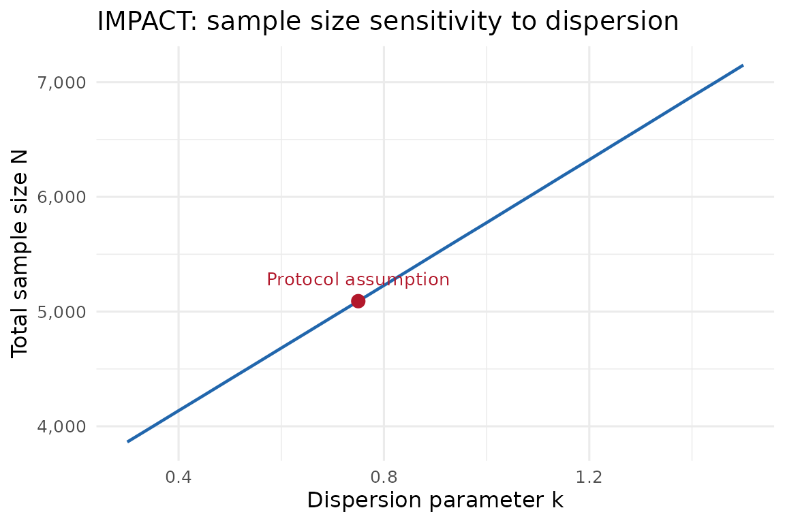

# Published sample-size examples with the gsDesignNB AI skill

``` r

library(gsDesignNB)
```

## Purpose

This vignette demonstrates how the `SKILL.md` file in the **gsDesignNB**
repository helps an AI coding assistant turn natural-language trial
descriptions into transparent
[`sample_size_nbinom()`](https://keaven.github.io/gsDesignNB/reference/sample_size_nbinom.md)
calls. The examples are not meant to replace the original protocols or
statistical review; they show how the skill keeps the translation from
text to code disciplined. The skill teaches the AI to:

1.  **Extract** stated parameters from the text.
2.  **Prompt** for essential information that is missing.
3.  **Apply sensible defaults** for non-essential parameters.
4.  **Handle ambiguities** (dropout meaning, \\k\\ parameterization).
5.  **Compute and report** the sample size with full transparency.

## What is a skill file?

A *skill file* (`SKILL.md`) is a structured document that teaches an AI
assistant domain-specific knowledge — in this case, how to translate a
clinical trial description into a
[`sample_size_nbinom()`](https://keaven.github.io/gsDesignNB/reference/sample_size_nbinom.md)
call. Unlike a general prompt, a skill file encodes parameter extraction
rules, validation checks, unit-conversion logic, and domain heuristics
(e.g., “COPD dispersion is typically 0.5–1.0”) so that the AI can work
reliably without requiring the user to know the package API.

The main **gsDesignNB** skill covers sample size calculation, group
sequential design, blinded SSR, simulation, and interim data cuts. This
vignette focuses on the sample size workflow.

## Using the skill with an AI assistant

In the source repository, the main skill lives at
`.agents/skills/gsdesignnb/SKILL.md`. A companion simulation entrypoint
lives at `.agents/skills/gsdesignnb-simulation-entrypoint/SKILL.md`.

How you provide the skill depends on the assistant. Workspace-aware
coding assistants may discover the file automatically when the
repository is open. For assistants that accept attached files, project
knowledge, or system instructions, attach or paste `SKILL.md`, then
provide the trial description in natural language.

The skill is model-agnostic — it uses structured Markdown with
extraction tables, decision rules, and worked examples that any
instruction-following LLM can interpret.

## Overview of examples

The examples span three disease areas, four published trial protocols,
and two methodology papers — deliberately chosen to exercise different
challenges the skill must handle:

| Example | Disease | Design | Key skill challenge |
|:---|:---|:---|:---|
| FLAME (Wedzicha et al. 2016) | COPD | Non-inferiority | Dropout interpretation (inflation vs exposure integral); inferring follow-up from “annual rate” |
| IMPACT (Lipson et al. 2018) | COPD | 3-arm superiority | Unequal allocation; deriving control rate from stated treatment rate + % reduction; 28-day event gap |
| OPERA I/II (Hauser et al. 2017) | MS | Superiority (paired studies) | Protocol sized by t-test, not NB; dispersion \\k\\ must be assumed |
| Friede & Schmidli (Friede and Schmidli 2010) | COPD | Fixed superiority + NI | Pooled-rate parameterization (\\\lambda\\ overall, not per-arm); \\\phi = k\\ notation |
| Mutze et al. (Mütze et al. 2019) | HF + MS | Group sequential | Inverse dispersion (\\\kappa = 1/k\\); variable follow-up from staggered entry; monthly vs annual units |
| PARADIGM-HF (McMurray et al. 2014) | HF | Event-driven GS | Primary endpoint is not NB; recurrent-event parameters must be sourced externally |

The first example (FLAME) walks through the full skill workflow in
detail. Subsequent examples focus on the extraction and computation
steps, highlighting where each trial poses a new challenge.

## FLAME trial

We replicate the sample size from the FLAME COPD exacerbation protocol
(Wedzicha et al. 2016).

### The user’s input

In a real session, the user might paste a protocol paragraph or
summarize the design as follows:

> Size a non-inferiority COPD exacerbation trial with equal annual rates
> of 3.0, non-inferiority margin 1.15, one-sided alpha 0.025, greater
> than 95% power, dispersion k = 0.625, and 30% dropout or major
> protocol violations. The published target was 3332 randomized
> patients.

The rest of this vignette walks through what the skill instructs the AI
to do with this input.

### Skill Step 1: Extract what is stated

Following the skill’s extraction table, the AI parses the text and
classifies each parameter:

| Parameter | Found? | Extracted value | Notes |
|:---|:--:|:---|:---|
| Control event rate | Yes | 3.0 events/year | “the underlying annual rate is 3.0” |
| Treatment effect | Yes | RR = 1.0 | “no difference between treatment groups” |
| Dispersion | Yes | \\k = 0.625\\ | “index parameter k = 0.625” |
| Power | Yes | \> 95% | “greater than 95% power” |
| Alpha | Yes | 0.025, one-sided | “at the level of 0.025 (one-sided)” |
| Null hypothesis | Yes | Non-inferiority, \\\text{rr}\_0 = 1.15\\ | “rule out a 1.15-fold increase” |
| Follow-up | **Inferred** | 1 year | Implied by “annual rate” but not explicitly stated |
| Dropout | Yes | 30% | “30% dropped out or major protocol violators” |
| Event gap | **Not stated** | — |  |
| Enrollment | **Not stated** | — |  |
| Trial duration | **Not stated** | — |  |

### Skill Step 2: Prompt for essentials

Everything essential is present or inferable. In a real session, the AI
would confirm the follow-up duration:

> *“The protocol states an annual rate but does not explicitly give the
> follow-up duration. I’ll assume 1 year of maximum follow-up. Is that
> correct?”*

If the dispersion value seemed unusual for the disease area, the skill
would also prompt: *“Is k = 0.625 the overdispersion parameter
(\\\text{Var} = \mu + k\mu^2\\) or the Gamma shape parameter
(\\1/k\\)?”* Here 0.625 is consistent with published COPD dispersion
values, so no flag is raised.

### Skill Step 3: Apply defaults for non-essentials

The skill instructs the AI to default these with a note:

- **Event gap:** “No event gap specified; assuming `event_gap = 0`.”
- **Accrual rate and trial duration:** “Accrual pattern does not affect
  the fixed-design N when all patients have the same max follow-up.
  Placeholder values used.”

### Skill Step 4: Handle dropout correctly

The protocol says “30% dropped out or major protocol violators.” The
skill recognises this as a combined dropout-plus-violator figure that
reduces the evaluable sample. Following the skill’s guidance, the AI
uses the inflation-factor approach: compute N assuming full follow-up,
then divide by 0.70.

### Skill Step 5: Confirm time units

All inputs are in **years**, matching the protocol’s “annual rate.”

### Skill Step 6: Compute the sample size

With all parameters extracted and defaults applied, the AI translates
directly to R code:

``` r

# All rates and durations in years
lambda1         <- 3.0                  # control exacerbation rate (events/year)
lambda2         <- 3.0                  # experimental rate (no difference under H1)
dispersion      <- 0.625                # NB dispersion k
rr0             <- 1.15                 # non-inferiority margin
event_gap       <- 0                    # no gap specified in protocol
max_followup    <- 1                    # 1-year follow-up
dropout_retained <- 0.70                # 30% dropout/violator -> inflate by 1/0.70
alpha           <- 0.025
power           <- 0.95

# Arbitrary accrual (does not affect N when all patients get the same max FU)
accrual_rate    <- 100                  # subjects/year (placeholder)
accrual_dur     <- 1                    # 1-year enrollment (placeholder)
trial_duration  <- 2                    # years
```

#### Skill-compatible replication

Because the FLAME wording combines dropout and major protocol
violations, the skill treats the 30% as an inflation factor rather than
as pure time-to-dropout. First compute the evaluable sample size under
full follow-up, then divide by 0.70.

``` r

wald_evaluable <- sample_size_nbinom(
  lambda1          = lambda1,
  lambda2          = lambda2,
  dispersion       = dispersion,
  power            = power,
  alpha            = alpha,
  rr0              = rr0,
  accrual_rate     = accrual_rate,
  accrual_duration = accrual_dur,
  trial_duration   = trial_duration,
  dropout_rate     = 0,
  max_followup     = max_followup,
  event_gap        = event_gap,
  test_type        = "wald"
)

n_inflated <- ceiling(ceiling(wald_evaluable$n_total) / dropout_retained)
```

If the 30% represented true dropout only, an alternative is to model it
through the exposure integral by converting cumulative dropout to an
exponential hazard. That gives partial credit for follow-up before
dropout, so it is smaller than a sample-size inflation.

``` r

wald_exposure <- sample_size_nbinom(
  lambda1          = lambda1,
  lambda2          = lambda2,
  dispersion       = dispersion,
  power            = power,
  alpha            = alpha,
  rr0              = rr0,
  accrual_rate     = accrual_rate,
  accrual_duration = accrual_dur,
  trial_duration   = trial_duration,
  dropout_rate     = -log(dropout_retained) / max_followup,
  max_followup     = max_followup,
  event_gap        = event_gap,
  test_type        = "wald"
)

data.frame(
  Method           = c("Full follow-up + inflate / 0.70",
                        "Dropout via exposure integral",
                        "Protocol target"),
  N                = c(n_inflated, ceiling(wald_exposure$n_total), 3332)
) |> knitr::kable(caption = "Sample size comparison: two dropout approaches vs protocol.")
```

| Method                          |    N |
|:--------------------------------|-----:|
| Full follow-up + inflate / 0.70 | 3646 |
| Dropout via exposure integral   | 2916 |
| Protocol target                 | 3332 |

Sample size comparison: two dropout approaches vs protocol. {.table}

The protocol’s 3332 falls between the two approaches and is closer to
the inflation-factor calculation. That is expected because the protocol
quantity combines true dropout with major protocol violations. For a
design where dropout is purely loss of follow-up, modeling dropout
through the exposure integral is usually more informative; for a
replication of this protocol statement, the inflation calculation is the
cleaner match.

The object summary below is the evaluable Wald calculation before the
30% randomized-sample inflation is applied.

``` r

summary(wald_evaluable)
#> Fixed sample size design for negative binomial outcome, total sample size 2552
#> (n1=1276, n2=1276), 95 percent power, 2.5 percent (1-sided) Type I error.
#> Control rate 3.0000, treatment rate 3.0000, risk ratio 1.0000, null hypothesis
#> RR 1.1500, dispersion 0.6250. Accrual duration 1.0, trial duration 2.0, average
#> exposure 1.00. Expected events 7656.0. Randomization ratio 1:1.
```

### Extensions beyond the core skill

The skill’s extraction workflow ends with the computed sample size
above. The remaining sections show optional extensions that a user or AI
might explore in a follow-up conversation.

#### Score sizing (comparison)

The skill recommends comparing Wald and score sizing. For
non-inferiority where the null and alternative rates differ, the score
formula’s null-variance calibration can produce a meaningfully different
sample size.

``` r

score_evaluable <- sample_size_nbinom(
  lambda1          = lambda1,
  lambda2          = lambda2,
  dispersion       = dispersion,
  power            = power,
  alpha            = alpha,
  rr0              = rr0,
  accrual_rate     = accrual_rate,
  accrual_duration = accrual_dur,
  trial_duration   = trial_duration,
  dropout_rate     = 0,
  max_followup     = max_followup,
  event_gap        = event_gap,
  test_type        = "score"
)

score_inflated <- ceiling(ceiling(score_evaluable$n_total) / dropout_retained)

summary(score_evaluable)
#> Fixed sample size design for negative binomial outcome, total sample size 2518
#> (n1=1259, n2=1259), 95 percent power, 2.5 percent (1-sided) Type I error.
#> Control rate 3.0000, treatment rate 3.0000, risk ratio 1.0000, null hypothesis
#> RR 1.1500, dispersion 0.6250. Accrual duration 1.0, trial duration 2.0, average
#> exposure 1.00. Expected events 7554.0. Randomization ratio 1:1.
```

#### Compare the two sizing rules

``` r

comparison <- data.frame(
  Sizing        = c("Wald", "Score", "Protocol target"),
  evaluable_N   = c(ceiling(wald_evaluable$n_total), ceiling(score_evaluable$n_total), NA),
  randomized_N  = c(n_inflated, score_inflated, 3332),
  events        = round(c(wald_evaluable$total_events, score_evaluable$total_events, NA), 1)
)

knitr::kable(comparison,
  caption = "Wald vs score sizing with randomized-sample inflation."
)
```

| Sizing          | evaluable_N | randomized_N | events |
|:----------------|------------:|-------------:|-------:|
| Wald            |        2552 |         3646 |   7656 |
| Score           |        2518 |         3598 |   7554 |
| Protocol target |          NA |         3332 |     NA |

Wald vs score sizing with randomized-sample inflation. {.table}

For this non-inferiority design with equal planned rates (\\\lambda_1 =
\lambda_2 = 3.0\\), score sizing is slightly smaller than Wald sizing.
That is not a general rule; it depends on the null margin, rates,
dispersion, and the variance reference used by the formula. The skill
asks the analyst to compare both rules rather than assume one is always
more conservative.

#### What if the protocol required an event gap?

FLAME does not specify a minimum gap between exacerbations, but many
COPD protocols require 28 symptom-free days to count a “new”
exacerbation. Here we show how the Jensen correction would change the
sample size if a 28-day gap were imposed. (Since rates are in years, we
convert: 28/365.25 years.)

``` r

wald_gap_evaluable <- sample_size_nbinom(
  lambda1          = lambda1,
  lambda2          = lambda2,
  dispersion       = dispersion,
  power            = power,
  alpha            = alpha,
  rr0              = rr0,
  accrual_rate     = accrual_rate,
  accrual_duration = accrual_dur,
  trial_duration   = trial_duration,
  dropout_rate     = 0,
  max_followup     = max_followup,
  event_gap        = 28 / 365.25,       # 28 days in years
  test_type        = "wald"
)

n_gap_inflated <- ceiling(ceiling(wald_gap_evaluable$n_total) / dropout_retained)

data.frame(
  Formula   = c("No gap (FLAME protocol)", "28-day gap (Jensen-corrected)"),
  N         = c(n_inflated, n_gap_inflated),
  delta_n   = c(0, n_gap_inflated - n_inflated)
) |> knitr::kable(
  caption = "Impact of a hypothetical 28-day event gap on the FLAME sample size."
)
```

| Formula                       |    N | delta_n |
|:------------------------------|-----:|--------:|
| No gap (FLAME protocol)       | 3646 |       0 |
| 28-day gap (Jensen-corrected) | 4100 |     454 |

Impact of a hypothetical 28-day event gap on the FLAME sample size.
{.table}

#### Verify by simulation (fixed design)

A simulation can check whether the randomized sample size delivers the
target power under the alternative (\\\lambda_1 = \lambda_2 = 3.0\\, so
\\\text{rr} = 1\\) when the analysis tests non-inferiority against
\\\text{rr}\_0 = 1.15\\. The code below is intentionally not run during
vignette building; use thousands of replicates for a real
operating-characteristic check.

Since
[`mutze_test()`](https://keaven.github.io/gsDesignNB/reference/mutze_test.md)
tests \\H_0\\: \log(\text{rr}) = 0\\, we shift the z-statistic to test
the NI null:

\\z\_{\text{NI}} = \frac{\log(\text{rr}\_0) -
\hat{\beta}}{\widehat{\text{SE}}}\\

and reject when \\z\_{\text{NI}} \geq z\_{1-\alpha}\\.

``` r

n_sims <- 5000
n_per_arm <- ceiling(n_inflated / 2)

enroll_rate <- data.frame(rate = n_per_arm * 2, duration = accrual_dur)
fail_rate <- data.frame(
  treatment  = c("Control", "Experimental"),
  rate       = c(lambda1, lambda2),
  dispersion = c(dispersion, dispersion)
)
dropout_df <- data.frame(
  treatment = c("Control", "Experimental"),
  rate      = c(-log(dropout_retained), -log(dropout_retained)),
  duration  = c(100, 100)
)

set.seed(20260506)
rejections <- 0L
for (i in seq_len(n_sims)) {
  dat <- nb_sim(
    enroll_rate  = enroll_rate,
    fail_rate    = fail_rate,
    dropout_rate = dropout_df,
    max_followup = max_followup
  )
  dat <- cut_data_by_date(dat, trial_duration)
  tst <- mutze_test(dat, test_type = "wald")
  # NI z-statistic: shift from H0: beta=0 to H0: rr >= rr0
  z_ni <- (log(rr0) - tst$estimate) / tst$se
  if (z_ni >= qnorm(1 - alpha)) rejections <- rejections + 1L
}

empirical_power <- rejections / n_sims

data.frame(
  Metric = c("Target power", "Empirical power", "Replicates"),
  Value  = c(sprintf("%.1f%%", power * 100),
             sprintf("%.1f%%", empirical_power * 100),
             n_sims)
) |> knitr::kable(caption = "Fixed-design simulation verification.")
```

At 5,000 replicates, the Monte Carlo standard error near 95% power is
about 0.3 percentage points.

## IMPACT trial

The IMPACT trial (Lipson et al. 2018) compared triple therapy
(fluticasone furoate/umeclidinium/vilanterol, FF/UMEC/VI) to two dual
therapies (FF/VI and UMEC/VI) in COPD patients with a history of
exacerbations. The protocol (Section 8.2.1) gives exact sample size
assumptions.

### The user’s input

The user might summarize the protocol assumptions this way:

> Size the two pairwise IMPACT contrasts from a 2:2:1 trial: 4000 on
> triple therapy, 4000 on FF/VI, and 2000 on UMEC/VI. Use 90% power,
> two-sided 1% alpha, a 0.80/year triple-therapy event rate, 15%
> reduction versus UMEC/VI, 12% reduction versus FF/VI, dispersion k =
> 0.75, 52 weeks of follow-up, and a 28-day event gap.

### Extraction and computation

The skill extracts the FF/UMEC/VI vs UMEC/VI comparison:

- Control rate (UMEC/VI): \\0.80 / (1 - 0.15) \approx 0.941\\/year
- Treatment rate (FF/UMEC/VI): 0.80/year → RR = 0.85
- Dispersion: \\k = 0.75\\
- Power: 90%, Alpha: 0.01 two-sided (→ 0.005 one-sided)
- Allocation: 2:1 (FF/UMEC/VI : UMEC/VI)
- Follow-up: 52 weeks ≈ 1 year
- Event gap: 28 days = 28/365.25 years

``` r

# IMPACT: FF/UMEC/VI vs UMEC/VI
lambda_triple <- 0.80                     # FF/UMEC/VI rate (events/year)
lambda_umec   <- lambda_triple / (1 - 0.15)  # UMEC/VI rate (~0.941)

impact_wald <- sample_size_nbinom(
  lambda1          = lambda_umec,           # control = UMEC/VI
  lambda2          = lambda_triple,         # experimental = FF/UMEC/VI
  dispersion       = 0.75,
  power            = 0.90,
  alpha            = 0.005,                 # two-sided 1% → one-sided 0.5%
  sided            = 1,
  ratio            = 2,                     # 2:1 (experimental:control)
  accrual_rate     = 100,
  accrual_duration = 1,
  trial_duration   = 2,
  max_followup     = 1,                     # 52-week follow-up
  event_gap        = 28 / 365.25,           # 28-day gap
  test_type        = "wald"
)

data.frame(
  Metric = c("N control (UMEC/VI)", "N experimental (FF/UMEC/VI)",
             "N total (this comparison)", "Protocol target (comparison)"),
  Value  = c(ceiling(impact_wald$n1), ceiling(impact_wald$n2),
             ceiling(impact_wald$n_total), "2,000 + 4,000 = 6,000")
) |> knitr::kable(caption = "IMPACT: FF/UMEC/VI vs UMEC/VI.")
```

| Metric                       | Value                 |
|:-----------------------------|:----------------------|
| N control (UMEC/VI)          | 1697                  |
| N experimental (FF/UMEC/VI)  | 3394                  |
| N total (this comparison)    | 5091                  |
| Protocol target (comparison) | 2,000 + 4,000 = 6,000 |

IMPACT: FF/UMEC/VI vs UMEC/VI. {.table}

The protocol’s 10,000-patient total also powers the FF/UMEC/VI vs FF/VI
comparison with a smaller 12% effect:

``` r

# IMPACT: FF/UMEC/VI vs FF/VI
lambda_ffvi <- lambda_triple / (1 - 0.12)  # FF/VI rate (~0.909)

impact_ffvi <- sample_size_nbinom(
  lambda1          = lambda_ffvi,
  lambda2          = lambda_triple,
  dispersion       = 0.75,
  power            = 0.90,
  alpha            = 0.005,
  sided            = 1,
  ratio            = 1,                     # 1:1 (4,000 : 4,000)
  accrual_rate     = 100,
  accrual_duration = 1,
  trial_duration   = 2,
  max_followup     = 1,
  event_gap        = 28 / 365.25,
  test_type        = "wald"
)

data.frame(
  Metric = c("N per arm (FF/UMEC/VI vs FF/VI)", "N total", "Protocol target"),
  Value  = c(ceiling(impact_ffvi$n1), ceiling(impact_ffvi$n_total), "4,000 + 4,000 = 8,000")
) |> knitr::kable(caption = "IMPACT: FF/UMEC/VI vs FF/VI (12% reduction).")
```

| Metric                          | Value                 |
|:--------------------------------|:----------------------|
| N per arm (FF/UMEC/VI vs FF/VI) | 3748                  |
| N total                         | 7496                  |
| Protocol target                 | 4,000 + 4,000 = 8,000 |

IMPACT: FF/UMEC/VI vs FF/VI (12% reduction). {.table}

### Sensitivity to dispersion

The protocol states \\k = 0.75\\ but acknowledges uncertainty. How does
sample size vary with \\k\\?

``` r

library(ggplot2)

k_vals <- seq(0.3, 1.5, by = 0.05)
n_by_k <- vapply(k_vals, function(k) {
  res <- sample_size_nbinom(
    lambda1 = lambda_umec, lambda2 = lambda_triple, dispersion = k,
    power = 0.90, alpha = 0.005, sided = 1, ratio = 2,
    accrual_rate = 100, accrual_duration = 1, trial_duration = 2,
    max_followup = 1, event_gap = 28 / 365.25, test_type = "wald"
  )
  ceiling(res$n_total)
}, numeric(1))

sens_df <- data.frame(k = k_vals, N = n_by_k)

p <- ggplot(sens_df, aes(x = k, y = N)) +
  geom_line(linewidth = 0.8, colour = "#2166AC") +
  geom_point(
    data = sens_df[sens_df$k == 0.75, ],
    colour = "#B2182B", size = 3
  ) +
  annotate("text", x = 0.75, y = sens_df$N[sens_df$k == 0.75],
           label = "Protocol assumption", vjust = -1.2,
           colour = "#B2182B", size = 3.5) +
  scale_y_continuous(labels = scales::comma) +
  labs(
    x = "Dispersion parameter k",
    y = "Total sample size N",
    title = "IMPACT: sample size sensitivity to dispersion"
  ) +
  theme_minimal(base_size = 12)

p
```



The sample size increases substantially with \\k\\ — motivating blinded
SSR (see the `ssr-example` vignette).

### Impact of the 28-day event gap

The Jensen correction reduces the effective rate (more events are
“absorbed” by the gap), which inflates the sample size:

``` r

impact_nogap <- sample_size_nbinom(
  lambda1 = lambda_umec, lambda2 = lambda_triple, dispersion = 0.75,
  power = 0.90, alpha = 0.005, sided = 1, ratio = 2,
  accrual_rate = 100, accrual_duration = 1, trial_duration = 2,
  max_followup = 1, event_gap = 0, test_type = "wald"
)

data.frame(
  Design      = c("No event gap", "28-day gap (Jensen-corrected)"),
  N           = c(ceiling(impact_nogap$n_total), ceiling(impact_wald$n_total)),
  Delta       = c(0, ceiling(impact_wald$n_total) - ceiling(impact_nogap$n_total))
) |> knitr::kable(caption = "Impact of the 28-day event gap on IMPACT sample size.")
```

| Design                        |    N | Delta |
|:------------------------------|-----:|------:|
| No event gap                  | 4754 |     0 |
| 28-day gap (Jensen-corrected) | 5091 |   337 |

Impact of the 28-day event gap on IMPACT sample size. {.table}

## OPERA I/II trials

The OPERA I and II trials (Hauser et al. 2017) evaluated ocrelizumab vs
interferon beta-1a (Rebif) in relapsing multiple sclerosis. The primary
endpoint was the annualized relapse rate (ARR) at 96 weeks, analyzed
with a negative binomial model.

### The user’s input

The user might summarize the published design as:

> Each OPERA study randomized about 400 patients per arm. Use a Rebif
> ARR of 0.33/year, a 50% relative reduction for ocrelizumab, two-sided
> alpha 0.05, 84% power, 96 weeks of follow-up, and 20% dropout. The
> protocol does not give an NB dispersion value for sample-size
> replication.

### Extraction and computation

The protocol used a t-test for sizing but the analysis used NB
regression. We can check what
[`sample_size_nbinom()`](https://keaven.github.io/gsDesignNB/reference/sample_size_nbinom.md)
gives with plausible dispersion values for MS relapses (\\k \in \[0.5,
1.5\]\\):

``` r

# OPERA: ocrelizumab vs Rebif
opera_k_vals <- c(0.5, 0.75, 1.0, 1.5)
opera_results <- lapply(opera_k_vals, function(k) {
  res <- sample_size_nbinom(
    lambda1          = 0.33,                 # Rebif ARR (events/year)
    lambda2          = 0.165,                # ocrelizumab ARR
    dispersion       = k,
    power            = 0.84,
    alpha            = 0.025,                # two-sided 5% → one-sided 2.5%
    sided            = 1,
    ratio            = 1,
    accrual_rate     = 100,
    accrual_duration = 1,
    trial_duration   = 3,
    max_followup     = 96 / 52,              # 96 weeks ≈ 1.846 years
    dropout_rate     = -log(0.80) / (96/52), # 20% dropout over 96 weeks
    test_type        = "wald"
  )
  data.frame(k = k, N_per_arm = ceiling(res$n1), N_total = ceiling(res$n_total))
})

opera_df <- do.call(rbind, opera_results)
opera_df$Protocol <- 400

knitr::kable(opera_df,
  caption = "OPERA sample size for varying dispersion k (84% power, RR = 0.50)."
)
```

|    k | N_per_arm | N_total | Protocol |
|-----:|----------:|--------:|---------:|
| 0.50 |       120 |     240 |      400 |
| 0.75 |       130 |     260 |      400 |
| 1.00 |       139 |     278 |      400 |
| 1.50 |       159 |     318 |      400 |

OPERA sample size for varying dispersion k (84% power, RR = 0.50).
{.table}

With a 50% rate reduction, this NB calculation gives fewer than 400
subjects per arm across the assumed dispersion range. That does not mean
the protocol was over-sized: the published calculation used a different
sizing model, and this NB replication requires an assumed \\k\\ that was
not stated in the excerpt. The skill should therefore present this as a
sensitivity analysis, not an exact replication.

## Friede & Schmidli - formula validation

Friede & Schmidli (2010) provide sample sizes for balanced COPD
superiority trials using the same Wald formula implemented in
[`sample_size_nbinom()`](https://keaven.github.io/gsDesignNB/reference/sample_size_nbinom.md).
Their Table 1 gives fixed-design \\n_0\\ per group for specific
combinations of rate ratio \\\theta\\, overall event rate \\\lambda\\,
shape parameter \\\phi\\, and target power.

### Published \\n_0\\ values

For their base scenario (\\\lambda^\* = 1.5\\/year, \\\phi^\* = 0.5\\,
equal allocation, one-sided \\\alpha = 0.025\\, follow-up \\t_i = 1\\
year):

| \\\theta\\ | Power | Published \\n_0\\ |
|------------|-------|-------------------|
| 0.7        | 80%   | 147               |
| 0.7        | 90%   | 196               |
| 0.8        | 80%   | 370               |
| 0.8        | 90%   | 496               |

Note that \\\lambda\\ in Friede & Schmidli is the overall (pooled) rate,
\\\lambda = (\lambda_0 + \lambda_1) / 2\\, and \\\phi\\ is our \\k\\
(dispersion such that \\\text{Var} = \mu + \phi\mu^2\\). Given \\\lambda
= 1.5\\ and \\\theta = \lambda_1/\lambda_0\\:

\\\lambda_0 = \frac{2\lambda}{1 + \theta}, \quad \lambda_1 = \theta
\cdot \lambda_0\\

### Replication

``` r

friede_scenarios <- expand.grid(
  theta = c(0.7, 0.8),
  power = c(0.80, 0.90)
)
lambda_overall <- 1.5
phi <- 0.5

friede_results <- mapply(function(theta, pwr) {
  lam0 <- 2 * lambda_overall / (1 + theta)
  lam1 <- theta * lam0
  res <- sample_size_nbinom(
    lambda1          = lam0,
    lambda2          = lam1,
    dispersion       = phi,
    power            = pwr,
    alpha            = 0.025,
    sided            = 1,
    ratio            = 1,
    accrual_rate     = 100,
    accrual_duration = 1,
    trial_duration   = 2,
    max_followup     = 1,               # ti = 1 year (equal FU for all)
    dropout_rate     = 0,
    test_type        = "wald"
  )
  ceiling(res$n1)
}, friede_scenarios$theta, friede_scenarios$power)

published_n0 <- c(147, 370, 196, 496)

knitr::kable(
  data.frame(
    theta     = friede_scenarios$theta,
    power     = friede_scenarios$power,
    published = published_n0,
    gsDesignNB = friede_results,
    difference = friede_results - published_n0,
    within_one = ifelse(abs(friede_results - published_n0) <= 1, "Yes", "No")
  ),
  caption = "Friede & Schmidli (2010) Table 1: fixed-design validation."
)
```

| theta | power | published | gsDesignNB | difference | within_one |
|------:|------:|----------:|-----------:|-----------:|:-----------|
|   0.7 |   0.8 |       147 |        147 |          0 | Yes        |
|   0.8 |   0.8 |       370 |        371 |          1 | Yes        |
|   0.7 |   0.9 |       196 |        197 |          1 | Yes        |
|   0.8 |   0.9 |       496 |        496 |          0 | Yes        |

Friede & Schmidli (2010) Table 1: fixed-design validation. {.table}

The replicated values match the published table exactly or within one
subject per arm, which is the expected resolution for small differences
in rounding conventions.

### Non-inferiority extension

Friede & Schmidli also consider a non-inferiority design using the COPD
combination therapy (Calverley et al.) as active control, with a 15%
non-inferiority margin:

- Control (combination therapy): \\\lambda_0 = 1.16\\/year
- Shape: \\\phi = 0.46\\
- Rate ratio: \\\theta = 1.0\\ (no difference under \\H_1\\)
- Margin: \\\text{rr}\_0 = 1.15\\

``` r

friede_ni <- sample_size_nbinom(
  lambda1          = 1.16,                # active control rate
  lambda2          = 1.16,                # experimental (no difference)
  dispersion       = 0.46,
  power            = 0.80,
  alpha            = 0.025,
  sided            = 1,
  ratio            = 1,
  rr0              = 1.15,               # NI margin
  accrual_rate     = 100,
  accrual_duration = 1,
  trial_duration   = 2,
  max_followup     = 1,
  dropout_rate     = 0,
  test_type        = "wald"
)

summary(friede_ni)
#> Fixed sample size design for negative binomial outcome, total sample size 2126
#> (n1=1063, n2=1063), 80 percent power, 2.5 percent (1-sided) Type I error.
#> Control rate 1.1600, treatment rate 1.1600, risk ratio 1.0000, null hypothesis
#> RR 1.1500, dispersion 0.4600. Accrual duration 1.0, trial duration 2.0, average
#> exposure 1.00. Expected events 2466.2. Randomization ratio 1:1.
```

This parallels the FLAME NI design above, but with a lower event rate
and different dispersion — both are COPD trials with identical 15%
non-inferiority margins.

## Mutze et al. - group sequential parameterization examples

Mutze et al. (2019) extended the fixed-design NB sample size formula to
group sequential designs and provide Tables 4 and 5 with information and
sample size calculations under O’Brien-Fleming and Pocock spending
functions.

### Fixed-design information

The tables report the fixed-design statistical information
\\I\_{\text{fix}}\\ and corresponding \\n_1\\ per arm. Their shape
parameter \\\kappa\\ is **the inverse** of the `gsDesignNB` dispersion
\\k\\: \\\kappa = 1/k\\.

**Heart failure scenarios** (Table 4): enrollment 15 months, study 48
months, variable follow-up (33–48 months), annualized rates.

``` r

# Mutze Table 4: HF scenarios, κ=2 (k=0.5), θ=0.70
# Their λ₁=λ₂ under H₀ gives the "overall" rate; under H₁ λ₂=θ·λ₁
# We verify a subset of fixed-design n₁ values
mutze_hf <- expand.grid(
  lambda_annual = c(0.08, 0.10, 0.12, 0.14),
  theta         = c(0.70, 0.80),
  kappa         = 2,
  power         = c(0.80, 0.90)
)

mutze_hf_results <- mapply(function(lam, theta, kappa, pwr) {
  k <- 1 / kappa
  # Rates are annualized; follow-up is variable (15-mo enrollment, 48-mo study)
  # Convert to monthly for enrollment/trial_duration consistency
  lam_mo <- lam / 12
  res <- sample_size_nbinom(
    lambda1          = lam_mo,              # control rate (monthly)
    lambda2          = theta * lam_mo,      # experimental rate
    dispersion       = k,
    power            = pwr,
    alpha            = 0.025,
    sided            = 1,
    ratio            = 1,
    accrual_rate     = 100,
    accrual_duration = 15,                  # 15 months enrollment
    trial_duration   = 48,                  # 48 months study
    dropout_rate     = 0,
    test_type        = "wald"
  )
  ceiling(res$n1)
}, mutze_hf$lambda_annual, mutze_hf$theta, mutze_hf$kappa, mutze_hf$power)

mutze_hf$k <- 1 / mutze_hf$kappa
mutze_hf$n1_gsDesignNB <- mutze_hf_results

knitr::kable(
  mutze_hf[, c("lambda_annual", "theta", "k", "power", "n1_gsDesignNB")],
  caption = "Mutze et al. (2019): HF fixed-design n₁ (κ=2, k=0.5)."
)
```

| lambda_annual | theta |   k | power | n1_gsDesignNB |
|--------------:|------:|----:|------:|--------------:|
|          0.08 |   0.7 | 0.5 |   0.8 |           618 |
|          0.10 |   0.7 | 0.5 |   0.8 |           507 |
|          0.12 |   0.7 | 0.5 |   0.8 |           433 |
|          0.14 |   0.7 | 0.5 |   0.8 |           380 |
|          0.08 |   0.8 | 0.5 |   0.8 |          1474 |
|          0.10 |   0.8 | 0.5 |   0.8 |          1211 |
|          0.12 |   0.8 | 0.5 |   0.8 |          1036 |
|          0.14 |   0.8 | 0.5 |   0.8 |           911 |
|          0.08 |   0.7 | 0.5 |   0.9 |           827 |
|          0.10 |   0.7 | 0.5 |   0.9 |           678 |
|          0.12 |   0.7 | 0.5 |   0.9 |           579 |
|          0.14 |   0.7 | 0.5 |   0.9 |           509 |
|          0.08 |   0.8 | 0.5 |   0.9 |          1972 |
|          0.10 |   0.8 | 0.5 |   0.9 |          1621 |
|          0.12 |   0.8 | 0.5 |   0.9 |          1386 |
|          0.14 |   0.8 | 0.5 |   0.9 |          1219 |

Mutze et al. (2019): HF fixed-design n₁ (κ=2, k=0.5). {.table}

**MS scenarios** (Table 5): fixed 6-month follow-up, monthly CUAL rates.

``` r

# Mutze Table 5: MS scenarios, κ=2 (k=0.5), fixed 6-month FU
mutze_ms <- expand.grid(
  lambda_annual = c(6, 8, 10),   # annualized monthly CUAL rates
  theta         = c(0.50, 0.70),
  kappa         = 2,
  power         = c(0.80, 0.90)
)

mutze_ms_results <- mapply(function(lam, theta, kappa, pwr) {
  k <- 1 / kappa
  lam_mo <- lam / 12          # monthly rate
  res <- sample_size_nbinom(
    lambda1          = lam_mo,
    lambda2          = theta * lam_mo,
    dispersion       = k,
    power            = pwr,
    alpha            = 0.025,
    sided            = 1,
    ratio            = 1,
    accrual_rate     = 100,
    accrual_duration = 1,
    trial_duration   = 7,       # 6-month FU + enrollment
    max_followup     = 6,       # fixed 6 months
    dropout_rate     = 0,
    test_type        = "wald"
  )
  ceiling(res$n1)
}, mutze_ms$lambda_annual, mutze_ms$theta, mutze_ms$kappa, mutze_ms$power)

mutze_ms$k <- 1 / mutze_ms$kappa
mutze_ms$n1_gsDesignNB <- mutze_ms_results

knitr::kable(
  mutze_ms[, c("lambda_annual", "theta", "k", "power", "n1_gsDesignNB")],
  caption = "Mutze et al. (2019): MS fixed-design n₁ (κ=2, k=0.5)."
)
```

| lambda_annual | theta |   k | power | n1_gsDesignNB |
|--------------:|------:|----:|------:|--------------:|
|             6 |   0.5 | 0.5 |   0.8 |            33 |
|             8 |   0.5 | 0.5 |   0.8 |            29 |
|            10 |   0.5 | 0.5 |   0.8 |            27 |
|             6 |   0.7 | 0.5 |   0.8 |           112 |
|             8 |   0.7 | 0.5 |   0.8 |           100 |
|            10 |   0.7 | 0.5 |   0.8 |            92 |
|             6 |   0.5 | 0.5 |   0.9 |            44 |
|             8 |   0.5 | 0.5 |   0.9 |            39 |
|            10 |   0.5 | 0.5 |   0.9 |            35 |
|             6 |   0.7 | 0.5 |   0.9 |           150 |
|             8 |   0.7 | 0.5 |   0.9 |           133 |
|            10 |   0.7 | 0.5 |   0.9 |           123 |

Mutze et al. (2019): MS fixed-design n₁ (κ=2, k=0.5). {.table}

### Real-data reverse engineering: CHARM-Preserved

Mutze et al. Table 1 reports results from the CHARM-Preserved trial
(candesartan vs placebo in heart failure with preserved ejection
fraction):

- Placebo: \\n = 1509\\, 4374 person-years, 547 HF admissions
- Candesartan: \\n = 1514\\, 4425 person-years, 392 admissions
- Estimated NB rate ratio: \\\hat{\theta} = 0.71\\

What sample size would
[`sample_size_nbinom()`](https://keaven.github.io/gsDesignNB/reference/sample_size_nbinom.md)
recommend if we were designing a new trial with these observed
parameters?

``` r

# Estimate rates from CHARM-Preserved
rate_placebo   <- 547 / 4374     # events per person-year
rate_treatment <- 392 / 4425
rr_observed    <- rate_treatment / rate_placebo

charm <- sample_size_nbinom(
  lambda1          = rate_placebo,
  lambda2          = rate_treatment,
  dispersion       = 0.5,           # typical HF dispersion
  power            = 0.90,
  alpha            = 0.025,
  sided            = 1,
  ratio            = 1,
  accrual_rate     = 100,
  accrual_duration = 12,
  trial_duration   = 48,            # ~4-year study
  max_followup     = 36,            # ~3-year median FU
  dropout_rate     = 0,
  test_type        = "wald"
)

data.frame(
  Metric = c("Control rate (events/person-year)", "Rate ratio",
             "Required N (90% power)", "CHARM-Preserved actual N"),
  Value  = c(round(rate_placebo, 3), round(rr_observed, 3),
             ceiling(charm$n_total), 3023)
) |> knitr::kable(caption = "Design from CHARM-Preserved observed data.")
```

| Metric                            |    Value |
|:----------------------------------|---------:|
| Control rate (events/person-year) |    0.125 |
| Rate ratio                        |    0.708 |
| Required N (90% power)            |  272.000 |
| CHARM-Preserved actual N          | 3023.000 |

Design from CHARM-Preserved observed data. {.table}

### Small-sample regime: BOLD trial

The BOLD study (Mutze et al. Table 2) was a dose-ranging trial of
siponimod in relapsing MS with very small sample sizes — a regime where
the Wald test’s Type I error inflation is known to be problematic:

- Placebo (\\n = 61\\): monthly CUALs = 1.39
- Siponimod 2 mg (\\n = 45\\): monthly CUALs = 0.42, RR = 0.303

``` r

bold_wald <- sample_size_nbinom(
  lambda1          = 1.39,                # monthly CUAL rate, placebo
  lambda2          = 0.42,                # siponimod 2mg
  dispersion       = 0.5,                # assumed
  power            = 0.80,
  alpha            = 0.025,
  sided            = 1,
  ratio            = 1,
  accrual_rate     = 100,
  accrual_duration = 1,
  trial_duration   = 4,
  max_followup     = 3,                  # 3 months
  dropout_rate     = 0,
  test_type        = "wald"
)

bold_score <- sample_size_nbinom(
  lambda1          = 1.39,
  lambda2          = 0.42,
  dispersion       = 0.5,
  power            = 0.80,
  alpha            = 0.025,
  sided            = 1,
  ratio            = 1,
  accrual_rate     = 100,
  accrual_duration = 1,
  trial_duration   = 4,
  max_followup     = 3,
  dropout_rate     = 0,
  test_type        = "score"
)

data.frame(
  Test  = c("Wald", "Score"),
  N_per_arm = c(ceiling(bold_wald$n1), ceiling(bold_score$n1)),
  N_total   = c(ceiling(bold_wald$n_total), ceiling(bold_score$n_total))
) |> knitr::kable(
  caption = "BOLD trial sizing: Wald vs Score (RR = 0.30, high rate)."
)
```

| Test  | N_per_arm | N_total |
|:------|----------:|--------:|
| Wald  |        12 |      24 |
| Score |        10 |      20 |

BOLD trial sizing: Wald vs Score (RR = 0.30, high rate). {.table}

At these small sample sizes, the score test is recommended for the final
analysis to maintain proper Type I error control (see Mutze et al.,
2019, Section 5.2).

## PARADIGM-HF: recurrent-event re-analysis

The PARADIGM-HF trial (McMurray et al. 2014) was designed with a
time-to-first-event primary endpoint (CV death or HF hospitalization)
analyzed by Cox regression. The protocol specified:

- N = 7,980 (3,990 per arm)
- CV death hazard reduction: 15%, event rate 7%/year in enalapril
- Primary composite rate: 14.5%/year → power ≥ 97%
- O’Brien-Fleming spending, 2 interim analyses at 1/3 and 2/3
  information

But recurrent HF hospitalizations were also analyzed. What if the trial
had been sized for recurrent hospitalizations using an NB model? Using
rates from the gsDesignNB paper (\\\sim 0.3\\ events/month, \\k \approx
0.5\\) and a 20% rate reduction:

``` r

paradigm_nb <- sample_size_nbinom(
  lambda1          = 0.3,                  # HF hospitalization rate, monthly
  lambda2          = 0.3 * 0.80,           # 20% reduction
  dispersion       = 0.5,
  power            = 0.90,
  alpha            = 0.025,
  sided            = 1,
  ratio            = 1,
  accrual_rate     = 362,                  # ~7,980 over 22 months
  accrual_duration = 22,
  trial_duration   = 43,                   # 22 enrollment + 21 minimum FU
  dropout_rate     = 0,
  test_type        = "wald"
)

data.frame(
  Design      = c("NB recurrent events (hypothetical)",
                   "Cox time-to-first (protocol)"),
  N           = c(ceiling(paradigm_nb$n_total), 7980),
  Endpoint    = c("Recurrent HF hospitalizations", "CV death or first HF hosp.")
) |> knitr::kable(
  caption = "PARADIGM-HF: NB recurrent-event sizing vs actual protocol."
)
```

| Design                             |    N | Endpoint                      |
|:-----------------------------------|-----:|:------------------------------|
| NB recurrent events (hypothetical) |  538 | Recurrent HF hospitalizations |
| Cox time-to-first (protocol)       | 7980 | CV death or first HF hosp.    |

PARADIGM-HF: NB recurrent-event sizing vs actual protocol. {.table}

This illustrates a key trade-off: time-to-first-event designs require
more patients but capture mortality; recurrent-event NB designs use
information from all events and can be more efficient for rate-based
endpoints.

## Summary

This vignette applied the `SKILL.md` extraction workflow to six
published examples spanning COPD, MS, and heart failure. The table below
summarizes what the skill handled well and where challenges arose.

### Successes

| Skill step | Demonstrated in | What worked |
|:---|:---|:---|
| Parameter extraction | FLAME, IMPACT | All stated parameters (rates, \\k\\, power, \\\alpha\\, allocation, margin) were correctly parsed from protocol text |
| Sensible defaults | FLAME, OPERA | Follow-up inferred from “annual rate”; accrual pattern recognized as irrelevant for fixed-FU sizing |
| Dispersion check | FLAME, IMPACT | Values checked against disease-area ranges (COPD: \\k \in \[0.5, 1.0\]\\); no false alarms |
| Event gap handling | IMPACT | 28-day gap automatically triggered Jensen correction; sensitivity table showed practical impact |
| Non-inferiority | FLAME, Friede NI | NI margin (\\\text{rr}\_0 = 1.15\\) correctly distinguished from the treatment effect |
| Formula validation | Friede & Schmidli | Published \\n_0\\ values matched exactly or within one subject per arm, confirming the Wald formula implementation up to rounding |
| Score vs Wald comparison | FLAME, BOLD | Both sizing rules computed; difference clearly explained in context |
| Dropout modeling | FLAME | Inflation and exposure-integral approaches separated so protocol replication and prospective dropout modeling are not conflated |

### Challenges

| Challenge | Example | Issue | Resolution |
|:---|:---|:---|:---|
| Unstated dispersion | OPERA | Protocol sized by t-test; \\k\\ not given | Skill must ask user or sweep over plausible range (\\k \in \[0.5, 1.5\]\\) |
| Inverse parameterization | Mutze et al. | Paper uses \\\kappa = 1/k\\ | Skill’s dispersion-check step must detect and convert — easy to miss |
| Pooled-rate formulation | Friede & Schmidli | Paper gives overall \\\lambda\\, not per-arm | Need algebra: \\\lambda_0 = 2\lambda/(1+\theta)\\ — skill should prompt for clarification |
| Unequal allocation | IMPACT | 2:2:1 three-arm design | Skill handles pairwise comparisons but user must specify which contrast |
| Wrong endpoint family | PARADIGM-HF | Primary is Cox, not NB | Skill correctly flags that NB is not the primary model; recurrent-event parameters sourced externally |
| Time-unit ambiguity | Mutze HF vs MS | Monthly CUALs vs annualized rates in same paper | Skill must confirm units before computing; mixing units is a common error source |
| Small-sample regime | BOLD | \\n \approx 50\\/arm — Wald test inflates Type I error | Skill recommends score test and simulation verification |

### Lessons for skill development

1.  **Always confirm dispersion parameterization.** Three conventions
    appear in the literature: \\k\\ (our convention), \\\phi = k\\
    (Friede & Schmidli), and \\\kappa = 1/k\\ (Mutze). The skill should
    ask whenever the source notation is ambiguous.
2.  **Sweep when \\k\\ is unknown.** When a protocol does not state the
    dispersion (OPERA, PARADIGM-HF), a sensitivity table over plausible
    values is more useful than a single-point answer.
3.  **Flag non-NB primaries.** When the protocol’s primary analysis is
    Cox or another model, the skill should state clearly that the NB
    calculation is exploratory or hypothetical.
4.  **Dropout handling depends on wording.** If dropout is a true loss
    of follow-up, model it through the exposure integral with
    `dropout_rate > 0`. If the protocol combines dropout with
    non-evaluable or protocol-violator assumptions, an inflation factor
    may be the better replication.
5.  **Event gap matters more at high rates.** The Jensen correction had
    a visible impact for IMPACT (COPD, rate ≈ 0.9/year, 28-day gap) but
    would be negligible for MS relapses at 0.3/year.

### Practical notes for literature replication

- **Dropout handling.** Modeling dropout through the exposure integral
  (`dropout_rate > 0`) gives partial credit for dropout follow-up.
  Convert cumulative dropout incidence \\p\\ to an instantaneous rate:
  `dropout_rate = -log(1 - p) / T`. Use a simple \\N/(1 - p)\\ inflation
  when the protocol describes non-evaluable patients, major protocol
  violators, or a conventionally inflated randomized sample size rather
  than a pure dropout process.
- **Accrual pattern.** For a fixed-design replication where all patients
  get the same maximum follow-up, the accrual shape does not affect N.
- **Event gap.** When a protocol does not mention a minimum inter-event
  gap, set `event_gap = 0`. The Jensen correction activates
  automatically when `event_gap > 0`.
- **Dispersion parameterization.** Friede & Schmidli’s \\\phi\\ equals
  our \\k\\. Mutze et al.’s \\\kappa\\ equals \\1/k\\. Always check
  whether a paper uses \\\text{Var} = \mu + k\mu^2\\ (our convention) or
  the Gamma shape \\1/k\\.

For group sequential designs and SSR studies, see the
`group-sequential-simulation`, `ssr-example`, and `ssr-simulation-study`
vignettes.

## References

Friede, Tim, and Heinz Schmidli. 2010. “Blinded Sample Size Reestimation
with Negative Binomial Counts in Superiority and Non-Inferiority
Trials.” *Methods of Information in Medicine* 49 (06): 618–24.
<https://doi.org/10.3414/ME09-02-0060>.

Hauser, Stephen L, Amit Bar-Or, Giancarlo Comi, et al. 2017.
“Ocrelizumab Versus Interferon Beta-1a in Relapsing Multiple Sclerosis.”
*New England Journal of Medicine* 376 (3): 221–34.
<https://doi.org/10.1056/NEJMoa1601277>.

Lipson, David A, Frank Barnhart, Noushin Brealey, et al. 2018.
“Once-Daily Single-Inhaler Triple Versus Dual Therapy in Patients with
COPD.” *New England Journal of Medicine* 378 (18): 1671–80.
<https://doi.org/10.1056/NEJMoa1713901>.

McMurray, John J V, Milton Packer, Akshay S Desai, et al. 2014.
“Angiotensin–Neprilysin Inhibition Versus Enalapril in Heart Failure.”
*New England Journal of Medicine* 371 (11): 993–1004.
<https://doi.org/10.1056/NEJMoa1409077>.

Mütze, Tobias, Ekkehard Glimm, Heinz Schmidli, and Tim Friede. 2019.
“Group Sequential Designs for Negative Binomial Outcomes.” *Statistical
Methods in Medical Research* 28 (8): 2326–47.
<https://doi.org/10.1177/0962280218773115>.

Wedzicha, Jadwiga A, Dalal Banerji, Kenneth R Chapman, et al. 2016.
“Indacaterol–Glycopyrronium Versus Salmeterol–Fluticasone for COPD.”
*New England Journal of Medicine* 374 (23): 2222–34.
<https://doi.org/10.1056/NEJMoa1516385>.
