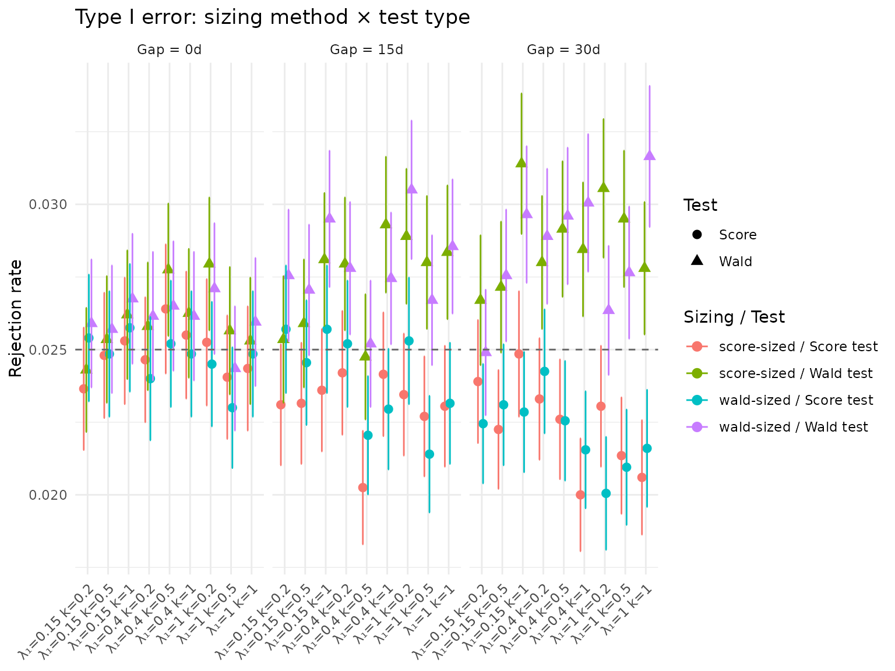
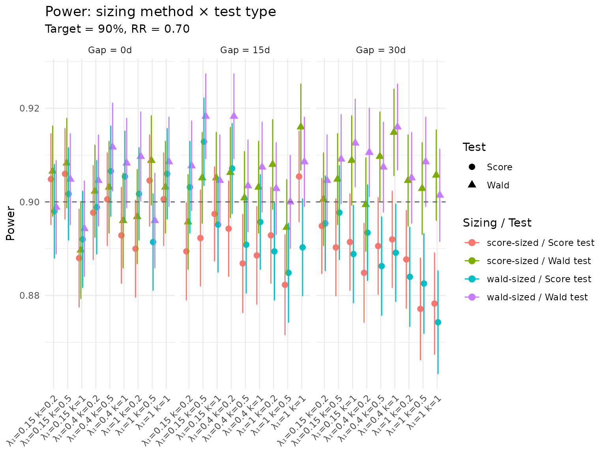
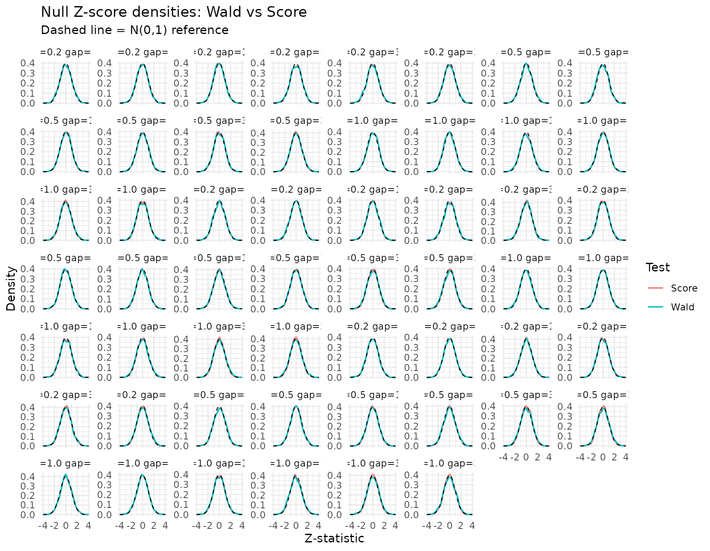

# Score vs Wald tests and sample-size recommendations

``` r

library(gsDesignNB)
library(data.table)
library(ggplot2)
```

## Introduction

This vignette compares the Wald and score test implementations in
[`mutze_test()`](https://keaven.github.io/gsDesignNB/reference/mutze_test.md)
across a factorial grid of negative binomial trial scenarios. It also
gives practical recommendations for sample-size calculation when the
usual Zhu–Lakkis / Friede–Schmidli / Mutze Wald formula is adequate,
when score-test sizing is a useful diagnostic, and when the score test
itself is the more important change for Type I error control.

The **Wald sizing** option in `sample_size_nbinom(test_type = "wald")`
uses the alternative variance \\V_1\\ for both the Type I and power
components. The **score sizing** option in
`sample_size_nbinom(test_type = "score")` uses the null variance \\V_0\\
for the Type I component and the alternative variance \\V_1\\ for the
power component:

\\ n_1 = \frac{(z\_{\alpha/s}\sqrt{V_0} + z\_\beta\sqrt{V_1})^2}
{(\theta - \theta_0)^2}. \\

This distinction matters most when the planned final analysis uses a
score statistic evaluated under the null, or when finite-sample Type I
error control is more important than preserving the historical Wald
analysis convention. In the superiority scenarios below, the Wald and
score sample sizes are close; the traditional Wald sample size paired
with the score test often provides a useful practical margin for power
while preserving the score test’s Type I error protection.

The full \\2 \times 2\\ factorial comparison is:

|                | Wald-sized trial | Score-sized trial |
|----------------|------------------|-------------------|
| **Wald test**  | Wald / Wald      | Score / Wald      |
| **Score test** | Wald / Score     | Score / Score     |

We assess:

- **Type I error control** under \\H_0: RR = 1\\
- **Power** under \\H_1: RR = 0.70\\
- **Z-score distributions** to check asymptotic normality

Tables and figures are rendered from compact precomputed summaries so
the CRAN package does not need to bundle the full trial-level simulation
output or large interactive widget dependencies.

Results are pre-computed by `data-raw/generate_score_sweep.R`,
summarized for the CRAN vignette cache, and loaded here.

## Load pre-computed results

``` r

summary_file <- system.file("extdata", "score_sweep_summary.rds",
                            package = "gsDesignNB")
if (summary_file == "" && file.exists("../inst/extdata/score_sweep_summary.rds")) {
  summary_file <- "../inst/extdata/score_sweep_summary.rds"
}

raw_file <- system.file("extdata", "score_sweep_results.rds",
                        package = "gsDesignNB")
if (raw_file == "" && file.exists("../inst/extdata/score_sweep_results.rds")) {
  raw_file <- "../inst/extdata/score_sweep_results.rds"
}

if (summary_file != "") {
  res <- readRDS(summary_file)
  using_summary_cache <- TRUE
} else if (raw_file != "") {
  res <- readRDS(raw_file)
  using_summary_cache <- FALSE
} else {
  stop("Precomputed score sweep summary not found.")
}
config <- res$config
scenarios <- as.data.table(res$scenarios)
base_grid <- as.data.table(res$base_grid)
```

``` r

cat(sprintf(
  "Expanded scenarios: %d | Power sims: %s | Null sims: %s | RR: %.2f | alpha: %.3f\n",
  nrow(scenarios),
  format(config$n_sims_power, big.mark = ","),
  format(config$n_sims_null, big.mark = ","),
  config$rr_power,
  config$alpha
))
#> Expanded scenarios: 54 | Power sims: 3,500 | Null sims: 20,000 | RR: 0.70 | alpha: 0.025
cat(sprintf(
  "Cache: %s\n",
  if (using_summary_cache) "compact summary" else "full raw simulation output"
))
#> Cache: compact summary
```

### Scenario grid

The base scenario grid varies control event rate (\\\lambda_1\\),
overdispersion (\\k\\), and minimum inter-event gap. For each base
scenario, sample sizes are computed using both the Wald and score
variance formulas. In this superiority grid the score-sized trials are
equal to or slightly smaller than the Wald-sized trials; score sizing is
therefore not a generic “add a few subjects” rule, and the operating
characteristics still need to be checked under the planned analysis
test.

``` r

base_display <- base_grid[, .(
  `Control rate` = lambda1,
  `Dispersion (k)` = k,
  `Event gap (days)` = gap_days,
  `N (Wald sizing)` = n_wald,
  `N (Score sizing)` = n_score,
  `Wald - Score` = n_wald - n_score
)]

knitr::kable(
  base_display,
  caption = "Base scenario grid with sample sizes by method",
  digits = 2
)
```

| Control rate | Dispersion (k) | Event gap (days) | N (Wald sizing) | N (Score sizing) | Wald - Score |
|---:|---:|---:|---:|---:|---:|
| 0.15 | 0.2 | 0 | 304 | 300 | 4 |
| 0.40 | 0.2 | 0 | 158 | 156 | 2 |
| 1.00 | 0.2 | 0 | 104 | 104 | 0 |
| 0.15 | 0.5 | 0 | 406 | 402 | 4 |
| 0.40 | 0.5 | 0 | 260 | 258 | 2 |
| 1.00 | 0.5 | 0 | 206 | 206 | 0 |
| 0.15 | 1.0 | 0 | 576 | 572 | 4 |
| 0.40 | 1.0 | 0 | 430 | 428 | 2 |
| 1.00 | 1.0 | 0 | 378 | 376 | 2 |
| 0.15 | 0.2 | 15 | 320 | 316 | 4 |
| 0.40 | 0.2 | 15 | 174 | 172 | 2 |
| 1.00 | 0.2 | 15 | 120 | 120 | 0 |
| 0.15 | 0.5 | 15 | 428 | 424 | 4 |
| 0.40 | 0.5 | 15 | 280 | 278 | 2 |
| 1.00 | 0.5 | 15 | 226 | 226 | 0 |
| 0.15 | 1.0 | 15 | 606 | 602 | 4 |
| 0.40 | 1.0 | 15 | 458 | 458 | 0 |
| 1.00 | 1.0 | 15 | 404 | 404 | 0 |
| 0.15 | 0.2 | 30 | 338 | 334 | 4 |
| 0.40 | 0.2 | 30 | 190 | 188 | 2 |
| 1.00 | 0.2 | 30 | 136 | 136 | 0 |
| 0.15 | 0.5 | 30 | 448 | 444 | 4 |
| 0.40 | 0.5 | 30 | 300 | 298 | 2 |
| 1.00 | 0.5 | 30 | 244 | 244 | 0 |
| 0.15 | 1.0 | 30 | 634 | 630 | 4 |
| 0.40 | 1.0 | 30 | 486 | 484 | 2 |
| 1.00 | 1.0 | 30 | 426 | 426 | 0 |

Base scenario grid with sample sizes by method {.table}

## Type I error comparison

``` r

null_dt <- as.data.table(res$null_summary)
null_long <- melt(
  null_dt,
  id.vars = c("lambda1", "k", "gap_days", "n_total", "sizing"),
  measure.vars = c("rate_wald", "rate_score"),
  variable.name = "test",
  value.name = "rejection_rate"
)
null_long[, test := fifelse(test == "rate_wald", "Wald", "Score")]

se_long <- melt(
  null_dt,
  id.vars = c("lambda1", "k", "gap_days", "sizing"),
  measure.vars = c("se_wald", "se_score"),
  variable.name = "test",
  value.name = "se"
)
se_long[, test := fifelse(test == "se_wald", "Wald", "Score")]
null_long <- merge(null_long, se_long,
                   by = c("lambda1", "k", "gap_days", "sizing", "test"))
null_long[, combo := paste0(sizing, "-sized / ", test, " test")]
null_long[, `:=`(
  above_nominal_95 = rejection_rate - 1.96 * se > config$alpha,
  below_nominal_95 = rejection_rate + 1.96 * se < config$alpha
)]
```

``` r

type1_summary <- null_long[, .(
  `Scenarios` = .N,
  `Minimum` = min(rejection_rate),
  `Mean` = mean(rejection_rate),
  `Maximum` = max(rejection_rate),
  `Above nominal beyond MC error` = sum(above_nominal_95),
  `Below nominal beyond MC error` = sum(below_nominal_95)
), by = .(`Sizing` = sizing, `Test` = test)]

knitr::kable(
  type1_summary[order(Sizing, Test)],
  caption = "Type I error synopsis across the scenario grid",
  digits = 4
)
```

| Sizing | Test | Scenarios | Minimum | Mean | Maximum | Above nominal beyond MC error | Below nominal beyond MC error |
|:---|:---|---:|---:|---:|---:|---:|---:|
| score | Score | 27 | 0.0200 | 0.0235 | 0.0264 | 0 | 7 |
| score | Wald | 27 | 0.0243 | 0.0274 | 0.0314 | 15 | 0 |
| wald | Score | 27 | 0.0200 | 0.0236 | 0.0257 | 0 | 9 |
| wald | Wald | 27 | 0.0244 | 0.0274 | 0.0316 | 13 | 0 |

Type I error synopsis across the scenario grid {.table}

``` r

null_display <- null_long[order(lambda1, k, gap_days, sizing, test),
  .(
    `Control rate` = lambda1,
    Dispersion = k,
    `Gap (days)` = gap_days,
    Sizing = sizing,
    N = n_total,
    Test = test,
    `Type I error` = round(rejection_rate, 4),
    SE = round(se, 4)
  )
]

knitr::kable(
  null_display,
  caption = sprintf(
    "Type I error rate: nominal alpha = %.3f, %s null sims/scenario",
    config$alpha,
    format(config$n_sims_null, big.mark = ",")
  )
)
```

| Control rate | Dispersion | Gap (days) | Sizing |   N | Test  | Type I error |     SE |
|-------------:|-----------:|-----------:|:-------|----:|:------|-------------:|-------:|
|         0.15 |        0.2 |          0 | score  | 300 | Score |       0.0237 | 0.0011 |
|         0.15 |        0.2 |          0 | score  | 300 | Wald  |       0.0243 | 0.0011 |
|         0.15 |        0.2 |          0 | wald   | 304 | Score |       0.0254 | 0.0011 |
|         0.15 |        0.2 |          0 | wald   | 304 | Wald  |       0.0259 | 0.0011 |
|         0.15 |        0.2 |         15 | score  | 316 | Score |       0.0231 | 0.0011 |
|         0.15 |        0.2 |         15 | score  | 316 | Wald  |       0.0254 | 0.0011 |
|         0.15 |        0.2 |         15 | wald   | 320 | Score |       0.0257 | 0.0011 |
|         0.15 |        0.2 |         15 | wald   | 320 | Wald  |       0.0276 | 0.0012 |
|         0.15 |        0.2 |         30 | score  | 334 | Score |       0.0239 | 0.0011 |
|         0.15 |        0.2 |         30 | score  | 334 | Wald  |       0.0267 | 0.0011 |
|         0.15 |        0.2 |         30 | wald   | 338 | Score |       0.0225 | 0.0010 |
|         0.15 |        0.2 |         30 | wald   | 338 | Wald  |       0.0249 | 0.0011 |
|         0.15 |        0.5 |          0 | score  | 402 | Score |       0.0248 | 0.0011 |
|         0.15 |        0.5 |          0 | score  | 402 | Wald  |       0.0254 | 0.0011 |
|         0.15 |        0.5 |          0 | wald   | 406 | Score |       0.0249 | 0.0011 |
|         0.15 |        0.5 |          0 | wald   | 406 | Wald  |       0.0257 | 0.0011 |
|         0.15 |        0.5 |         15 | score  | 424 | Score |       0.0232 | 0.0011 |
|         0.15 |        0.5 |         15 | score  | 424 | Wald  |       0.0259 | 0.0011 |
|         0.15 |        0.5 |         15 | wald   | 428 | Score |       0.0245 | 0.0011 |
|         0.15 |        0.5 |         15 | wald   | 428 | Wald  |       0.0271 | 0.0011 |
|         0.15 |        0.5 |         30 | score  | 444 | Score |       0.0222 | 0.0010 |
|         0.15 |        0.5 |         30 | score  | 444 | Wald  |       0.0272 | 0.0011 |
|         0.15 |        0.5 |         30 | wald   | 448 | Score |       0.0231 | 0.0011 |
|         0.15 |        0.5 |         30 | wald   | 448 | Wald  |       0.0276 | 0.0012 |
|         0.15 |        1.0 |          0 | score  | 572 | Score |       0.0253 | 0.0011 |
|         0.15 |        1.0 |          0 | score  | 572 | Wald  |       0.0262 | 0.0011 |
|         0.15 |        1.0 |          0 | wald   | 576 | Score |       0.0257 | 0.0011 |
|         0.15 |        1.0 |          0 | wald   | 576 | Wald  |       0.0267 | 0.0011 |
|         0.15 |        1.0 |         15 | score  | 602 | Score |       0.0236 | 0.0011 |
|         0.15 |        1.0 |         15 | score  | 602 | Wald  |       0.0281 | 0.0012 |
|         0.15 |        1.0 |         15 | wald   | 606 | Score |       0.0257 | 0.0011 |
|         0.15 |        1.0 |         15 | wald   | 606 | Wald  |       0.0295 | 0.0012 |
|         0.15 |        1.0 |         30 | score  | 630 | Score |       0.0249 | 0.0011 |
|         0.15 |        1.0 |         30 | score  | 630 | Wald  |       0.0314 | 0.0012 |
|         0.15 |        1.0 |         30 | wald   | 634 | Score |       0.0228 | 0.0011 |
|         0.15 |        1.0 |         30 | wald   | 634 | Wald  |       0.0296 | 0.0012 |
|         0.40 |        0.2 |          0 | score  | 156 | Score |       0.0246 | 0.0011 |
|         0.40 |        0.2 |          0 | score  | 156 | Wald  |       0.0258 | 0.0011 |
|         0.40 |        0.2 |          0 | wald   | 158 | Score |       0.0240 | 0.0011 |
|         0.40 |        0.2 |          0 | wald   | 158 | Wald  |       0.0261 | 0.0011 |
|         0.40 |        0.2 |         15 | score  | 172 | Score |       0.0242 | 0.0011 |
|         0.40 |        0.2 |         15 | score  | 172 | Wald  |       0.0279 | 0.0012 |
|         0.40 |        0.2 |         15 | wald   | 174 | Score |       0.0252 | 0.0011 |
|         0.40 |        0.2 |         15 | wald   | 174 | Wald  |       0.0278 | 0.0012 |
|         0.40 |        0.2 |         30 | score  | 188 | Score |       0.0233 | 0.0011 |
|         0.40 |        0.2 |         30 | score  | 188 | Wald  |       0.0280 | 0.0012 |
|         0.40 |        0.2 |         30 | wald   | 190 | Score |       0.0243 | 0.0011 |
|         0.40 |        0.2 |         30 | wald   | 190 | Wald  |       0.0289 | 0.0012 |
|         0.40 |        0.5 |          0 | score  | 258 | Score |       0.0264 | 0.0011 |
|         0.40 |        0.5 |          0 | score  | 258 | Wald  |       0.0278 | 0.0012 |
|         0.40 |        0.5 |          0 | wald   | 260 | Score |       0.0252 | 0.0011 |
|         0.40 |        0.5 |          0 | wald   | 260 | Wald  |       0.0265 | 0.0011 |
|         0.40 |        0.5 |         15 | score  | 278 | Score |       0.0203 | 0.0010 |
|         0.40 |        0.5 |         15 | score  | 278 | Wald  |       0.0248 | 0.0011 |
|         0.40 |        0.5 |         15 | wald   | 280 | Score |       0.0220 | 0.0010 |
|         0.40 |        0.5 |         15 | wald   | 280 | Wald  |       0.0252 | 0.0011 |
|         0.40 |        0.5 |         30 | score  | 298 | Score |       0.0226 | 0.0011 |
|         0.40 |        0.5 |         30 | score  | 298 | Wald  |       0.0291 | 0.0012 |
|         0.40 |        0.5 |         30 | wald   | 300 | Score |       0.0226 | 0.0010 |
|         0.40 |        0.5 |         30 | wald   | 300 | Wald  |       0.0296 | 0.0012 |
|         0.40 |        1.0 |          0 | score  | 428 | Score |       0.0255 | 0.0011 |
|         0.40 |        1.0 |          0 | score  | 428 | Wald  |       0.0262 | 0.0011 |
|         0.40 |        1.0 |          0 | wald   | 430 | Score |       0.0249 | 0.0011 |
|         0.40 |        1.0 |          0 | wald   | 430 | Wald  |       0.0261 | 0.0011 |
|         0.40 |        1.0 |         15 | score  | 458 | Score |       0.0242 | 0.0011 |
|         0.40 |        1.0 |         15 | score  | 458 | Wald  |       0.0293 | 0.0012 |
|         0.40 |        1.0 |         15 | wald   | 458 | Score |       0.0230 | 0.0011 |
|         0.40 |        1.0 |         15 | wald   | 458 | Wald  |       0.0274 | 0.0012 |
|         0.40 |        1.0 |         30 | score  | 484 | Score |       0.0200 | 0.0010 |
|         0.40 |        1.0 |         30 | score  | 484 | Wald  |       0.0284 | 0.0012 |
|         0.40 |        1.0 |         30 | wald   | 486 | Score |       0.0216 | 0.0010 |
|         0.40 |        1.0 |         30 | wald   | 486 | Wald  |       0.0301 | 0.0012 |
|         1.00 |        0.2 |          0 | score  | 104 | Score |       0.0253 | 0.0011 |
|         1.00 |        0.2 |          0 | score  | 104 | Wald  |       0.0279 | 0.0012 |
|         1.00 |        0.2 |          0 | wald   | 104 | Score |       0.0245 | 0.0011 |
|         1.00 |        0.2 |          0 | wald   | 104 | Wald  |       0.0271 | 0.0011 |
|         1.00 |        0.2 |         15 | score  | 120 | Score |       0.0234 | 0.0011 |
|         1.00 |        0.2 |         15 | score  | 120 | Wald  |       0.0289 | 0.0012 |
|         1.00 |        0.2 |         15 | wald   | 120 | Score |       0.0253 | 0.0011 |
|         1.00 |        0.2 |         15 | wald   | 120 | Wald  |       0.0305 | 0.0012 |
|         1.00 |        0.2 |         30 | score  | 136 | Score |       0.0231 | 0.0011 |
|         1.00 |        0.2 |         30 | score  | 136 | Wald  |       0.0306 | 0.0012 |
|         1.00 |        0.2 |         30 | wald   | 136 | Score |       0.0200 | 0.0010 |
|         1.00 |        0.2 |         30 | wald   | 136 | Wald  |       0.0263 | 0.0011 |
|         1.00 |        0.5 |          0 | score  | 206 | Score |       0.0240 | 0.0011 |
|         1.00 |        0.5 |          0 | score  | 206 | Wald  |       0.0256 | 0.0011 |
|         1.00 |        0.5 |          0 | wald   | 206 | Score |       0.0230 | 0.0011 |
|         1.00 |        0.5 |          0 | wald   | 206 | Wald  |       0.0244 | 0.0011 |
|         1.00 |        0.5 |         15 | score  | 226 | Score |       0.0227 | 0.0011 |
|         1.00 |        0.5 |         15 | score  | 226 | Wald  |       0.0280 | 0.0012 |
|         1.00 |        0.5 |         15 | wald   | 226 | Score |       0.0214 | 0.0010 |
|         1.00 |        0.5 |         15 | wald   | 226 | Wald  |       0.0267 | 0.0011 |
|         1.00 |        0.5 |         30 | score  | 244 | Score |       0.0214 | 0.0010 |
|         1.00 |        0.5 |         30 | score  | 244 | Wald  |       0.0295 | 0.0012 |
|         1.00 |        0.5 |         30 | wald   | 244 | Score |       0.0210 | 0.0010 |
|         1.00 |        0.5 |         30 | wald   | 244 | Wald  |       0.0277 | 0.0012 |
|         1.00 |        1.0 |          0 | score  | 376 | Score |       0.0244 | 0.0011 |
|         1.00 |        1.0 |          0 | score  | 376 | Wald  |       0.0253 | 0.0011 |
|         1.00 |        1.0 |          0 | wald   | 378 | Score |       0.0249 | 0.0011 |
|         1.00 |        1.0 |          0 | wald   | 378 | Wald  |       0.0260 | 0.0011 |
|         1.00 |        1.0 |         15 | score  | 404 | Score |       0.0231 | 0.0011 |
|         1.00 |        1.0 |         15 | score  | 404 | Wald  |       0.0284 | 0.0012 |
|         1.00 |        1.0 |         15 | wald   | 404 | Score |       0.0232 | 0.0011 |
|         1.00 |        1.0 |         15 | wald   | 404 | Wald  |       0.0285 | 0.0012 |
|         1.00 |        1.0 |         30 | score  | 426 | Score |       0.0206 | 0.0010 |
|         1.00 |        1.0 |         30 | score  | 426 | Wald  |       0.0278 | 0.0012 |
|         1.00 |        1.0 |         30 | wald   | 426 | Score |       0.0216 | 0.0010 |
|         1.00 |        1.0 |         30 | wald   | 426 | Wald  |       0.0316 | 0.0012 |

Type I error rate: nominal alpha = 0.025, 20,000 null sims/scenario
{.table style="width:100%;"}

``` r

null_long[, scenario := paste0("λ₁=", lambda1, " k=", k)]

p_null <- ggplot(null_long,
  aes(x = scenario, y = rejection_rate,
      color = combo, shape = test)) +
  geom_point(size = 2.5, position = position_dodge(width = 0.5)) +
  geom_errorbar(aes(ymin = rejection_rate - 1.96 * se,
                     ymax = rejection_rate + 1.96 * se),
                width = 0.2, position = position_dodge(width = 0.5)) +
  geom_hline(yintercept = config$alpha, linetype = "dashed", color = "grey40") +
  facet_wrap(~ paste0("Gap = ", gap_days, "d")) +
  labs(
    title = "Type I error: sizing method × test type",
    x = NULL, y = "Rejection rate",
    color = "Sizing / Test", shape = "Test"
  ) +
  theme_minimal() +
  theme(axis.text.x = element_text(angle = 45, hjust = 1))

p_null
```



## Power comparison

``` r

power_dt <- as.data.table(res$power_summary)
power_long <- melt(
  power_dt,
  id.vars = c("lambda1", "k", "gap_days", "n_total", "sizing"),
  measure.vars = c("rate_wald", "rate_score"),
  variable.name = "test",
  value.name = "power"
)
power_long[, test := fifelse(test == "rate_wald", "Wald", "Score")]

se_power <- melt(
  power_dt,
  id.vars = c("lambda1", "k", "gap_days", "sizing"),
  measure.vars = c("se_wald", "se_score"),
  variable.name = "test",
  value.name = "se"
)
se_power[, test := fifelse(test == "se_wald", "Wald", "Score")]
power_long <- merge(power_long, se_power,
                    by = c("lambda1", "k", "gap_days", "sizing", "test"))
power_long[, combo := paste0(sizing, "-sized / ", test, " test")]
```

``` r

power_summary <- power_long[, .(
  `Scenarios` = .N,
  `Minimum` = min(power),
  `Mean` = mean(power),
  `Maximum` = max(power),
  `Below 90%` = sum(power < config$power_target)
), by = .(`Sizing` = sizing, `Test` = test)]

knitr::kable(
  power_summary[order(Sizing, Test)],
  caption = "Power synopsis across the scenario grid",
  digits = 4
)
```

| Sizing | Test  | Scenarios | Minimum |   Mean | Maximum | Below 90% |
|:-------|:------|----------:|--------:|-------:|--------:|----------:|
| score  | Score |        27 |  0.8771 | 0.8927 |  0.9060 |        21 |
| score  | Wald  |        27 |  0.8897 | 0.9037 |  0.9160 |         6 |
| wald   | Score |        27 |  0.8743 | 0.8949 |  0.9129 |        19 |
| wald   | Wald  |        27 |  0.8943 | 0.9068 |  0.9183 |         3 |

Power synopsis across the scenario grid {.table}

``` r

power_display <- power_long[order(lambda1, k, gap_days, sizing, test),
  .(
    `Control rate` = lambda1,
    Dispersion = k,
    `Gap (days)` = gap_days,
    Sizing = sizing,
    N = n_total,
    Test = test,
    Power = round(power, 4),
    SE = round(se, 4)
  )
]

knitr::kable(
  power_display,
  caption = sprintf(
    "Power: RR = %.2f, %s power sims/scenario",
    config$rr_power,
    format(config$n_sims_power, big.mark = ",")
  )
)
```

| Control rate | Dispersion | Gap (days) | Sizing |   N | Test  |  Power |     SE |
|-------------:|-----------:|-----------:|:-------|----:|:------|-------:|-------:|
|         0.15 |        0.2 |          0 | score  | 300 | Score | 0.9049 | 0.0050 |
|         0.15 |        0.2 |          0 | score  | 300 | Wald  | 0.9066 | 0.0049 |
|         0.15 |        0.2 |          0 | wald   | 304 | Score | 0.8980 | 0.0051 |
|         0.15 |        0.2 |          0 | wald   | 304 | Wald  | 0.8989 | 0.0051 |
|         0.15 |        0.2 |         15 | score  | 316 | Score | 0.8894 | 0.0053 |
|         0.15 |        0.2 |         15 | score  | 316 | Wald  | 0.8957 | 0.0052 |
|         0.15 |        0.2 |         15 | wald   | 320 | Score | 0.9031 | 0.0050 |
|         0.15 |        0.2 |         15 | wald   | 320 | Wald  | 0.9077 | 0.0049 |
|         0.15 |        0.2 |         30 | score  | 334 | Score | 0.8949 | 0.0052 |
|         0.15 |        0.2 |         30 | score  | 334 | Wald  | 0.9006 | 0.0051 |
|         0.15 |        0.2 |         30 | wald   | 338 | Score | 0.8954 | 0.0052 |
|         0.15 |        0.2 |         30 | wald   | 338 | Wald  | 0.9046 | 0.0050 |
|         0.15 |        0.5 |          0 | score  | 402 | Score | 0.9060 | 0.0049 |
|         0.15 |        0.5 |          0 | score  | 402 | Wald  | 0.9083 | 0.0049 |
|         0.15 |        0.5 |          0 | wald   | 406 | Score | 0.9017 | 0.0050 |
|         0.15 |        0.5 |          0 | wald   | 406 | Wald  | 0.9049 | 0.0050 |
|         0.15 |        0.5 |         15 | score  | 424 | Score | 0.8923 | 0.0052 |
|         0.15 |        0.5 |         15 | score  | 424 | Wald  | 0.9051 | 0.0050 |
|         0.15 |        0.5 |         15 | wald   | 428 | Score | 0.9129 | 0.0048 |
|         0.15 |        0.5 |         15 | wald   | 428 | Wald  | 0.9183 | 0.0046 |
|         0.15 |        0.5 |         30 | score  | 444 | Score | 0.8903 | 0.0053 |
|         0.15 |        0.5 |         30 | score  | 444 | Wald  | 0.9049 | 0.0050 |
|         0.15 |        0.5 |         30 | wald   | 448 | Score | 0.8977 | 0.0051 |
|         0.15 |        0.5 |         30 | wald   | 448 | Wald  | 0.9091 | 0.0049 |
|         0.15 |        1.0 |          0 | score  | 572 | Score | 0.8880 | 0.0053 |
|         0.15 |        1.0 |          0 | score  | 572 | Wald  | 0.8897 | 0.0053 |
|         0.15 |        1.0 |          0 | wald   | 576 | Score | 0.8920 | 0.0052 |
|         0.15 |        1.0 |          0 | wald   | 576 | Wald  | 0.8943 | 0.0052 |
|         0.15 |        1.0 |         15 | score  | 602 | Score | 0.8974 | 0.0051 |
|         0.15 |        1.0 |         15 | score  | 602 | Wald  | 0.9051 | 0.0050 |
|         0.15 |        1.0 |         15 | wald   | 606 | Score | 0.8951 | 0.0052 |
|         0.15 |        1.0 |         15 | wald   | 606 | Wald  | 0.9046 | 0.0050 |
|         0.15 |        1.0 |         30 | score  | 630 | Score | 0.8914 | 0.0053 |
|         0.15 |        1.0 |         30 | score  | 630 | Wald  | 0.9089 | 0.0049 |
|         0.15 |        1.0 |         30 | wald   | 634 | Score | 0.8889 | 0.0053 |
|         0.15 |        1.0 |         30 | wald   | 634 | Wald  | 0.9126 | 0.0048 |
|         0.40 |        0.2 |          0 | score  | 156 | Score | 0.8977 | 0.0051 |
|         0.40 |        0.2 |          0 | score  | 156 | Wald  | 0.9023 | 0.0050 |
|         0.40 |        0.2 |          0 | wald   | 158 | Score | 0.8989 | 0.0051 |
|         0.40 |        0.2 |          0 | wald   | 158 | Wald  | 0.9046 | 0.0050 |
|         0.40 |        0.2 |         15 | score  | 172 | Score | 0.8943 | 0.0052 |
|         0.40 |        0.2 |         15 | score  | 172 | Wald  | 0.9063 | 0.0049 |
|         0.40 |        0.2 |         15 | wald   | 174 | Score | 0.9071 | 0.0049 |
|         0.40 |        0.2 |         15 | wald   | 174 | Wald  | 0.9183 | 0.0046 |
|         0.40 |        0.2 |         30 | score  | 188 | Score | 0.8849 | 0.0054 |
|         0.40 |        0.2 |         30 | score  | 188 | Wald  | 0.8994 | 0.0051 |
|         0.40 |        0.2 |         30 | wald   | 190 | Score | 0.8934 | 0.0052 |
|         0.40 |        0.2 |         30 | wald   | 190 | Wald  | 0.9106 | 0.0048 |
|         0.40 |        0.5 |          0 | score  | 258 | Score | 0.9006 | 0.0051 |
|         0.40 |        0.5 |          0 | score  | 258 | Wald  | 0.9031 | 0.0050 |
|         0.40 |        0.5 |          0 | wald   | 260 | Score | 0.9066 | 0.0049 |
|         0.40 |        0.5 |          0 | wald   | 260 | Wald  | 0.9117 | 0.0048 |
|         0.40 |        0.5 |         15 | score  | 278 | Score | 0.8869 | 0.0054 |
|         0.40 |        0.5 |         15 | score  | 278 | Wald  | 0.9009 | 0.0051 |
|         0.40 |        0.5 |         15 | wald   | 280 | Score | 0.8909 | 0.0053 |
|         0.40 |        0.5 |         15 | wald   | 280 | Wald  | 0.9034 | 0.0050 |
|         0.40 |        0.5 |         30 | score  | 298 | Score | 0.8906 | 0.0053 |
|         0.40 |        0.5 |         30 | score  | 298 | Wald  | 0.9097 | 0.0048 |
|         0.40 |        0.5 |         30 | wald   | 300 | Score | 0.8863 | 0.0054 |
|         0.40 |        0.5 |         30 | wald   | 300 | Wald  | 0.9074 | 0.0049 |
|         0.40 |        1.0 |          0 | score  | 428 | Score | 0.8929 | 0.0052 |
|         0.40 |        1.0 |          0 | score  | 428 | Wald  | 0.8960 | 0.0052 |
|         0.40 |        1.0 |          0 | wald   | 430 | Score | 0.9054 | 0.0049 |
|         0.40 |        1.0 |          0 | wald   | 430 | Wald  | 0.9083 | 0.0049 |
|         0.40 |        1.0 |         15 | score  | 458 | Score | 0.8886 | 0.0053 |
|         0.40 |        1.0 |         15 | score  | 458 | Wald  | 0.9031 | 0.0050 |
|         0.40 |        1.0 |         15 | wald   | 458 | Score | 0.8957 | 0.0052 |
|         0.40 |        1.0 |         15 | wald   | 458 | Wald  | 0.9074 | 0.0049 |
|         0.40 |        1.0 |         30 | score  | 484 | Score | 0.8920 | 0.0052 |
|         0.40 |        1.0 |         30 | score  | 484 | Wald  | 0.9149 | 0.0047 |
|         0.40 |        1.0 |         30 | wald   | 486 | Score | 0.8891 | 0.0053 |
|         0.40 |        1.0 |         30 | wald   | 486 | Wald  | 0.9160 | 0.0047 |
|         1.00 |        0.2 |          0 | score  | 104 | Score | 0.8900 | 0.0053 |
|         1.00 |        0.2 |          0 | score  | 104 | Wald  | 0.8969 | 0.0051 |
|         1.00 |        0.2 |          0 | wald   | 104 | Score | 0.9017 | 0.0050 |
|         1.00 |        0.2 |          0 | wald   | 104 | Wald  | 0.9097 | 0.0048 |
|         1.00 |        0.2 |         15 | score  | 120 | Score | 0.8929 | 0.0052 |
|         1.00 |        0.2 |         15 | score  | 120 | Wald  | 0.9080 | 0.0049 |
|         1.00 |        0.2 |         15 | wald   | 120 | Score | 0.8894 | 0.0053 |
|         1.00 |        0.2 |         15 | wald   | 120 | Wald  | 0.9029 | 0.0050 |
|         1.00 |        0.2 |         30 | score  | 136 | Score | 0.8877 | 0.0053 |
|         1.00 |        0.2 |         30 | score  | 136 | Wald  | 0.9046 | 0.0050 |
|         1.00 |        0.2 |         30 | wald   | 136 | Score | 0.8840 | 0.0054 |
|         1.00 |        0.2 |         30 | wald   | 136 | Wald  | 0.9051 | 0.0050 |
|         1.00 |        0.5 |          0 | score  | 206 | Score | 0.9046 | 0.0050 |
|         1.00 |        0.5 |          0 | score  | 206 | Wald  | 0.9089 | 0.0049 |
|         1.00 |        0.5 |          0 | wald   | 206 | Score | 0.8914 | 0.0053 |
|         1.00 |        0.5 |          0 | wald   | 206 | Wald  | 0.8960 | 0.0052 |
|         1.00 |        0.5 |         15 | score  | 226 | Score | 0.8823 | 0.0054 |
|         1.00 |        0.5 |         15 | score  | 226 | Wald  | 0.8946 | 0.0052 |
|         1.00 |        0.5 |         15 | wald   | 226 | Score | 0.8849 | 0.0054 |
|         1.00 |        0.5 |         15 | wald   | 226 | Wald  | 0.9000 | 0.0051 |
|         1.00 |        0.5 |         30 | score  | 244 | Score | 0.8771 | 0.0055 |
|         1.00 |        0.5 |         30 | score  | 244 | Wald  | 0.9029 | 0.0050 |
|         1.00 |        0.5 |         30 | wald   | 244 | Score | 0.8826 | 0.0054 |
|         1.00 |        0.5 |         30 | wald   | 244 | Wald  | 0.9086 | 0.0049 |
|         1.00 |        1.0 |          0 | score  | 376 | Score | 0.9006 | 0.0051 |
|         1.00 |        1.0 |          0 | score  | 376 | Wald  | 0.9031 | 0.0050 |
|         1.00 |        1.0 |          0 | wald   | 378 | Score | 0.9060 | 0.0049 |
|         1.00 |        1.0 |          0 | wald   | 378 | Wald  | 0.9086 | 0.0049 |
|         1.00 |        1.0 |         15 | score  | 404 | Score | 0.9054 | 0.0049 |
|         1.00 |        1.0 |         15 | score  | 404 | Wald  | 0.9160 | 0.0047 |
|         1.00 |        1.0 |         15 | wald   | 404 | Score | 0.8903 | 0.0053 |
|         1.00 |        1.0 |         15 | wald   | 404 | Wald  | 0.9086 | 0.0049 |
|         1.00 |        1.0 |         30 | score  | 426 | Score | 0.8783 | 0.0055 |
|         1.00 |        1.0 |         30 | score  | 426 | Wald  | 0.9057 | 0.0049 |
|         1.00 |        1.0 |         30 | wald   | 426 | Score | 0.8743 | 0.0056 |
|         1.00 |        1.0 |         30 | wald   | 426 | Wald  | 0.9014 | 0.0050 |

Power: RR = 0.70, 3,500 power sims/scenario {.table}

``` r

power_long[, scenario := paste0("λ₁=", lambda1, " k=", k)]

p_power <- ggplot(power_long,
  aes(x = scenario, y = power,
      color = combo, shape = test)) +
  geom_point(size = 2.5, position = position_dodge(width = 0.5)) +
  geom_errorbar(aes(ymin = power - 1.96 * se,
                     ymax = power + 1.96 * se),
                width = 0.2, position = position_dodge(width = 0.5)) +
  geom_hline(yintercept = config$power_target, linetype = "dashed", color = "grey40") +
  facet_wrap(~ paste0("Gap = ", gap_days, "d")) +
  labs(
    title = "Power: sizing method × test type",
    subtitle = sprintf("Target = %.0f%%, RR = %.2f",
                        100 * config$power_target, config$rr_power),
    x = NULL, y = "Power",
    color = "Sizing / Test", shape = "Test"
  ) +
  theme_minimal() +
  theme(axis.text.x = element_text(angle = 45, hjust = 1))

p_power
```



## Z-score density comparison (null simulations)

Under \\H_0\\, the Z-statistics should follow \\N(0, 1)\\ if the
asymptotic approximation holds.

``` r

if (!is.null(res$z_density_null)) {
  z_density_null <- as.data.table(res$z_density_null)
} else {
  z_null <- as.data.table(res$z_sample_null)
  sc_info <- data.table(
    scenario_id = seq_len(nrow(scenarios)),
    scenarios[, .(lambda1, k, gap_days, sizing)]
  )
  z_null <- merge(z_null, sc_info, by = "scenario_id")
  z_null[, label := sprintf("l1=%.2f k=%.1f gap=%dd (%s)",
                             lambda1, k, gap_days, sizing)]

  z_null_long <- melt(
    z_null,
    id.vars = c("scenario_id", "label", "sizing"),
    measure.vars = c("z_wald", "z_score"),
    variable.name = "test",
    value.name = "z"
  )
  z_null_long[, test := fifelse(test == "z_wald", "Wald", "Score")]
  z_null_long <- z_null_long[is.finite(z)]

  z_density_null <- z_null_long[, {
    dens <- stats::density(z, from = -4, to = 4, n = 128)
    .(z = dens$x, density = dens$y)
  }, by = .(scenario_id, label, sizing, test)]
}

normal_curve <- data.table(
  z = seq(-4, 4, length.out = 128),
  density = dnorm(seq(-4, 4, length.out = 128))
)

p_z <- ggplot(z_density_null, aes(x = z, y = density, color = test)) +
  geom_line(linewidth = 0.6) +
  geom_line(data = normal_curve, aes(x = z, y = density),
            inherit.aes = FALSE, color = "black", linetype = "dashed",
            linewidth = 0.4) +
  facet_wrap(~ label, scales = "free_y") +
  labs(
    title = "Null Z-score densities: Wald vs Score",
    subtitle = "Dashed line = N(0,1) reference",
    x = "Z-statistic", y = "Density",
    color = "Test"
  ) +
  theme_minimal() +
  coord_cartesian(xlim = c(-4, 4))

p_z
```



## Fallback method frequency

When the negative binomial MLE fails to converge or yields
non-overdispersed estimates,
[`mutze_test()`](https://keaven.github.io/gsDesignNB/reference/mutze_test.md)
falls back to Poisson or method-of-moments estimation.

``` r

null_fb <- as.data.table(res$null_summary)
fb_display <- null_fb[, .(
  `Control rate` = lambda1,
  Dispersion = k,
  `Gap (days)` = gap_days,
  Sizing = sizing,
  `Poisson (Wald)` = round(pct_fallback_poisson_wald, 1),
  `MoM (Wald)` = round(pct_fallback_mom_wald, 1),
  `Poisson (Score)` = round(pct_fallback_poisson_score, 1),
  `MoM (Score)` = round(pct_fallback_mom_score, 1)
)]

knitr::kable(
  fb_display,
  caption = "Fallback method frequency (%, null sims)",
  digits = 1
)
```

| Control rate | Dispersion | Gap (days) | Sizing | Poisson (Wald) | MoM (Wald) | Poisson (Score) | MoM (Score) |
|---:|---:|---:|:---|---:|---:|---:|---:|
| 0.1 | 0.2 | 0 | wald | 0.2 | 0.0 | 0.2 | 0.0 |
| 0.4 | 0.2 | 0 | wald | 0.0 | 0.0 | 0.0 | 0.0 |
| 1.0 | 0.2 | 0 | wald | 0.0 | 0.0 | 0.0 | 0.0 |
| 0.1 | 0.5 | 0 | wald | 0.0 | 0.0 | 0.0 | 0.0 |
| 0.4 | 0.5 | 0 | wald | 0.0 | 0.0 | 0.0 | 0.0 |
| 1.0 | 0.5 | 0 | wald | 0.0 | 0.0 | 0.0 | 0.0 |
| 0.1 | 1.0 | 0 | wald | 0.0 | 0.0 | 0.0 | 0.0 |
| 0.4 | 1.0 | 0 | wald | 0.0 | 0.0 | 0.0 | 0.0 |
| 1.0 | 1.0 | 0 | wald | 0.0 | 0.0 | 0.0 | 0.0 |
| 0.1 | 0.2 | 15 | wald | 0.4 | 0.1 | 0.4 | 0.1 |
| 0.4 | 0.2 | 15 | wald | 0.0 | 0.1 | 0.0 | 0.1 |
| 1.0 | 0.2 | 15 | wald | 0.0 | 0.0 | 0.0 | 0.0 |
| 0.1 | 0.5 | 15 | wald | 0.0 | 0.1 | 0.0 | 0.1 |
| 0.4 | 0.5 | 15 | wald | 0.0 | 0.1 | 0.0 | 0.1 |
| 1.0 | 0.5 | 15 | wald | 0.0 | 0.1 | 0.0 | 0.1 |
| 0.1 | 1.0 | 15 | wald | 0.0 | 0.2 | 0.0 | 0.2 |
| 0.4 | 1.0 | 15 | wald | 0.0 | 0.1 | 0.0 | 0.1 |
| 1.0 | 1.0 | 15 | wald | 0.0 | 0.1 | 0.0 | 0.1 |
| 0.1 | 0.2 | 30 | wald | 0.5 | 0.2 | 0.5 | 0.2 |
| 0.4 | 0.2 | 30 | wald | 0.0 | 0.1 | 0.0 | 0.1 |
| 1.0 | 0.2 | 30 | wald | 0.0 | 0.1 | 0.0 | 0.1 |
| 0.1 | 0.5 | 30 | wald | 0.0 | 0.2 | 0.0 | 0.2 |
| 0.4 | 0.5 | 30 | wald | 0.0 | 0.2 | 0.0 | 0.1 |
| 1.0 | 0.5 | 30 | wald | 0.0 | 0.1 | 0.0 | 0.1 |
| 0.1 | 1.0 | 30 | wald | 0.0 | 0.2 | 0.0 | 0.2 |
| 0.4 | 1.0 | 30 | wald | 0.0 | 0.2 | 0.0 | 0.2 |
| 1.0 | 1.0 | 30 | wald | 0.0 | 0.2 | 0.0 | 0.2 |
| 0.1 | 0.2 | 0 | score | 0.2 | 0.0 | 0.2 | 0.0 |
| 0.4 | 0.2 | 0 | score | 0.0 | 0.0 | 0.0 | 0.0 |
| 1.0 | 0.2 | 0 | score | 0.0 | 0.0 | 0.0 | 0.0 |
| 0.1 | 0.5 | 0 | score | 0.0 | 0.0 | 0.0 | 0.0 |
| 0.4 | 0.5 | 0 | score | 0.0 | 0.0 | 0.0 | 0.0 |
| 1.0 | 0.5 | 0 | score | 0.0 | 0.0 | 0.0 | 0.0 |
| 0.1 | 1.0 | 0 | score | 0.0 | 0.0 | 0.0 | 0.0 |
| 0.4 | 1.0 | 0 | score | 0.0 | 0.0 | 0.0 | 0.0 |
| 1.0 | 1.0 | 0 | score | 0.0 | 0.0 | 0.0 | 0.0 |
| 0.1 | 0.2 | 15 | score | 0.4 | 0.1 | 0.3 | 0.1 |
| 0.4 | 0.2 | 15 | score | 0.0 | 0.1 | 0.0 | 0.1 |
| 1.0 | 0.2 | 15 | score | 0.0 | 0.0 | 0.0 | 0.0 |
| 0.1 | 0.5 | 15 | score | 0.0 | 0.1 | 0.0 | 0.1 |
| 0.4 | 0.5 | 15 | score | 0.0 | 0.1 | 0.0 | 0.1 |
| 1.0 | 0.5 | 15 | score | 0.0 | 0.0 | 0.0 | 0.0 |
| 0.1 | 1.0 | 15 | score | 0.0 | 0.1 | 0.0 | 0.1 |
| 0.4 | 1.0 | 15 | score | 0.0 | 0.1 | 0.0 | 0.1 |
| 1.0 | 1.0 | 15 | score | 0.0 | 0.1 | 0.0 | 0.1 |
| 0.1 | 0.2 | 30 | score | 0.5 | 0.1 | 0.4 | 0.1 |
| 0.4 | 0.2 | 30 | score | 0.0 | 0.1 | 0.0 | 0.1 |
| 1.0 | 0.2 | 30 | score | 0.0 | 0.1 | 0.0 | 0.1 |
| 0.1 | 0.5 | 30 | score | 0.0 | 0.2 | 0.0 | 0.2 |
| 0.4 | 0.5 | 30 | score | 0.0 | 0.1 | 0.0 | 0.1 |
| 1.0 | 0.5 | 30 | score | 0.0 | 0.1 | 0.0 | 0.1 |
| 0.1 | 1.0 | 30 | score | 0.0 | 0.2 | 0.0 | 0.2 |
| 0.4 | 1.0 | 30 | score | 0.0 | 0.2 | 0.0 | 0.2 |
| 1.0 | 1.0 | 30 | score | 0.0 | 0.2 | 0.0 | 0.2 |

Fallback method frequency (%, null sims) {.table}

## Summary

- The choice of final analysis test matters more than the choice of Wald
  versus score sizing in this grid. Wald and score sample sizes differ
  by at most four subjects, while the null rejection pattern changes
  materially when the test statistic changes.
- The Wald test is mildly anti-conservative in several finite-sample
  scenarios. Across the grid, its empirical Type I error ranges from
  0.0243 to 0.0316, and many Wald cells are above nominal beyond Monte
  Carlo error.
- The score test provides better Type I protection. Its empirical Type I
  error ranges from 0.02 to 0.0264; no score-test cell is above nominal
  beyond Monte Carlo error, although several are conservatively below
  nominal.
- Use the Zhu–Lakkis / Friede–Schmidli / Mutze Wald formula when the
  planned primary analysis is the Wald log-rate-ratio test. It is also a
  reasonable practical baseline when the planned primary analysis is the
  score test, because in this superiority grid Wald sizing gives the
  score test a small sample-size margin.
- Move to the score-test workflow when Type I error preservation is the
  primary concern, especially for lower-information designs, high
  dispersion, event gaps, non-inferiority or super-superiority margins,
  or adaptive/group sequential settings. In that workflow, analyze and
  simulate with `mutze_test(test_type = "score")`,
  `sim_gs_nbinom(test_type = "score")`, or
  `sim_ssr_nbinom(test_type = "score")`; compare Wald and score sizing
  rather than assuming the two-variance score formula will automatically
  deliver nominal power.
- Score-test power is slightly conservative in this grid. If the score
  test is the planned primary analysis, verify power by simulation and
  consider retaining Wald sizing, increasing the target power, or adding
  a modest information margin before finalizing the protocol.
