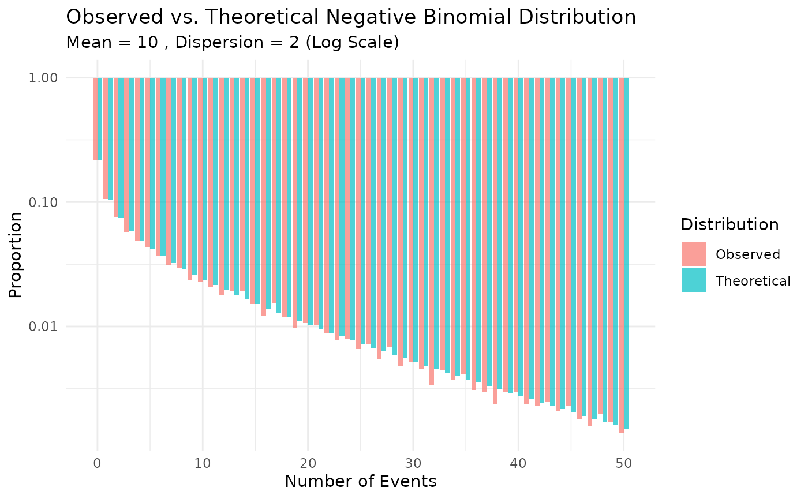

# Simulating recurrent events

``` r

library(gsDesignNB)
library(data.table)
library(ggplot2)
library(gt)
library(scales)
```

This vignette demonstrates how to use the
[`nb_sim()`](https://keaven.github.io/gsDesignNB/reference/nb_sim.md)
function to simulate a 2-arm clinical trial with recurrent event
outcomes.

## Simulation setup

We will simulate a small trial with the following parameters:

- **Enrollment:** 20 patients total, recruited over 5 months with a
  constant rate.
- **Treatments:** Two groups (Control vs. Experimental) with a 1:1
  allocation ratio.
- **Event Rates:**
  - Control: 0.5 events per year.
  - Experimental: 0.3 events per year.
- **Dropout:**
  - Control: 10% annual dropout rate.
  - Experimental: 5% annual dropout rate.
- **Maximum Follow-up:** Each patient is followed for a maximum of 2
  years from randomization.

### Defining input parameters

``` r

# Enrollment: rate of 4 patients/month for 5 months -> ~20 patients
enroll_rate <- data.frame(
  rate = 4,
  duration = 5
)

# Failure rates (events per unit time)
fail_rate <- data.frame(
  treatment = c("Control", "Experimental"),
  rate = c(0.5, 0.3) # events per year (assuming time unit is year, adjust enroll duration if needed)
)

# Let's ensure time units are consistent.
# If fail_rate is per year, then durations should be in years.
# 5 months = 5/12 years.
enroll_rate <- data.frame(
  rate = 20 / (5 / 12), # 20 patients over 5/12 years
  duration = 5 / 12
)

# Dropout rates (per year)
dropout_rate <- data.frame(
  treatment = c("Control", "Experimental"),
  rate = c(0.1, 0.05),
  duration = c(100, 100) # constant rate for long duration
)

# Maximum follow-up per patient (years)
max_followup <- 2
```

## Running the simulation

``` r

set.seed(123)

sim_data <- nb_sim(
  enroll_rate = enroll_rate,
  fail_rate = fail_rate,
  dropout_rate = dropout_rate,
  max_followup = max_followup,
  n = 20
)

head(sim_data)
#>   id id    treatment enroll_time       tte calendar_time event
#> 1  1  1      Control  0.01757203 2.0000000     2.0175720     0
#> 2  2  2 Experimental  0.02958474 0.8651927     0.8947775     1
#> 3  2  2 Experimental  0.02958474 2.0000000     2.0295847     0
#> 4  3  3 Experimental  0.05727338 2.0000000     2.0572734     0
#> 5  4  4      Control  0.05793124 2.0000000     2.0579312     0
#> 6  5  5 Experimental  0.05910231 2.0000000     2.0591023     0
```

The output contains multiple rows per subject:

- `event = 1`: An actual recurrent event.
- `event = 0`: The censoring time (either due to dropout or reaching
  `max_followup`).

## Analyzing the data

We can aggregate the data to calculate the observed event rates and
total follow-up time for each group.

``` r

sim_dt <- as.data.table(sim_data)
sim_dt[, censor_followup := ifelse(event == 0, tte, 0)]
summary_stats <- sim_dt[
  ,
  .(
    n_subjects = uniqueN(id),
    total_events = sum(event == 1),
    total_followup = sum(censor_followup),
    observed_rate = sum(event == 1) / sum(censor_followup)
  ),
  by = treatment
]
summary_stats |>
  gt() |>
  tab_header(title = "Summary Statistics by Treatment") |>
  cols_label(
    treatment = "Treatment",
    n_subjects = "N",
    total_events = "Events",
    total_followup = "Follow-up",
    observed_rate = "Rate"
  ) |>
  fmt_number(columns = total_followup, decimals = 2) |>
  fmt_number(columns = observed_rate, decimals = 3)
```

| Summary Statistics by Treatment |     |        |           |       |
|---------------------------------|-----|--------|-----------|-------|
| Treatment                       | N   | Events | Follow-up | Rate  |
| Control                         | 10  | 6      | 18.42     | 0.326 |
| Experimental                    | 10  | 5      | 20.00     | 0.250 |

### Inspect first ten records

Before plotting, we can look at the first ten records from the simulated
dataset.

``` r

head(sim_data, 10)
#>    id id    treatment enroll_time       tte calendar_time event
#> 1   1  1      Control  0.01757203 2.0000000     2.0175720     0
#> 2   2  2 Experimental  0.02958474 0.8651927     0.8947775     1
#> 3   2  2 Experimental  0.02958474 2.0000000     2.0295847     0
#> 4   3  3 Experimental  0.05727338 2.0000000     2.0572734     0
#> 5   4  4      Control  0.05793124 2.0000000     2.0579312     0
#> 6   5  5 Experimental  0.05910231 2.0000000     2.0591023     0
#> 7   6  6 Experimental  0.06569608 2.0000000     2.0656961     0
#> 8   7  7      Control  0.07224248 0.4510840     0.5233265     1
#> 9   7  7      Control  0.07224248 2.0000000     2.0722425     0
#> 10  8  8      Control  0.07526888 2.0000000     2.0752689     0
```

### Plotting events

We can visualize the events and censoring times for each subject. To
avoid any side-effects from `data.table`, we convert the dataset back to
a plain data frame. We also display an event gap after each event where
no new events can be recorded. For illustration purposes in this plot,
we show a **20-day gap** so it is visible on the timeline.

``` r

sim_plot <- as.data.frame(sim_data)
names(sim_plot) <- make.names(names(sim_plot), unique = TRUE)
events_df <- sim_plot[sim_plot$event == 1, ]
censor_df <- sim_plot[sim_plot$event == 0, ]

# Define a 20-day gap for visualization
gap_duration <- 20 / 365.25

# Create segments for the gap after each event
events_df$gap_start <- events_df$tte
events_df$gap_end <- events_df$tte + gap_duration

ggplot(sim_plot, aes(x = tte, y = factor(id), color = treatment)) +
  geom_line(aes(group = id), color = "gray80") +
  # Add gap segments
  geom_segment(
    data = events_df,
    aes(x = gap_start, xend = gap_end, y = factor(id), yend = factor(id)),
    color = "gray50", linewidth = 2, alpha = 0.7
  ) +
  geom_point(data = events_df, shape = 19, size = 2) +
  geom_point(data = censor_df, shape = 4, size = 3) +
  labs(
    title = "Patient Timelines",
    x = "Time from Randomization (Years)",
    y = "Patient ID",
    caption = "Dots = Events, Gray Bars = 20-day Gap, X = Censoring/Dropout"
  ) +
  theme_minimal()
```


## Cutting data by analysis date

We can truncate the simulated data at an interim analysis date using
[`cut_data_by_date()`](https://keaven.github.io/gsDesignNB/reference/cut_data_by_date.md).
The function returns a single record per participant with the truncated
follow-up time (`tte`) and number of observed events. By default, no gap
(`event_gap = 0`) is applied after each event. If a positive `event_gap`
is used, no new events are counted during that gap, and this time is
excluded from time at risk.

``` r

cut_summary <- cut_data_by_date(sim_data, cut_date = 1.5)
head(cut_summary)
#>   id    treatment enroll_time      tte tte_total events
#> 1  1      Control  0.01757203 1.482428  1.482428      0
#> 2  2 Experimental  0.02958474 1.470415  1.470415      1
#> 3  3 Experimental  0.05727338 1.442727  1.442727      0
#> 4  4      Control  0.05793124 1.442069  1.442069      0
#> 5  5 Experimental  0.05910231 1.440898  1.440898      0
#> 6  6 Experimental  0.06569608 1.434304  1.434304      0
```

## Missing data assumptions and imputation

The primary analysis in `gsDesignNB` is an observed-data rate analysis:
each participant contributes the recurrent events observed before the
analysis cut and the corresponding exposure time. In
[`mutze_test()`](https://keaven.github.io/gsDesignNB/reference/mutze_test.md),
this appears as a negative binomial or Poisson log-rate model with
`offset(log(tte))`; unobserved future events after censoring are not
filled in.

Under the current estimand and model, missing at random (MAR) censoring
does not by itself require multiple imputation (MI). Rubin’s
ignorability result states that, for direct likelihood or Bayesian
inference, the missing-data process can be ignored when the data are MAR
and the parameters governing missingness are distinct from the
outcome-model parameters (Rubin 1976). For this package, the practical
reading is:

- if dropout or administrative censoring is independent of future
  unobserved event burden after conditioning on the variables and
  histories represented in the analysis model, use the observed events
  and observed exposure;
- do not discard partially followed participants, since their observed
  events and exposure remain informative;
- MI under MAR is optional as a modeling or reporting strategy, not a
  requirement for valid point estimates and standard errors from a
  correctly specified observed-data likelihood.

This statement is narrower than saying that any available-case analysis
is valid under MAR. If MAR depends on auxiliary covariates, prior event
history, center, season, adherence, or other observed predictors that
are not represented in the analysis, those variables should be added to
the analysis, used in an inverse probability weighting model, or used in
a compatible imputation model. A complete-case analysis of only subjects
with full follow-up is generally a different and less efficient
analysis, and may be biased when incomplete participants differ from
completers.

For missing not at random (MNAR), the missing future event process is
not identified from observed data alone. Imputation can be useful, but
only as part of an explicit sensitivity analysis (National Research
Council 2010). For recurrent events, Keene et al. provide a directly
relevant controlled-imputation framework using a negative multinomial
formulation compatible with a Gamma-Poisson / negative binomial
recurrent-event model (Keene et al. 2014). Their reference-based
approach, such as borrowing control-arm event behaviour for active-arm
dropouts, targets de facto sensitivity estimands rather than replacing
the MAR primary analysis. A future MNAR MI routine for this package
should first preserve enough information to define what is missing:

- record the censoring reason, such as dropout, administrative cut,
  maximum follow-up, or analysis cut;
- keep the planned follow-up horizon so the unobserved exposure window
  after dropout can be calculated;
- include observed predictors of both dropout and event burden, such as
  treatment, observed events, observed exposure, season, enrollment
  time, and dropout reason.

An MNAR imputation model should then impute post-dropout recurrent-event
counts or event times from a negative binomial recurrent-event model
with an exposure offset. Sensitivity parameters can shift the
post-dropout event rate, for example by using treatment-specific
multipliers `\lambda_post = \lambda_model * exp(delta_g)`, or can impose
reference-based rules such as jump-to-reference or copy-reference.
Running a grid of assumptions gives a tipping-point or pattern-mixture
sensitivity analysis. Each imputed dataset should be analyzed with the
same
[`mutze_test()`](https://keaven.github.io/gsDesignNB/reference/mutze_test.md)
estimand, with variance estimation specified and checked as part of the
sensitivity analysis. If `event_gap` is important, imputing event times
rather than only total counts is preferable so at-risk time after events
is handled consistently.

## Wald test (Mütze et al. 2019)

Using the truncated data we can run a negative binomial Wald test as
described by Mütze et al. (2019).

``` r

mutze_res <- mutze_test(cut_summary)
mutze_res
#> Mutze Test Results
#> ==================
#> 
#> Method:     Negative binomial Wald 
#> Estimate:   -0.6217
#> SE:         0.7812
#> Z:          -0.7958
#> p-value:    0.2131
#> Rate Ratio: 0.5370
#> CI (95%):  [0.1161, 2.4831]
#> Dispersion: 0.9530
#> 
#> Group Summary:
#>     treatment subjects events exposure
#>       Control       10      6 12.66322
#>  Experimental       10      4 13.63050
```

## Finding analysis date for target events

Often we want to perform an interim analysis not at a fixed calendar
date, but when a specific number of events have accumulated. We can find
this date using
[`get_analysis_date()`](https://keaven.github.io/gsDesignNB/reference/get_analysis_date.md)
and then cut the data accordingly. This function also respects the
`event_gap` (defaulting to 5 days).

``` r

# Target 15 total events
target_events <- 15
analysis_date <- get_analysis_date(sim_data, planned_events = target_events)
#> Only 11 events in trial

print(paste("Calendar date for", target_events, "events:", round(analysis_date, 3)))
#> [1] "Calendar date for 15 events: 2.338"

# Cut data at this date
cut_events <- cut_data_by_date(sim_data, cut_date = analysis_date)

# Verify event count
sum(cut_events$events)
#> [1] 11
```

## Generating and verifying negative binomial data

The
[`nb_sim()`](https://keaven.github.io/gsDesignNB/reference/nb_sim.md)
function can also generate data where the counts follow a negative
binomial distribution. This is achieved by providing a `dispersion`
parameter in the `fail_rate` data frame. The dispersion parameter k
relates the variance to the mean as Var(Y) = \mu + k\mu^2.

### Simulation with dispersion

We define a scenario with a known dispersion of 0.5.

``` r

# Define failure rates with dispersion
fail_rate_nb <- data.frame(
  treatment = "Control",
  rate = 10, # Mean event rate
  dispersion = 2 # Variance = mean + 2 * mean^2
)

enroll_rate_nb <- data.frame(
  rate = 100,
  duration = 1
)

set.seed(1)
# Simulate 10000 subjects for a quick local review build
sim_nb <- nb_sim(
  enroll_rate = enroll_rate_nb,
  fail_rate = fail_rate_nb,
  max_followup = 1,
  n = 10000,
  block = "Control" # Assign all to Control for simplicity
)
```

### Verifying the dispersion parameter

We can verify that the simulated data reflects the input dispersion
parameter by estimating it back from the data. We use the Method of
Moments (MoM) estimator:

\hat{k} = \frac{Var(Y) - \bar{Y}}{\bar{Y}^2}

``` r

# Count events per subject
counts_nb <- as.data.table(sim_nb)[, .(events = sum(event)), by = id]

m <- mean(counts_nb$events)
v <- var(counts_nb$events)
k_mom <- (v - m) / (m^2)

# Theoretical values
mu_true <- 10
k_true <- 2
v_true <- mu_true + k_true * mu_true^2

# Also estimate using GLM
# We use MASS::glm.nb to fit the negative binomial model
# We suppress warnings because fitting intercept-only models on simulated data
# can occasionally produce convergence warnings despite valid estimates.
k_glm <- tryCatch(
  {
    fit <- suppressWarnings(MASS::glm.nb(events ~ 1, data = counts_nb))
    1 / fit$theta
  },
  error = function(e) NA
)

print(paste("True Mean:", mu_true, "| Observed Mean:", signif(m, 4)))
#> [1] "True Mean: 10 | Observed Mean: 9.968"
print(paste("True Variance:", v_true, "| Observed Variance:", signif(v, 4)))
#> [1] "True Variance: 210 | Observed Variance: 212.9"
print(paste("True Dispersion:", k_true))
#> [1] "True Dispersion: 2"
print(paste("Estimated Dispersion (MoM):", signif(k_mom, 4)))
#> [1] "Estimated Dispersion (MoM): 2.042"
print(paste("Estimated Dispersion (GLM):", signif(k_glm, 4)))
#> [1] "Estimated Dispersion (GLM): 2.018"
```

### Visualizing the distribution

We can compare the observed distribution of event counts to the
theoretical negative binomial distribution.

``` r

# Calculate observed proportions
obs_dist <- counts_nb[, .N, by = events]
obs_dist[, prop := N / sum(N)]
obs_dist[, type := "Observed"]

# Calculate theoretical probabilities
# Parameters: mu = 10, size = 1/k = 1/2 = 0.5
mu <- 10
k <- 2
size <- 1/k
max_events <- max(obs_dist$events)
theo_probs <- dnbinom(0:max_events, size = size, mu = mu)
theo_dist <- data.table(
  events = 0:max_events,
  N = NA,
  prop = theo_probs,
  type = "Theoretical"
)

# Combine for plotting
plot_data <- rbind(obs_dist, theo_dist)

# Filter for visualization (limit x-axis to 50)
plot_data <- plot_data[events <= 50]

# Plot
ggplot(plot_data, aes(x = events, y = prop, fill = type)) +
  geom_bar(stat = "identity", position = "dodge", alpha = 0.7) +
  scale_y_log10(labels = scales::label_number()) +
  labs(
    title = "Observed vs. Theoretical Negative Binomial Distribution",
    subtitle = paste("Mean =", mu, ", Dispersion =", k, "(Log Scale)"),
    x = "Number of Events",
    y = "Proportion",
    fill = "Distribution"
  ) +
  theme_minimal()
```



## References

Keene, Oliver N., James H. Roger, Benjamin F. Hartley, and Michael G.
Kenward. 2014. “Missing Data Sensitivity Analysis for Recurrent Event
Data Using Controlled Imputation.” *Pharmaceutical Statistics* 13 (4):
258–64. <https://doi.org/10.1002/pst.1624>.

Mütze, Tobias, Ekkehard Glimm, Heinz Schmidli, and Tim Friede. 2019.
“Group Sequential Designs for Negative Binomial Outcomes.” *Statistical
Methods in Medical Research* 28 (8): 2326–47.
<https://doi.org/10.1177/0962280218773115>.

National Research Council. 2010. *The Prevention and Treatment of
Missing Data in Clinical Trials*. National Academies Press.
<https://doi.org/10.17226/12955>.

Rubin, Donald B. 1976. “Inference and Missing Data.” *Biometrika* 63
(3): 581–92. <https://doi.org/10.1093/biomet/63.3.581>.
