# SSR simulation study

``` r
library(gsDesignNB)
library(gsDesign)
library(data.table)
library(MASS)
library(ggplot2)
library(dplyr)
library(gt)
library(DT)
library(future)
library(future.apply)
```

## Introduction

This vignette presents a simulation study evaluating **sample size
re-estimation (SSR)** for group sequential trials with negative binomial
recurrent event endpoints. We compare three strategies:

1.  **No adaptation** – the trial proceeds with the planned sample size.
2.  **Blinded SSR** (Friede and Schmidli 2010) – nuisance parameters are
    re-estimated from pooled (treatment-blinded) interim data.
3.  **Unblinded SSR** – nuisance parameters are re-estimated from
    treatment-specific interim data.

For hypothesis testing, all interim and final analyses use the
[`mutze_test()`](https://keaven.github.io/gsDesignNB/reference/mutze_test.md)
Wald statistic. This test underpins both efficacy/futility crossing
decisions and the unblinded-information fallback used when blinded
information estimation fails.

Interim analyses are triggered when the **blinded statistical
information** reaches the planned fraction of the target, rather than at
fixed calendar times. This ensures analyses occur at comparable
information levels regardless of the true nuisance parameters.

## Planned trial design

``` r
lambda1_plan      <- 0.5
rr_plan           <- 0.7
lambda2_plan      <- lambda1_plan * rr_plan
k_plan            <- 0.3
power_plan        <- 0.9
alpha_plan        <- 0.025
accrual_rate_plan <- 30
accrual_scenario_plan <- 18
accrual_dur_plan  <- 12
max_followup      <- 12
trial_dur_plan    <- accrual_dur_plan + max_followup
analysis_times_plan <- c(9, 14, 24)  # Calendar times under plan
```

### Fixed design

``` r
design_plan <- sample_size_nbinom(
  lambda1 = lambda1_plan, lambda2 = lambda2_plan,
  dispersion = k_plan, power = power_plan, alpha = alpha_plan,
  accrual_rate = accrual_rate_plan,
  accrual_duration = accrual_dur_plan,
  trial_duration = trial_dur_plan,
  max_followup = max_followup
)
cat("Fixed-design sample size:", design_plan$n_total, "\n")
#> Fixed-design sample size: 166
```

### Group sequential design

We use a 3-analysis group sequential design with HSD efficacy spending
and Cauchy futility spending calibrated so the futility bounds
correspond to approximately RR = 0.9 at each analysis.

Specifically, `sfl = sfCauchy` with `sflpar = c(0.4, 0.75, 0.56, 0.63)`
gives planned lower bounds that are close to declaring futility when the
observed RR is greater than about 0.9 at either interim. Because the
design uses non-binding futility (`test.type = 4`), ignoring a
lower-bound crossing does not invalidate the final efficacy decision,
which is still based on upper boundary control.

``` r
gs_plan <- design_plan |>
  gsNBCalendar(
    k = 3, test.type = 4, alpha = alpha_plan,
    sfu = sfHSD, sfupar = -2,
    sfl = sfCauchy, sflpar = c(0.4, 0.75, 0.56, 0.63),
    analysis_times = analysis_times_plan
  ) |>
  gsDesignNB::toInteger()

n_planned <- gs_plan$n_total[gs_plan$k]
target_info <- gs_plan$n.I[gs_plan$k]
planned_timing <- gs_plan$timing
gs_inflation <- n_planned / design_plan$n_total
accrual_rate_plan_eff <- n_planned / accrual_dur_plan
design_note <- paste0(
  "Design: lambda1=", lambda1_plan,
  ", RR=", rr_plan,
  ", k=", k_plan,
  ", planned accrual=", round(accrual_rate_plan_eff, 1), "/mo",
  ", planned N=", n_planned,
  ", max follow-up=", max_followup, " mo"
)

cat("Planned N (GS):", n_planned, "\n")
#> Planned N (GS): 202
cat("Information fractions:", round(planned_timing, 3), "\n")
#> Information fractions: 0.401 0.76 1
cat("GS inflation factor:", round(gs_inflation, 3), "\n")
#> GS inflation factor: 1.217
cat("Effective accrual rate for GS design:", round(accrual_rate_plan_eff, 2), "/month\n")
#> Effective accrual rate for GS design: 16.83 /month
```

``` r
gsBoundSummary(gs_plan,
  deltaname = "RR", logdelta = TRUE,
  Nname = "Information", timename = "Month",
  digits = 4, ddigits = 2
) |>
  as.data.frame() |>
  gt() |>
  tab_header(
    title = "Planned Group Sequential Design",
    subtitle = design_note
  ) |>
  tab_footnote(
    "Cauchy futility spending gives planned futility near observed RR > 0.9 at IA1/IA2; lower bounds are non-binding."
  ) |>
  tab_footnote(
    footnote = sprintf(
      "Planned cumulative sample size: IA1 = %.0f, IA2 = %.0f, Final = %.0f.",
      gs_plan$n_total[1], gs_plan$n_total[2], gs_plan$n_total[3]
    )
  )
```

| Planned Group Sequential Design                                                                                   |                    |          |          |
|-------------------------------------------------------------------------------------------------------------------|--------------------|----------|----------|
| Design: lambda1=0.5, RR=0.7, k=0.3, planned accrual=16.8/mo, planned N=202, max follow-up=12 mo                   |                    |          |          |
| Analysis                                                                                                          | Value              | Efficacy | Futility |
| IA 1: 40%                                                                                                         | Z                  | 2.5890   | 0.6752   |
| Information: 40.31                                                                                                | p (1-sided)        | 0.0048   | 0.2498   |
| Month: 9                                                                                                          | ~RR at bound       | 0.6651   | 0.8991   |
|                                                                                                                   | P(Cross) if RR=1   | 0.0048   | 0.7502   |
|                                                                                                                   | P(Cross) if RR=0.7 | 0.3727   | 0.0560   |
| IA 2: 76%                                                                                                         | Z                  | 2.2872   | 1.0289   |
| Information: 76.4                                                                                                 | p (1-sided)        | 0.0111   | 0.1518   |
| Month: 14                                                                                                         | ~RR at bound       | 0.7698   | 0.8889   |
|                                                                                                                   | P(Cross) if RR=1   | 0.0135   | 0.8903   |
|                                                                                                                   | P(Cross) if RR=0.7 | 0.7935   | 0.0633   |
| Final                                                                                                             | Z                  | 2.0853   | 2.0853   |
| Information: 100.52                                                                                               | p (1-sided)        | 0.0185   | 0.0185   |
| Month: 24                                                                                                         | ~RR at bound       | 0.8122   | 0.8122   |
|                                                                                                                   | P(Cross) if RR=1   | 0.0221   | 0.9779   |
|                                                                                                                   | P(Cross) if RR=0.7 | 0.9025   | 0.0975   |
| Cauchy futility spending gives planned futility near observed RR \> 0.9 at IA1/IA2; lower bounds are non-binding. |                    |          |          |
| Planned cumulative sample size: IA1 = 81, IA2 = 154, Final = 202.                                                 |                    |          |          |

### Expected information fraction at planned time of each interim

This table shows the expected information fraction at each planned
interim calendar time under each nuisance scenario. Under the design
assumptions (bold green row), the information fractions match the GS
design (40.1%, 76%).

``` r
nuisance_grid <- expand.grid(
  lambda1_true = c(0.3, 0.5, 0.8),
  k_true = c(0.3, 0.6),
  accrual_true = c(12, 18, 24),
  stringsAsFactors = FALSE
)

# Accrual scenarios use effective monthly enrollment rates directly.

for (a in 1:2) {
  col_name <- paste0("IF_analysis_", a)
  nuisance_grid[[col_name]] <- sapply(seq_len(nrow(nuisance_grid)), function(i) {
    accrual_eff <- nuisance_grid$accrual_true[i]
    info_at_t <- compute_info_at_time(
      analysis_time = analysis_times_plan[a],
      accrual_rate = accrual_eff,
      accrual_duration = accrual_dur_plan,
      lambda1 = nuisance_grid$lambda1_true[i],
      lambda2 = nuisance_grid$lambda1_true[i] * rr_plan,
      dispersion = nuisance_grid$k_true[i],
      max_followup = max_followup
    )
    round(100 * info_at_t / target_info, 1)
  })
}

nuisance_grid$is_planned <- with(nuisance_grid,
  lambda1_true == 0.5 & k_true == 0.3 & accrual_true == accrual_scenario_plan)

nuisance_grid |>
  select(-is_planned) |>
  gt() |>
  tab_header(
    title = "Expected Information Fraction (%) at Planned Time of Each Interim",
    subtitle = design_note
  ) |>
  cols_label(
    lambda1_true = "lambda1 (true)",
    k_true = "k (true)",
    accrual_true = "Accrual (pts/mo)",
    IF_analysis_1 = paste0("IA 1 (mo ", analysis_times_plan[1], ")"),
    IF_analysis_2 = paste0("IA 2 (mo ", analysis_times_plan[2], ")")
  ) |>
  tab_style(
    style = list(cell_fill(color = "#E8F5E9"), cell_text(weight = "bold")),
    locations = cells_body(rows = nuisance_grid$is_planned)
  ) |>
  tab_footnote(
    footnote = paste(
      "Computed via compute_info_at_time() divided by planned final information.",
      "Accrual values (12/18/24) are effective enrollment rates used directly.",
      "Bold green = design assumptions.",
      "With information-based timing, interims occur when blinded info reaches",
      "the target fraction, so the calendar time varies by scenario."
    )
  )
```

| Expected Information Fraction (%) at Planned Time of Each Interim                                                                                                                                                                                                                                                        |          |                  |             |              |
|--------------------------------------------------------------------------------------------------------------------------------------------------------------------------------------------------------------------------------------------------------------------------------------------------------------------------|----------|------------------|-------------|--------------|
| Design: lambda1=0.5, RR=0.7, k=0.3, planned accrual=16.8/mo, planned N=202, max follow-up=12 mo                                                                                                                                                                                                                          |          |                  |             |              |
| lambda1 (true)                                                                                                                                                                                                                                                                                                           | k (true) | Accrual (pts/mo) | IA 1 (mo 9) | IA 2 (mo 14) |
| 0.3                                                                                                                                                                                                                                                                                                                      | 0.3      | 12               | 20.7        | 41.3         |
| 0.5                                                                                                                                                                                                                                                                                                                      | 0.3      | 12               | 28.6        | 54.2         |
| 0.8                                                                                                                                                                                                                                                                                                                      | 0.3      | 12               | 36.4        | 65.7         |
| 0.3                                                                                                                                                                                                                                                                                                                      | 0.6      | 12               | 15.8        | 29.4         |
| 0.5                                                                                                                                                                                                                                                                                                                      | 0.6      | 12               | 20.0        | 35.4         |
| 0.8                                                                                                                                                                                                                                                                                                                      | 0.6      | 12               | 23.6        | 40.0         |
| 0.3                                                                                                                                                                                                                                                                                                                      | 0.3      | 18               | 31.0        | 61.9         |
| 0.5                                                                                                                                                                                                                                                                                                                      | 0.3      | 18               | 42.9        | 81.3         |
| 0.8                                                                                                                                                                                                                                                                                                                      | 0.3      | 18               | 54.6        | 98.6         |
| 0.3                                                                                                                                                                                                                                                                                                                      | 0.6      | 18               | 23.7        | 44.1         |
| 0.5                                                                                                                                                                                                                                                                                                                      | 0.6      | 18               | 30.1        | 53.1         |
| 0.8                                                                                                                                                                                                                                                                                                                      | 0.6      | 18               | 35.4        | 60.0         |
| 0.3                                                                                                                                                                                                                                                                                                                      | 0.3      | 24               | 41.3        | 82.6         |
| 0.5                                                                                                                                                                                                                                                                                                                      | 0.3      | 24               | 57.2        | 108.4        |
| 0.8                                                                                                                                                                                                                                                                                                                      | 0.3      | 24               | 72.9        | 131.5        |
| 0.3                                                                                                                                                                                                                                                                                                                      | 0.6      | 24               | 31.6        | 58.8         |
| 0.5                                                                                                                                                                                                                                                                                                                      | 0.6      | 24               | 40.1        | 70.8         |
| 0.8                                                                                                                                                                                                                                                                                                                      | 0.6      | 24               | 47.2        | 80.0         |
| Computed via compute_info_at_time() divided by planned final information. Accrual values (12/18/24) are effective enrollment rates used directly. Bold green = design assumptions. With information-based timing, interims occur when blinded info reaches the target fraction, so the calendar time varies by scenario. |          |                  |             |              |

## Scenario grid

``` r
scenarios <- expand.grid(
  lambda1_true = c(0.3, 0.5, 0.8),
  k_true = c(0.3, 0.6),
  accrual_true = c(12, 18, 24),
  rr_true = c(0.5, 0.6, 0.7, 0.8, 0.9, 1.0, 1.1),
  stringsAsFactors = FALSE
)

n_sims_initial <- 50
use_production <- identical(Sys.getenv("GSDESIGNNB_PRODUCTION_SSR"), "true")

scenarios$n_sims <- ifelse(
  use_production,
  3600,
  n_sims_initial
)
scenarios$accrual_eff <- scenarios$accrual_true

n_max <- 2 * n_planned
min_if_futility <- 0.3
target_if <- planned_timing  # Target IF for each analysis
# IA2 adaptation gate (less strict than prior 80% / 2 months setting)
max_enrollment_frac_for_ia2 <- 1.00
min_months_to_close_for_adapt <- 2
analysis_lag_months <- 2

# Optional precomputed outputs for fast vignette builds
precomputed_basename <- "ssr_sim_vignette_outputs.rds"
project_root <- if (file.exists("DESCRIPTION")) "." else
  if (file.exists("../DESCRIPTION")) ".." else "."
precomputed_source_path <- file.path(
  project_root, "inst", "extdata", precomputed_basename
)
precomputed_file <- system.file("extdata", precomputed_basename, package = "gsDesignNB")
if (precomputed_file == "" && file.exists(precomputed_source_path)) {
  precomputed_file <- precomputed_source_path
}
force_rerun <- identical(Sys.getenv("GSDESIGNNB_FORCE_SSR_SIM"), "true")
use_precomputed <- (!use_production) && !force_rerun && nzchar(precomputed_file)
save_precomputed <- identical(Sys.getenv("GSDESIGNNB_SAVE_SSR_OUTPUTS"), "true")
save_precomputed_path <- precomputed_source_path

cat("Scenarios:", nrow(scenarios), "| Replicates:", sum(scenarios$n_sims), "\n")
#> Scenarios: 126 | Replicates: 6300
cat("Accrual rates used in simulation:", paste(round(sort(unique(scenarios$accrual_true)), 1), collapse = ", "),
    "/month\n")
#> Accrual rates used in simulation: 12, 18, 24 /month
cat(
  "IA2 SSR gate: adaptation uses cutoff at min(IA2 time, predicted close - ",
  min_months_to_close_for_adapt,
  " months); enrollment cap <= ",
  100 * max_enrollment_frac_for_ia2,
  "%.\n",
  sep = ""
)
#> IA2 SSR gate: adaptation uses cutoff at min(IA2 time, predicted close - 2 months); enrollment cap <= 100%.
cat("Futility-stop sample size counts enrollment through +",
    analysis_lag_months, " months after stop.\n", sep = "")
#> Futility-stop sample size counts enrollment through +2 months after stop.
cat("Production plan: 3600 reps for each main-grid scenario;\n")
#> Production plan: 3600 reps for each main-grid scenario;
cat("separate RR=1 non-binding futility check uses 20000 reps.\n")
#> separate RR=1 non-binding futility check uses 20000 reps.
if (use_precomputed) cat("Using precomputed outputs:", precomputed_file, "\n")
#> Using precomputed outputs: /home/runner/work/_temp/Library/gsDesignNB/extdata/ssr_sim_vignette_outputs.rds
```

## Simulation engine

Interim analyses are information-based and use dynamic spending:

1.  **IA1 (~40% IF)**: efficacy/futility only; no SSR adaptation.
2.  **IA2 (target ~76% IF)**: efficacy/futility evaluated using observed
    IF and spending.
3.  **SSR at IA2 only**: nuisance estimates for adaptation use an IA2
    adaptation cutoff time at \$(, - 2 months), enforcing at least 2
    months operational lead-time. The enrollment-fraction cap is set in
    the scenario setup.

At each analysis, bounds are recalculated from observed information and
spending time. If blinded NB information fails, timing falls back to
[`mutze_test()`](https://keaven.github.io/gsDesignNB/reference/mutze_test.md)
information (tracked in output).

``` r
run_one_trial <- function(sim_id, lambda1_true, rr_true, k_true,
                          accrual_true, accrual_eff, n_planned, n_max,
                          max_followup, gs_plan, target_info,
                          planned_timing, gs_inflation,
                          lambda1_plan, lambda2_plan, rr_plan,
                          accrual_rate_plan, accrual_dur_plan,
                          trial_dur_plan, power_plan, alpha_plan,
                          min_if_futility,
                          max_enrollment_frac_for_ia2,
                          min_months_to_close_for_adapt,
                          analysis_lag_months,
                          ignore_futility = FALSE) {
  lambda2_true <- lambda1_true * rr_true
  k_analyses <- 3

  enroll_rate_sim <- data.frame(
    rate = accrual_eff, duration = n_max / accrual_eff
  )
  fail_rate_sim <- data.frame(
    treatment = c("Control", "Experimental"),
    rate = c(lambda1_true, lambda2_true),
    dispersion = k_true
  )
  dropout_rate_sim <- data.frame(
    treatment = c("Control", "Experimental"),
    rate = c(0, 0), duration = c(100, 100)
  )
  sim_data <- nb_sim(
    enroll_rate = enroll_rate_sim, fail_rate = fail_rate_sim,
    dropout_rate = dropout_rate_sim, max_followup = max_followup,
    n = n_max
  )

  id_enroll <- unique(sim_data[, c("id", "enroll_time")])
  id_enroll <- id_enroll[order(id_enroll$enroll_time, id_enroll$id), ]
  all_ids <- id_enroll$id
  max_calendar <- max(sim_data$calendar_time) + 1

  n_strategies <- c(
    "No adaptation" = n_planned,
    "Blinded SSR" = n_planned,
    "Unblinded SSR" = n_planned
  )

  # Helper: info and method at a given cut time
  info_method_at_t <- function(pool, t) {
    cut_dt <- cut_data_by_date(pool, cut_date = t)
    if (sum(cut_dt$events) < 2 || length(unique(cut_dt$id)) < 4) {
      return(list(info = 0, method = "insufficient"))
    }

    blind_res <- tryCatch(
      calculate_blinded_info(
        cut_dt, ratio = 1,
        lambda1_planning = lambda1_plan,
        lambda2_planning = lambda2_plan
      ),
      error = function(e) NULL
    )
    if (!is.null(blind_res) &&
        is.finite(blind_res$blinded_info) &&
        !is.na(blind_res$blinded_info) &&
        blind_res$blinded_info > 0) {
      return(list(info = blind_res$blinded_info, method = "blinded"))
    }

    mutze_res <- tryCatch(mutze_test(cut_dt), error = function(e) NULL)
    if (!is.null(mutze_res) &&
        is.finite(mutze_res$se) &&
        !is.na(mutze_res$se) &&
        mutze_res$se > 0) {
      return(list(info = 1 / mutze_res$se^2, method = "unblinded"))
    }

    # User-requested last-resort fallback
    list(info = 100, method = "fallback100")
  }

  # --- Find information-based interim times ---
  # Restrict to planned N for interim timing search
  planned_pool <- sim_data[sim_data$id %in% all_ids[seq_len(n_planned)], ]
  class(planned_pool) <- class(sim_data)

  ia_times <- numeric(k_analyses)
  ia_info_method <- rep("blinded", k_analyses)

  for (a in 1:(k_analyses - 1)) {
    target_info_a <- planned_timing[a] * target_info
    min_t <- if (a == 1) 1 else ia_times[a - 1] + 0.5

    ia_times[a] <- tryCatch(
      get_cut_date(
        data = planned_pool,
        target_info = target_info_a,
        lambda1 = lambda1_plan, lambda2 = lambda2_plan,
        ratio = 1, min_date = min_t, max_date = max_calendar
      ),
      error = function(e) max_calendar
    )

    # Track whether blinded or fallback method was needed at this cut
    ia_info_method[a] <- info_method_at_t(planned_pool, ia_times[a])$method
  }

  # --- Run each strategy ---
  strategy_results <- list()

  for (strat in names(n_strategies)) {
    stopped <- FALSE
    reject <- FALSE
    futility_stop <- FALSE
    reject_stage <- "No reject"
    futility_stage <- "No futility"
    ia2_enroll_frac <- NA_real_
    ia2_months_to_close_pred <- NA_real_
    ia2_adapt_allowed <- FALSE
    ia2_adapt_applied <- FALSE
    ia2_adapt_cut_time <- NA_real_
    n_futility_report <- NA_real_
    z_values <- rep(NA_real_, k_analyses)
    info_values <- rep(NA_real_, k_analyses)
    if_values <- rep(NA_real_, k_analyses)
    cal_times <- rep(NA_real_, k_analyses)

    for (a in seq_len(k_analyses)) {
      if (stopped) break

      current_n <- n_strategies[[strat]]

      if (a < k_analyses) {
        # Interim analyses are based on planned N for all strategies.
        # SSR changes the final sample size target after IA2.
        cut_time <- ia_times[a]
        interim_n <- min(n_planned, length(all_ids))
        analysis_ids <- all_ids[seq_len(interim_n)]
        enrolled_by_t <- id_enroll$id[
          id_enroll$id %in% analysis_ids & id_enroll$enroll_time <= cut_time
        ]
        analysis_pool <- sim_data[sim_data$id %in% enrolled_by_t, ]

        if (a == 2) {
          # Adaptation cutoff may be earlier than IA2 efficacy/futility
          # to ensure time to implement enrollment changes.
          enrolled_n_ia2 <- length(enrolled_by_t)
          accrual_hat_ia2 <- if (cut_time > 0) enrolled_n_ia2 / cut_time else NA_real_
          predicted_enroll_close <- if (!is.na(accrual_hat_ia2) && accrual_hat_ia2 > 0) {
            interim_n / accrual_hat_ia2
          } else {
            NA_real_
          }

          ia2_adapt_cut_time <- if (!is.na(predicted_enroll_close)) {
            min(cut_time, predicted_enroll_close - min_months_to_close_for_adapt)
          } else {
            cut_time
          }
          ia2_adapt_cut_time <- max(ia2_adapt_cut_time, ia_times[1] + 0.5)

          enrolled_n_adapt <- sum(
            id_enroll$id %in% analysis_ids &
              id_enroll$enroll_time <= ia2_adapt_cut_time
          )
          ia2_enroll_frac <- if (interim_n > 0) enrolled_n_adapt / interim_n else NA_real_
          accrual_hat <- if (ia2_adapt_cut_time > 0) {
            enrolled_n_adapt / ia2_adapt_cut_time
          } else {
            NA_real_
          }
          ia2_months_to_close_pred <- if (!is.na(accrual_hat) && accrual_hat > 0) {
            max(0, (interim_n - enrolled_n_adapt) / accrual_hat)
          } else {
            NA_real_
          }
          ia2_adapt_allowed <- !is.na(ia2_enroll_frac) &&
            is.finite(ia2_adapt_cut_time) &&
            ia2_adapt_cut_time <= cut_time &&
            ia2_enroll_frac <= max_enrollment_frac_for_ia2
        }
      } else {
        # Final: all current_n subjects, wait for max follow-up
        analysis_ids <- all_ids[seq_len(min(current_n, length(all_ids)))]
        last_enroll <- max(id_enroll$enroll_time[id_enroll$id %in% analysis_ids])
        analysis_pool <- sim_data[sim_data$id %in% analysis_ids, ]
        # Ensure all selected subjects are followed through their observed
        # event/dropout/follow-up process by cutting at the latest observed
        # calendar time for selected participants.
        cut_time <- max(
          last_enroll + max_followup,
          max(analysis_pool$calendar_time, na.rm = TRUE)
        )
      }
      cal_times[a] <- cut_time

      class(analysis_pool) <- class(sim_data)
      cut_data <- cut_data_by_date(analysis_pool, cut_date = cut_time)

      if (length(unique(cut_data$id)) < 10) next

      test_res <- tryCatch(mutze_test(cut_data), error = function(e) NULL)
      if (is.null(test_res)) next

      z_val <- -test_res$z
      info_val <- 1 / test_res$se^2
      if_val <- info_val / target_info

      z_values[a] <- z_val
      info_values[a] <- info_val
      if_values[a] <- if_val

      # --- GS bounds ---
      # Always use k=2+ so gsDesign can compute interim bounds
      # Append a placeholder final analysis at timing=1 if needed
      timing_vec <- c(if_values[1:a], if (a < k_analyses) 1)
      spend_vec <- c(
        pmin(planned_timing[1:a], if_values[1:a]),
        if (a < k_analyses) 1
      )
      if (a == k_analyses) {
        timing_vec[a] <- 1
        spend_vec[a] <- 1
      }

      # Ensure monotonicity
      for (j in 2:length(timing_vec)) {
        if (!is.na(timing_vec[j]) && !is.na(timing_vec[j-1]) &&
            timing_vec[j] <= timing_vec[j-1])
          timing_vec[j] <- timing_vec[j-1] + 0.001
        if (!is.na(spend_vec[j]) && !is.na(spend_vec[j-1]) &&
            spend_vec[j] <= spend_vec[j-1])
          spend_vec[j] <- spend_vec[j-1] + 0.001
      }

      if (any(is.na(timing_vec))) next

      k_gs <- length(timing_vec)
      gs_updated <- tryCatch(
        gsDesign(
          k = k_gs, test.type = gs_plan$test.type,
          alpha = alpha_plan, beta = 1 - power_plan,
          sfu = gs_plan$upper$sf, sfupar = gs_plan$upper$param,
          sfl = gs_plan$lower$sf, sflpar = gs_plan$lower$param,
          n.fix = target_info,
          timing = timing_vec, usTime = spend_vec, lsTime = spend_vec
        ),
        error = function(e) NULL
      )
      if (is.null(gs_updated)) next

      if (z_val > gs_updated$upper$bound[a]) {
        reject <- TRUE
        reject_stage <- if (a < k_analyses) paste0("IA", a) else "Final"
        stopped <- TRUE
      } else if (a < k_analyses && !ignore_futility &&
                 if_val >= min_if_futility &&
                 z_val < gs_updated$lower$bound[a]) {
        futility_stop <- TRUE
        futility_stage <- paste0("IA", a)
        n_futility_report <- sum(
          id_enroll$id %in% analysis_ids &
            id_enroll$enroll_time <= (cut_time + analysis_lag_months)
        )
        n_futility_report <- max(n_futility_report, length(enrolled_by_t))
        n_futility_report <- min(n_futility_report, length(analysis_ids))
        n_strategies[[strat]] <- n_futility_report
        stopped <- TRUE
      }

      # --- SSR at second interim only ---
      if (a == 2 && !stopped && strat != "No adaptation" && ia2_adapt_allowed) {
        adapt_cut_data <- cut_data
        if (!is.na(ia2_adapt_cut_time)) {
          adapt_pool <- sim_data[sim_data$id %in% analysis_ids, ]
          class(adapt_pool) <- class(sim_data)
          adapt_cut_data <- cut_data_by_date(adapt_pool, cut_date = ia2_adapt_cut_time)
        }
        if (length(unique(adapt_cut_data$id)) < 10) next

        if (strat == "Blinded SSR") {
          blind_res <- tryCatch(
            calculate_blinded_info(adapt_cut_data, ratio = 1,
              lambda1_planning = lambda1_plan,
              lambda2_planning = lambda2_plan),
            error = function(e) NULL
          )
          if (!is.null(blind_res) && !is.na(blind_res$lambda1_adjusted)) {
            ssr_design <- tryCatch(
              sample_size_nbinom(
                lambda1 = blind_res$lambda1_adjusted,
                lambda2 = blind_res$lambda2_adjusted,
                dispersion = blind_res$dispersion_blinded,
                power = power_plan, alpha = alpha_plan,
                accrual_rate = accrual_rate_plan,
                accrual_duration = accrual_dur_plan,
                trial_duration = trial_dur_plan,
                max_followup = max_followup
              ),
              error = function(e) NULL
            )
            if (!is.null(ssr_design)) {
              n_new <- min(
                max(ceiling(ssr_design$n_total * gs_inflation), n_planned),
                n_max
              )
              ia2_adapt_applied <- (n_new > n_planned)
              n_strategies[[strat]] <- n_new
            }
          }
        } else {
          unblind_fit <- tryCatch(
            MASS::glm.nb(events ~ treatment + offset(log(tte)),
                          data = adapt_cut_data),
            error = function(e) NULL
          )
          if (!is.null(unblind_fit)) {
            k_est <- 1 / unblind_fit$theta
            lambda1_est <- exp(coef(unblind_fit)[1])
            ssr_design <- tryCatch(
              sample_size_nbinom(
                lambda1 = lambda1_est,
                lambda2 = lambda1_est * rr_plan,
                dispersion = k_est,
                power = power_plan, alpha = alpha_plan,
                accrual_rate = accrual_rate_plan,
                accrual_duration = accrual_dur_plan,
                trial_duration = trial_dur_plan,
                max_followup = max_followup
              ),
              error = function(e) NULL
            )
            if (!is.null(ssr_design)) {
              n_new <- min(
                max(ceiling(ssr_design$n_total * gs_inflation), n_planned),
                n_max
              )
              ia2_adapt_applied <- (n_new > n_planned)
              n_strategies[[strat]] <- n_new
            }
          }
        }
      }
    }

    strategy_results[[strat]] <- data.frame(
      sim = sim_id, strategy = strat,
      reject = reject, futility = futility_stop,
      reject_stage = reject_stage,
      futility_stage = futility_stage,
      n_adapted = n_strategies[[strat]],
      adapted = n_strategies[[strat]] > n_planned,
      z_ia1 = z_values[1], if_ia1 = if_values[1],
      ia1_time = cal_times[1],
      ia1_info_method = ia_info_method[1],
      ia1_fallback = ia_info_method[1] != "blinded",
      z_ia2 = z_values[2], if_ia2 = if_values[2],
      ia2_time = cal_times[2],
      ia2_info_method = ia_info_method[2],
      ia2_fallback = ia_info_method[2] != "blinded",
      ia2_enroll_frac = ia2_enroll_frac,
      ia2_months_to_close_pred = ia2_months_to_close_pred,
      ia2_adapt_cut_time = ia2_adapt_cut_time,
      ia2_adapt_allowed = ia2_adapt_allowed,
      ia2_adapt_applied = ia2_adapt_applied,
      z_final = z_values[3],
      info_final = info_values[3],
      if_final = if_values[3],
      final_time = cal_times[3],
      stringsAsFactors = FALSE
    )
  }

  do.call(rbind, strategy_results)
}
```

## Running simulations

``` r
precomputed_outputs <- NULL
if (use_precomputed) {
  precomputed_outputs <- readRDS(precomputed_file)
  all_results <- as.data.frame(precomputed_outputs$plot_data)
  sim_runtime_seconds <- precomputed_outputs$sim_runtime_seconds
  workers <- if (!is.null(precomputed_outputs$workers)) {
    as.integer(precomputed_outputs$workers)
  } else {
    max(1L, future::availableCores() - 1L)
  }
  sim_mode <- "Loaded precomputed outputs"
} else {
  run_scenario <- function(sc_idx) {
    sc <- scenarios[sc_idx, ]
    message(sprintf("Starting scenario %d / %d: RR=%.2f, lambda1=%.2f, k=%.2f, accrual=%.1f", 
                    sc_idx, nrow(scenarios), sc$rr_true, sc$lambda1_true, sc$k_true, sc$accrual_true))
    set.seed(1000 + sc_idx)
    results_list <- lapply(seq_len(sc$n_sims), function(sim_id) {
      tryCatch(
        run_one_trial(
          sim_id = sim_id,
          lambda1_true = sc$lambda1_true, rr_true = sc$rr_true,
          k_true = sc$k_true,
          accrual_true = sc$accrual_true,
          accrual_eff = sc$accrual_eff,
          n_planned = n_planned, n_max = n_max,
          max_followup = max_followup,
          gs_plan = gs_plan, target_info = target_info,
          planned_timing = planned_timing, gs_inflation = gs_inflation,
          lambda1_plan = lambda1_plan, lambda2_plan = lambda2_plan,
          rr_plan = rr_plan, accrual_rate_plan = accrual_rate_plan,
          accrual_dur_plan = accrual_dur_plan,
          trial_dur_plan = trial_dur_plan,
          power_plan = power_plan, alpha_plan = alpha_plan,
          min_if_futility = min_if_futility,
          max_enrollment_frac_for_ia2 = max_enrollment_frac_for_ia2,
          min_months_to_close_for_adapt = min_months_to_close_for_adapt,
          analysis_lag_months = analysis_lag_months,
          ignore_futility = FALSE
        ),
        error = function(e) NULL
      )
    })
    res <- do.call(rbind, results_list)
    if (is.null(res) || nrow(res) == 0) return(NULL)
    res$lambda1_true <- sc$lambda1_true
    res$k_true <- sc$k_true
    res$accrual_true <- sc$accrual_true
    res$accrual_eff <- sc$accrual_eff
    res$rr_true <- sc$rr_true
    res
  }

  sim_start <- Sys.time()
  workers <- max(1L, future::availableCores() - 1L)
  old_plan <- future::plan()
  future::plan(future::multisession, workers = workers)

  all_results <- future.apply::future_lapply(
    seq_len(nrow(scenarios)),
    run_scenario,
    future.seed = TRUE
  )

  future::plan(old_plan)
  all_results <- Filter(Negate(is.null), all_results)
  all_results <- do.call(rbind, all_results)
  sim_runtime_seconds <- as.numeric(difftime(Sys.time(), sim_start, units = "secs"))
  sim_mode <- "Fresh simulation"
}

# Backward-compatible defaults for precomputed files from older vignette versions
required_cols <- c(
  "ia2_adapt_cut_time",
  "ia2_enroll_frac", "ia2_months_to_close_pred",
  "ia2_adapt_allowed", "ia2_adapt_applied"
)
missing_cols <- setdiff(required_cols, names(all_results))
if (length(missing_cols) > 0) {
  for (nm in missing_cols) all_results[[nm]] <- NA
}

cat("Simulation mode:", sim_mode, "\n")
#> Simulation mode: Loaded precomputed outputs
cat("Workers:", workers, "\n")
#> Workers: 11
cat("Rows:", nrow(all_results), "\n")
#> Rows: 1360800
if (!is.null(sim_runtime_seconds) && is.finite(sim_runtime_seconds)) {
  cat(sprintf("Simulation wall time: %.2f minutes (%.1f seconds)\n",
              sim_runtime_seconds / 60, sim_runtime_seconds))
}
#> Simulation wall time: 352.44 minutes (21146.4 seconds)

# Separate RR = 1.0 non-binding futility check (ignore futility stopping)
null_nonbinding_n <- if (use_production) 20000 else n_sims_initial
if (use_precomputed && !is.null(precomputed_outputs$null_nonbinding_summary)) {
  null_nonbinding_summary <- as.data.table(precomputed_outputs$null_nonbinding_summary)
  null_nonbinding_runtime_seconds <- precomputed_outputs$null_nonbinding_runtime_seconds
  null_nonbinding_mode <- "Loaded precomputed outputs"
} else {
  null_nonbinding_mode <- "Fresh simulation"
  null_start <- Sys.time()

  run_null_nonbinding <- function(sim_id) {
    if (sim_id %% 1000 == 0) message(sprintf("Processing RR=1 null simulation %d / %d", sim_id, null_nonbinding_n))
    tryCatch(
      run_one_trial(
        sim_id = sim_id,
        lambda1_true = lambda1_plan, rr_true = 1.0, k_true = k_plan,
        accrual_true = accrual_scenario_plan,
        accrual_eff = accrual_scenario_plan,
        n_planned = n_planned, n_max = n_max,
        max_followup = max_followup,
        gs_plan = gs_plan, target_info = target_info,
        planned_timing = planned_timing, gs_inflation = gs_inflation,
        lambda1_plan = lambda1_plan, lambda2_plan = lambda2_plan,
        rr_plan = rr_plan, accrual_rate_plan = accrual_rate_plan,
        accrual_dur_plan = accrual_dur_plan,
        trial_dur_plan = trial_dur_plan,
        power_plan = power_plan, alpha_plan = alpha_plan,
        min_if_futility = min_if_futility,
        max_enrollment_frac_for_ia2 = max_enrollment_frac_for_ia2,
        min_months_to_close_for_adapt = min_months_to_close_for_adapt,
        analysis_lag_months = analysis_lag_months,
        ignore_futility = TRUE
      ),
      error = function(e) NULL
    )
  }

  old_plan_null <- future::plan()
  future::plan(future::multisession, workers = workers)
  null_results <- future.apply::future_lapply(
    seq_len(null_nonbinding_n),
    run_null_nonbinding,
    future.seed = TRUE
  )
  future::plan(old_plan_null)

  null_results <- Filter(Negate(is.null), null_results)
  if (length(null_results) > 0) {
    null_dt <- as.data.table(do.call(rbind, null_results))
    null_nonbinding_summary <- null_dt[, .(
      n_sims = .N,
      type1_error = mean(reject, na.rm = TRUE),
      cross_ia1 = mean(reject_stage == "IA1", na.rm = TRUE),
      cross_ia2 = mean(reject_stage == "IA2", na.rm = TRUE),
      cross_final = mean(reject_stage == "Final", na.rm = TRUE),
      futility_rate = mean(futility, na.rm = TRUE),
      futility_ia1 = mean(futility_stage == "IA1", na.rm = TRUE),
      futility_ia2 = mean(futility_stage == "IA2", na.rm = TRUE),
      mean_n = mean(n_adapted, na.rm = TRUE),
      adapted_rate = mean(adapted, na.rm = TRUE)
    ), by = .(strategy)]
  } else {
    null_nonbinding_summary <- data.table(
      strategy = character(0), n_sims = integer(0), type1_error = numeric(0),
      cross_ia1 = numeric(0), cross_ia2 = numeric(0), cross_final = numeric(0),
      futility_rate = numeric(0), futility_ia1 = numeric(0),
      futility_ia2 = numeric(0), mean_n = numeric(0), adapted_rate = numeric(0)
    )
  }
  null_nonbinding_runtime_seconds <- as.numeric(
    difftime(Sys.time(), null_start, units = "secs")
  )
}

null_required_cols <- c("futility_ia1", "futility_ia2")
null_missing <- setdiff(null_required_cols, names(null_nonbinding_summary))
if (length(null_missing) > 0) {
  for (nm in null_missing) null_nonbinding_summary[[nm]] <- NA_real_
}

cat("RR=1 non-binding futility check mode:", null_nonbinding_mode, "\n")
#> RR=1 non-binding futility check mode: Loaded precomputed outputs
cat("RR=1 non-binding replications:", null_nonbinding_n, "\n")
#> RR=1 non-binding replications: 50
```

## Results

``` r
dt <- as.data.table(all_results)

summary_dt <- dt[, .(
  n_sims = .N,
  rejection_rate = mean(reject, na.rm = TRUE),
  futility_rate = mean(futility, na.rm = TRUE),
  cross_ia1 = mean(reject_stage == "IA1", na.rm = TRUE),
  cross_ia2 = mean(reject_stage == "IA2", na.rm = TRUE),
  cross_final = mean(reject_stage == "Final", na.rm = TRUE),
  mean_n = round(mean(n_adapted, na.rm = TRUE)),
  sd_n = round(sd(n_adapted, na.rm = TRUE), 1),
  pct_adapted = round(100 * mean(adapted, na.rm = TRUE), 1),
  mean_if_ia1 = round(100 * mean(if_ia1, na.rm = TRUE), 1),
  mean_if_ia2 = round(100 * mean(if_ia2, na.rm = TRUE), 1),
  mean_if_final = round(100 * mean(if_final, na.rm = TRUE), 1),
  mean_ia1_time = round(mean(ia1_time, na.rm = TRUE), 1),
  mean_ia2_time = round(mean(ia2_time, na.rm = TRUE), 1),
  mean_ia2_adapt_cut = round(mean(ia2_adapt_cut_time, na.rm = TRUE), 1),
  mean_final_time = round(mean(final_time, na.rm = TRUE), 1),
  mean_ia2_enroll_pct = round(100 * mean(ia2_enroll_frac, na.rm = TRUE), 1),
  mean_ia2_months_to_close = round(mean(ia2_months_to_close_pred, na.rm = TRUE), 1),
  pct_ia2_adapt_allowed = round(100 * mean(ia2_adapt_allowed, na.rm = TRUE), 1),
  pct_ia2_adapt_applied = round(100 * mean(ia2_adapt_applied, na.rm = TRUE), 1),
  pct_reach_final = round(100 * mean(!is.na(if_final), na.rm = TRUE), 1),
  pct_futility_deferred = round(100 * mean(if_ia1 < min_if_futility, na.rm = TRUE), 1),
  pct_fallback_ia1 = round(100 * mean(ia1_fallback, na.rm = TRUE), 1),
  pct_fallback_ia2 = round(100 * mean(ia2_fallback, na.rm = TRUE), 1),
  pct_any_fallback = round(100 * mean(ia1_fallback | ia2_fallback, na.rm = TRUE), 1),
  pct_futility_ia1 = round(100 * mean(futility_stage == "IA1", na.rm = TRUE), 1),
  pct_futility_ia2 = round(100 * mean(futility_stage == "IA2", na.rm = TRUE), 1)
), by = .(lambda1_true, k_true, accrual_true, rr_true, strategy)]
```

``` r
plot_data <- dt[, .(
  lambda1_true, k_true, accrual_true, rr_true, strategy,
  reject, futility, reject_stage, futility_stage,
  n_adapted, adapted,
  if_ia1, if_ia2, if_final,
  ia1_time, ia2_time, final_time,
  ia1_fallback, ia2_fallback,
  ia2_adapt_cut_time,
  ia2_enroll_frac, ia2_months_to_close_pred,
  ia2_adapt_allowed, ia2_adapt_applied
)]

dir.create(dirname(save_precomputed_path), recursive = TRUE, showWarnings = FALSE)
saveRDS(
  list(
    plot_data = as.data.frame(plot_data),
    sim_runtime_seconds = sim_runtime_seconds,
    workers = workers,
    null_nonbinding_summary = as.data.frame(null_nonbinding_summary),
    null_nonbinding_n = null_nonbinding_n,
    null_nonbinding_runtime_seconds = null_nonbinding_runtime_seconds,
    generated_at = as.character(Sys.time()),
    settings = list(
      n_sims_initial = n_sims_initial,
      use_production = use_production,
      design_note = design_note
    )
  ),
  save_precomputed_path
)
cat("Saved precomputed vignette outputs to:", save_precomputed_path, "\n")
```

### Simulation results

Use the column filters to focus on specific parameter combinations or
rate ratios. RR \geq 1 rows show Type I error; RR \< 1 rows show power.
Efficacy crossing percentages and futility stopping percentages are
reported separately for IA1 and IA2.

``` r
display_dt <- summary_dt[, .(
  lambda1 = lambda1_true, k = k_true, Accrual = accrual_true,
  RR = rr_true, Strategy = strategy,
  Rejection = rejection_rate,
  Futility = futility_rate,
  `Futility IA1 (%)` = pct_futility_ia1,
  `Futility IA2 (%)` = pct_futility_ia2,
  `Cross IA1` = cross_ia1,
  `Cross IA2` = cross_ia2,
  `Cross Final` = cross_final,
  `Mean N` = mean_n,
  `SD N` = sd_n,
  `Adapted (%)` = pct_adapted,
  `IA2 enroll (%)` = mean_ia2_enroll_pct,
  `IA2 months to close` = mean_ia2_months_to_close,
  `IA2 adapt allowed (%)` = pct_ia2_adapt_allowed,
  `IA2 adapt applied (%)` = pct_ia2_adapt_applied,
  `IF at IA1 (%)` = mean_if_ia1,
  `IF at IA2 (%)` = mean_if_ia2,
  `IF at Final (%)` = mean_if_final,
  `IA1 month` = mean_ia1_time,
  `IA2 month` = mean_ia2_time,
  `IA2 adapt cut month` = mean_ia2_adapt_cut,
  `Final month` = mean_final_time,
  `Reach final (%)` = pct_reach_final,
  `Fut. defer (%)` = pct_futility_deferred,
  `Fallback IA1 (%)` = pct_fallback_ia1,
  `Fallback IA2 (%)` = pct_fallback_ia2,
  `Any fallback (%)` = pct_any_fallback,
  n_sims = n_sims
)]

DT::datatable(
  as.data.frame(display_dt),
  filter = "top",
  options = list(pageLength = 20, autoWidth = TRUE, scrollX = TRUE),
  caption = htmltools::tags$caption(
    style = "font-size: 14px; font-weight: bold;",
    "Simulation Results | ", design_note
  )
) |>
  DT::formatPercentage(
    c(
      "Rejection", "Futility", "Cross IA1", "Cross IA2", "Cross Final",
      "Adapted (%)", "IA2 enroll (%)", "IA2 adapt allowed (%)",
      "IA2 adapt applied (%)", "IF at IA1 (%)", "IF at IA2 (%)",
      "IF at Final (%)", "Reach final (%)", "Fut. defer (%)",
      "Fallback IA1 (%)", "Fallback IA2 (%)", "Any fallback (%)",
      "Futility IA1 (%)", "Futility IA2 (%)"
    ),
    digits = 1
  ) |>
  DT::formatStyle(
    "Rejection",
    backgroundColor = DT::styleInterval(0.03, c("white", "#FFCCCC")),
    target = "cell"
  )
```

``` r
stage_rates <- summary_dt[, .(
  `Rejection (%)` = 100 * mean(rejection_rate),
  `Futility IA1 (%)` = mean(pct_futility_ia1),
  `Futility IA2 (%)` = mean(pct_futility_ia2),
  `Cross IA1 (%)` = 100 * mean(cross_ia1),
  `Cross IA2 (%)` = 100 * mean(cross_ia2),
  `Cross Final (%)` = 100 * mean(cross_final)
), by = .(RR = rr_true, Strategy = strategy)]

stage_rates |>
  as.data.frame() |>
  dplyr::mutate(across(where(is.numeric), ~ round(.x, 1))) |>
  gt() |>
  tab_header(
    title = "Efficacy/Futility Stage Rates by RR and Strategy",
    subtitle = "IA1 and IA2 rates shown separately"
  )
```

| Efficacy/Futility Stage Rates by RR and Strategy |               |               |                  |                  |               |               |                 |
|--------------------------------------------------|---------------|---------------|------------------|------------------|---------------|---------------|-----------------|
| IA1 and IA2 rates shown separately               |               |               |                  |                  |               |               |                 |
| RR                                               | Strategy      | Rejection (%) | Futility IA1 (%) | Futility IA2 (%) | Cross IA1 (%) | Cross IA2 (%) | Cross Final (%) |
| 0.5                                              | No adaptation | 99.9          | 0.0              | 0.0              | 96.8          | 2.9           | 0.1             |
| 0.5                                              | Blinded SSR   | 100.0         | 0.0              | 0.0              | 96.8          | 2.9           | 0.2             |
| 0.5                                              | Unblinded SSR | 100.0         | 0.0              | 0.0              | 96.8          | 2.9           | 0.2             |
| 0.6                                              | No adaptation | 97.9          | 0.5              | 0.0              | 76.0          | 19.5          | 2.4             |
| 0.6                                              | Blinded SSR   | 99.3          | 0.5              | 0.0              | 76.0          | 19.5          | 3.8             |
| 0.6                                              | Unblinded SSR | 99.3          | 0.5              | 0.0              | 76.0          | 19.5          | 3.8             |
| 0.7                                              | No adaptation | 83.2          | 5.4              | 0.6              | 39.4          | 33.1          | 10.7            |
| 0.7                                              | Blinded SSR   | 91.0          | 5.4              | 0.6              | 39.4          | 33.1          | 18.5            |
| 0.7                                              | Unblinded SSR | 91.1          | 5.4              | 0.6              | 39.4          | 33.1          | 18.6            |
| 0.8                                              | No adaptation | 46.5          | 22.1             | 5.0              | 13.1          | 20.1          | 13.2            |
| 0.8                                              | Blinded SSR   | 55.6          | 22.1             | 5.0              | 13.1          | 20.1          | 22.3            |
| 0.8                                              | Unblinded SSR | 55.7          | 22.1             | 5.0              | 13.1          | 20.1          | 22.4            |
| 0.9                                              | No adaptation | 13.7          | 49.3             | 11.4             | 3.1           | 5.2           | 5.4             |
| 0.9                                              | Blinded SSR   | 16.3          | 49.3             | 11.4             | 3.1           | 5.2           | 8.1             |
| 0.9                                              | Unblinded SSR | 16.4          | 49.3             | 11.4             | 3.1           | 5.2           | 8.2             |
| 1.0                                              | No adaptation | 2.4           | 73.7             | 12.2             | 0.6           | 0.8           | 0.9             |
| 1.0                                              | Blinded SSR   | 2.4           | 73.7             | 12.2             | 0.6           | 0.8           | 1.0             |
| 1.0                                              | Unblinded SSR | 2.5           | 73.7             | 12.2             | 0.6           | 0.8           | 1.1             |
| 1.1                                              | No adaptation | 0.3           | 89.2             | 7.4              | 0.1           | 0.1           | 0.1             |
| 1.1                                              | Blinded SSR   | 0.2           | 89.2             | 7.4              | 0.1           | 0.1           | 0.1             |
| 1.1                                              | Unblinded SSR | 0.2           | 89.2             | 7.4              | 0.1           | 0.1           | 0.1             |

``` r
runtime_df <- data.frame(
  Metric = c("Simulation mode", "Workers", "Scenarios", "Replicates", "Rows", "Wall time (minutes)"),
  Value = c(
    sim_mode,
    as.character(workers),
    nrow(scenarios),
    sum(scenarios$n_sims),
    nrow(all_results),
    if (!is.null(sim_runtime_seconds) && is.finite(sim_runtime_seconds))
      sprintf("%.2f", sim_runtime_seconds / 60) else "NA"
  )
)

runtime_df |>
  gt() |>
  tab_header(
    title = "Simulation Runtime",
    subtitle = "Use precomputed outputs to avoid rerunning on pkgdown/CI/CRAN builds"
  )
```

| Simulation Runtime                                                   |                            |
|----------------------------------------------------------------------|----------------------------|
| Use precomputed outputs to avoid rerunning on pkgdown/CI/CRAN builds |                            |
| Metric                                                               | Value                      |
| Simulation mode                                                      | Loaded precomputed outputs |
| Workers                                                              | 11                         |
| Scenarios                                                            | 126                        |
| Replicates                                                           | 6300                       |
| Rows                                                                 | 1360800                    |
| Wall time (minutes)                                                  | 352.44                     |

``` r
null_nonbinding_summary |>
  as.data.frame() |>
  dplyr::mutate(
    type1_error = round(type1_error, 4),
    cross_ia1 = round(cross_ia1, 4),
    cross_ia2 = round(cross_ia2, 4),
    cross_final = round(cross_final, 4),
    futility_rate = round(futility_rate, 4),
    futility_ia1 = round(futility_ia1, 4),
    futility_ia2 = round(futility_ia2, 4),
    mean_n = round(mean_n, 1),
    adapted_rate = round(adapted_rate, 4)
  ) |>
  gt() |>
  tab_header(
    title = "RR = 1.0 Non-binding Futility Check (Ignored Futility Stopping)",
    subtitle = paste0(
      "Replications: ", null_nonbinding_n,
      " | Mode: ", null_nonbinding_mode,
      " | Runtime (min): ", round(null_nonbinding_runtime_seconds / 60, 2)
    )
  )
```

| RR = 1.0 Non-binding Futility Check (Ignored Futility Stopping)             |        |             |           |           |             |               |              |              |        |              |
|-----------------------------------------------------------------------------|--------|-------------|-----------|-----------|-------------|---------------|--------------|--------------|--------|--------------|
| Replications: 50 \| Mode: Loaded precomputed outputs \| Runtime (min): 20.5 |        |             |           |           |             |               |              |              |        |              |
| strategy                                                                    | n_sims | type1_error | cross_ia1 | cross_ia2 | cross_final | futility_rate | futility_ia1 | futility_ia2 | mean_n | adapted_rate |
| No adaptation                                                               | 20000  | 0.0296      | 0.0058    | 0.0107    | 0.0131      | 0             | 0            | 0            | 202.0  | 0.0000       |
| Blinded SSR                                                                 | 20000  | 0.0298      | 0.0058    | 0.0107    | 0.0134      | 0             | 0            | 0            | 209.6  | 0.3496       |
| Unblinded SSR                                                               | 20000  | 0.0305      | 0.0058    | 0.0107    | 0.0140      | 0             | 0            | 0            | 214.6  | 0.4780       |

### Power by rate ratio and SSR strategy

``` r
power_avg <- dt[rr_true < 1.0, .(
  power = mean(reject, na.rm = TRUE),
  mean_final_if = mean(if_final, na.rm = TRUE),
  mean_final_month = mean(final_time, na.rm = TRUE)
), by = .(rr_true, strategy)]

ggplot(power_avg, aes(x = rr_true, y = power,
                       color = strategy, linetype = strategy)) +
  geom_line(linewidth = 1) +
  geom_point(size = 2.5) +
  geom_hline(yintercept = power_plan, linetype = "dashed", alpha = 0.4) +
  scale_y_continuous(
    limits = c(0, 1),
    breaks = seq(0, 1, 0.2),
    labels = scales::percent
  ) +
  scale_x_continuous(breaks = seq(0.5, 0.9, 0.1)) +
  labs(
    title = "Power by Rate Ratio and SSR Strategy",
    subtitle = paste("Averaged across nuisance scenarios |", design_note),
    x = "True Rate Ratio", y = "Power",
    color = "Strategy", linetype = "Strategy"
  ) +
  theme_minimal(base_size = 13) +
  theme(legend.position = "bottom")
```


``` r
power_rr_plan <- summary_dt[
  rr_true == rr_plan &
    strategy %in% c("No adaptation", "Blinded SSR", "Unblinded SSR"),
  .(lambda1_true, k_true, accrual_true, strategy, rejection_rate)
]

power_rr_plan <- dcast(
  power_rr_plan,
  lambda1_true + k_true + accrual_true ~ strategy,
  value.var = "rejection_rate"
)
power_rr_plan[, `Best SSR power` := pmax(`Blinded SSR`, `Unblinded SSR`)]
power_rr_plan[, `Best SSR method` := ifelse(`Blinded SSR` >= `Unblinded SSR`,
                                            "Blinded", "Unblinded")]
power_rr_plan[, `Power gain from best SSR` := `Best SSR power` - `No adaptation`]
power_rr_plan[, `No adaptation shortfall to 90%` := pmax(0, power_plan - `No adaptation`)]
power_rr_plan[, `Best SSR shortfall to 90%` := pmax(0, power_plan - `Best SSR power`)]
power_rr_plan <- power_rr_plan[order(-`No adaptation shortfall to 90%`)]

power_rr_display <- power_rr_plan[, .(
  lambda1_true, k_true, accrual_true,
  `No adaptation power` = `No adaptation`,
  `Blinded SSR power` = `Blinded SSR`,
  `Unblinded SSR power` = `Unblinded SSR`,
  `Best SSR power`,
  `Best SSR method`,
  `Power gain from best SSR`,
  `No adaptation shortfall to 90%`,
  `Best SSR shortfall to 90%`
)]

power_rr_display |>
  as.data.frame() |>
  dplyr::mutate(
    across(where(is.numeric), ~ round(.x, 3))
  ) |>
  gt() |>
  tab_header(
    title = "Power Shortfall Without Adaptation at Planned RR (0.7)",
    subtitle = "Includes strategy-specific power, best SSR gain, and residual shortfall"
  )
```

| Power Shortfall Without Adaptation at Planned RR (0.7)                  |        |              |                     |                   |                     |                |                 |                          |                                |                           |
|-------------------------------------------------------------------------|--------|--------------|---------------------|-------------------|---------------------|----------------|-----------------|--------------------------|--------------------------------|---------------------------|
| Includes strategy-specific power, best SSR gain, and residual shortfall |        |              |                     |                   |                     |                |                 |                          |                                |                           |
| lambda1_true                                                            | k_true | accrual_true | No adaptation power | Blinded SSR power | Unblinded SSR power | Best SSR power | Best SSR method | Power gain from best SSR | No adaptation shortfall to 90% | Best SSR shortfall to 90% |
| 0.3                                                                     | 0.6    | 12           | 0.710               | 0.896             | 0.897               | 0.897          | Unblinded       | 0.187                    | 0.190                          | 0.003                     |
| 0.3                                                                     | 0.6    | 18           | 0.722               | 0.899             | 0.902               | 0.902          | Unblinded       | 0.181                    | 0.178                          | 0.000                     |
| 0.3                                                                     | 0.6    | 24           | 0.723               | 0.905             | 0.905               | 0.905          | Unblinded       | 0.182                    | 0.177                          | 0.000                     |
| 0.5                                                                     | 0.6    | 24           | 0.775               | 0.912             | 0.914               | 0.914          | Unblinded       | 0.139                    | 0.125                          | 0.000                     |
| 0.5                                                                     | 0.6    | 12           | 0.784               | 0.907             | 0.911               | 0.911          | Unblinded       | 0.127                    | 0.116                          | 0.000                     |
| 0.5                                                                     | 0.6    | 18           | 0.785               | 0.909             | 0.911               | 0.911          | Unblinded       | 0.126                    | 0.115                          | 0.000                     |
| 0.8                                                                     | 0.6    | 18           | 0.806               | 0.902             | 0.901               | 0.902          | Blinded         | 0.095                    | 0.094                          | 0.000                     |
| 0.8                                                                     | 0.6    | 12           | 0.811               | 0.903             | 0.904               | 0.904          | Unblinded       | 0.093                    | 0.089                          | 0.000                     |
| 0.8                                                                     | 0.6    | 24           | 0.820               | 0.909             | 0.907               | 0.909          | Blinded         | 0.089                    | 0.080                          | 0.000                     |
| 0.3                                                                     | 0.3    | 24           | 0.848               | 0.902             | 0.904               | 0.904          | Unblinded       | 0.055                    | 0.052                          | 0.000                     |
| 0.3                                                                     | 0.3    | 18           | 0.852               | 0.904             | 0.905               | 0.905          | Unblinded       | 0.053                    | 0.048                          | 0.000                     |
| 0.3                                                                     | 0.3    | 12           | 0.858               | 0.911             | 0.915               | 0.915          | Unblinded       | 0.057                    | 0.042                          | 0.000                     |
| 0.5                                                                     | 0.3    | 12           | 0.913               | 0.920             | 0.921               | 0.921          | Unblinded       | 0.009                    | 0.000                          | 0.000                     |
| 0.5                                                                     | 0.3    | 18           | 0.901               | 0.910             | 0.909               | 0.910          | Blinded         | 0.009                    | 0.000                          | 0.000                     |
| 0.5                                                                     | 0.3    | 24           | 0.903               | 0.913             | 0.913               | 0.913          | Blinded         | 0.010                    | 0.000                          | 0.000                     |
| 0.8                                                                     | 0.3    | 12           | 0.921               | 0.922             | 0.922               | 0.922          | Blinded         | 0.001                    | 0.000                          | 0.000                     |
| 0.8                                                                     | 0.3    | 18           | 0.923               | 0.924             | 0.924               | 0.924          | Blinded         | 0.001                    | 0.000                          | 0.000                     |
| 0.8                                                                     | 0.3    | 24           | 0.921               | 0.923             | 0.923               | 0.923          | Blinded         | 0.003                    | 0.000                          | 0.000                     |

``` r
final_metrics_all <- dt[rr_true <= 1.0, .(
  Scenario = "Average over nuisance scenarios",
  `Power` = mean(reject, na.rm = TRUE),
  `Mean final IF (%)` = 100 * mean(if_final, na.rm = TRUE),
  `Mean final month` = mean(final_time, na.rm = TRUE),
  `Futility stop (%)` = 100 * mean(futility, na.rm = TRUE),
  `Adapted (%)` = 100 * mean(adapted, na.rm = TRUE)
), by = .(rr_true, strategy)]

final_metrics_design <- dt[
  rr_true <= 1.0 &
    lambda1_true == lambda1_plan &
    k_true == k_plan &
    accrual_true == accrual_scenario_plan,
  .(
    Scenario = "Design assumptions",
    `Power` = mean(reject, na.rm = TRUE),
    `Mean final IF (%)` = 100 * mean(if_final, na.rm = TRUE),
    `Mean final month` = mean(final_time, na.rm = TRUE),
    `Futility stop (%)` = 100 * mean(futility, na.rm = TRUE),
    `Adapted (%)` = 100 * mean(adapted, na.rm = TRUE)
  ),
  by = .(rr_true, strategy)
]

final_metrics <- rbind(final_metrics_all, final_metrics_design)

final_metrics |>
  as.data.frame() |>
  dplyr::arrange(rr_true, strategy, desc(Scenario)) |>
  dplyr::mutate(
    `Power` = round(`Power`, 3),
    `Mean final IF (%)` = round(`Mean final IF (%)`, 1),
    `Mean final month` = round(`Mean final month`, 1),
    `Futility stop (%)` = round(`Futility stop (%)`, 1),
    `Adapted (%)` = round(`Adapted (%)`, 1)
  ) |>
  gt() |>
  tab_header(
    title = "Final Analysis Diagnostics by RR and Strategy",
    subtitle = design_note
  ) |>
  tab_style(
    style = list(cell_fill(color = "#E8F5E9"), cell_text(weight = "bold")),
    locations = cells_body(rows = Scenario == "Design assumptions")
  )
```

| Final Analysis Diagnostics by RR and Strategy                                                   |               |                                 |       |                   |                  |                   |             |
|-------------------------------------------------------------------------------------------------|---------------|---------------------------------|-------|-------------------|------------------|-------------------|-------------|
| Design: lambda1=0.5, RR=0.7, k=0.3, planned accrual=16.8/mo, planned N=202, max follow-up=12 mo |               |                                 |       |                   |                  |                   |             |
| rr_true                                                                                         | strategy      | Scenario                        | Power | Mean final IF (%) | Mean final month | Futility stop (%) | Adapted (%) |
| 0.5                                                                                             | Blinded SSR   | Design assumptions              | 1.000 | NaN               | NaN              | 0.0               | 0.0         |
| 0.5                                                                                             | Blinded SSR   | Average over nuisance scenarios | 1.000 | 92.4              | 33.2             | 0.0               | 0.2         |
| 0.5                                                                                             | No adaptation | Design assumptions              | 1.000 | NaN               | NaN              | 0.0               | 0.0         |
| 0.5                                                                                             | No adaptation | Average over nuisance scenarios | 0.999 | 51.2              | 23.9             | 0.0               | 0.0         |
| 0.5                                                                                             | Unblinded SSR | Design assumptions              | 1.000 | NaN               | NaN              | 0.0               | 0.0         |
| 0.5                                                                                             | Unblinded SSR | Average over nuisance scenarios | 1.000 | 91.7              | 33.1             | 0.0               | 0.2         |
| 0.6                                                                                             | Blinded SSR   | Design assumptions              | 0.993 | 106.6             | 24.2             | 0.6               | 0.6         |
| 0.6                                                                                             | Blinded SSR   | Average over nuisance scenarios | 0.993 | 102.0             | 32.8             | 0.6               | 3.7         |
| 0.6                                                                                             | No adaptation | Design assumptions              | 0.993 | 98.9              | 23.4             | 0.6               | 0.0         |
| 0.6                                                                                             | No adaptation | Average over nuisance scenarios | 0.979 | 61.8              | 24.2             | 0.6               | 0.0         |
| 0.6                                                                                             | Unblinded SSR | Design assumptions              | 0.993 | 106.2             | 24.2             | 0.6               | 0.6         |
| 0.6                                                                                             | Unblinded SSR | Average over nuisance scenarios | 0.993 | 101.3             | 32.7             | 0.6               | 3.7         |
| 0.7                                                                                             | Blinded SSR   | Design assumptions              | 0.910 | 110.3             | 24.1             | 6.6               | 6.9         |
| 0.7                                                                                             | Blinded SSR   | Average over nuisance scenarios | 0.910 | 105.7             | 30.7             | 6.0               | 18.3        |
| 0.7                                                                                             | No adaptation | Design assumptions              | 0.901 | 102.6             | 23.3             | 6.6               | 0.0         |
| 0.7                                                                                             | No adaptation | Average over nuisance scenarios | 0.832 | 73.1              | 24.2             | 6.0               | 0.0         |
| 0.7                                                                                             | Unblinded SSR | Design assumptions              | 0.909 | 110.2             | 24.1             | 6.6               | 6.7         |
| 0.7                                                                                             | Unblinded SSR | Average over nuisance scenarios | 0.911 | 105.5             | 30.7             | 6.0               | 18.3        |
| 0.8                                                                                             | Blinded SSR   | Design assumptions              | 0.561 | 111.5             | 23.9             | 28.9              | 15.8        |
| 0.8                                                                                             | Blinded SSR   | Average over nuisance scenarios | 0.556 | 107.2             | 29.5             | 27.1              | 32.1        |
| 0.8                                                                                             | No adaptation | Design assumptions              | 0.542 | 104.8             | 23.2             | 28.9              | 0.0         |
| 0.8                                                                                             | No adaptation | Average over nuisance scenarios | 0.465 | 79.0              | 24.2             | 27.1              | 0.0         |
| 0.8                                                                                             | Unblinded SSR | Design assumptions              | 0.564 | 111.6             | 23.9             | 28.9              | 16.1        |
| 0.8                                                                                             | Unblinded SSR | Average over nuisance scenarios | 0.557 | 107.4             | 29.6             | 27.1              | 32.1        |
| 0.9                                                                                             | Blinded SSR   | Design assumptions              | 0.167 | 112.7             | 23.8             | 63.8              | 12.0        |
| 0.9                                                                                             | Blinded SSR   | Average over nuisance scenarios | 0.163 | 107.8             | 29.1             | 60.6              | 24.3        |
| 0.9                                                                                             | No adaptation | Design assumptions              | 0.161 | 107.0             | 23.2             | 63.8              | 0.0         |
| 0.9                                                                                             | No adaptation | Average over nuisance scenarios | 0.137 | 81.6              | 24.2             | 60.6              | 0.0         |
| 0.9                                                                                             | Unblinded SSR | Design assumptions              | 0.167 | 112.9             | 23.9             | 63.8              | 12.3        |
| 0.9                                                                                             | Unblinded SSR | Average over nuisance scenarios | 0.164 | 108.4             | 29.2             | 60.6              | 24.4        |
| 1.0                                                                                             | Blinded SSR   | Design assumptions              | 0.026 | 114.0             | 23.7             | 88.5              | 3.9         |
| 1.0                                                                                             | Blinded SSR   | Average over nuisance scenarios | 0.024 | 107.7             | 29.2             | 85.9              | 10.0        |
| 1.0                                                                                             | No adaptation | Design assumptions              | 0.026 | 109.3             | 23.2             | 88.5              | 0.0         |
| 1.0                                                                                             | No adaptation | Average over nuisance scenarios | 0.024 | 80.6              | 24.1             | 85.9              | 0.0         |
| 1.0                                                                                             | Unblinded SSR | Design assumptions              | 0.026 | 114.3             | 23.7             | 88.5              | 3.9         |
| 1.0                                                                                             | Unblinded SSR | Average over nuisance scenarios | 0.025 | 108.6             | 29.3             | 85.9              | 10.0        |

``` r
adapt_disp <- summary_dt[
  rr_true < 1 & strategy %in% c("Blinded SSR", "Unblinded SSR"),
  .(
    `Mean SD(adapted N)` = mean(sd_n, na.rm = TRUE),
    `Median SD(adapted N)` = median(sd_n, na.rm = TRUE),
    `Mean adapted (%)` = mean(pct_adapted, na.rm = TRUE),
    `IA2 adaptation allowed (%)` = mean(pct_ia2_adapt_allowed, na.rm = TRUE),
    `IA2 adaptation applied (%)` = mean(pct_ia2_adapt_applied, na.rm = TRUE)
  ),
  by = .(strategy)
]

adapt_disp |>
  as.data.frame() |>
  dplyr::mutate(across(where(is.numeric), ~ round(.x, 1))) |>
  gt() |>
  tab_header(
    title = "Adapted Sample Size Dispersion (RR < 1)",
    subtitle = "Delayed IA2-only adaptation with enrollment-window eligibility"
  )
```

| Adapted Sample Size Dispersion (RR \< 1)                       |                    |                      |                  |                            |                            |
|----------------------------------------------------------------|--------------------|----------------------|------------------|----------------------------|----------------------------|
| Delayed IA2-only adaptation with enrollment-window eligibility |                    |                      |                  |                            |                            |
| strategy                                                       | Mean SD(adapted N) | Median SD(adapted N) | Mean adapted (%) | IA2 adaptation allowed (%) | IA2 adaptation applied (%) |
| Blinded SSR                                                    | 32.2               | 26.0                 | 15.7             | 38.8                       | 15.7                       |
| Unblinded SSR                                                  | 32.2               | 26.8                 | 15.7             | 38.8                       | 15.7                       |

### Power by nuisance scenario

- `rr_values`` ``<-`` `[`sort`](https://rdrr.io/r/base/sort.html)`(`[`unique`](https://rdrr.io/r/base/unique.html)`(``scenarios``$``rr_true``[``scenarios``$``rr_true`` ``<=`` ``1``]``)``)`` `` ``for`` ``(``rr_val`` ``in`` ``rr_values``)`` ``{`` `` `[`cat`](https://rdrr.io/r/base/cat.html)`(`[`sprintf`](https://rdrr.io/r/base/sprintf.html)`(``"\n\n#### RR = %s\n\n"``, ``rr_val``)``)`` `` `` ``stage_dt`` ``<-`` ``dt``[``rr_true`` ``==`` ``rr_val``, ``.``(`` `` IA1 ``=`` `[`mean`](https://rdrr.io/r/base/mean.html)`(``reject_stage`` ``==`` ``"IA1"``, na.rm ``=`` ``TRUE``)``,`` `` IA2 ``=`` `[`mean`](https://rdrr.io/r/base/mean.html)`(``reject_stage`` ``==`` ``"IA2"``, na.rm ``=`` ``TRUE``)``,`` `` Final ``=`` `[`mean`](https://rdrr.io/r/base/mean.html)`(``reject_stage`` ``==`` ``"Final"``, na.rm ``=`` ``TRUE``)`` `` ``)``, by ``=`` ``.``(``lambda1_true``, ``k_true``, ``accrual_true``, ``strategy``)``]`` `` `` ``stage_long`` ``<-`` ``data.table``::`[`melt`](https://rdrr.io/pkg/data.table/man/melt.data.table.html)`(`` `` ``stage_dt``,`` `` id.vars ``=`` `[`c`](https://rdrr.io/r/base/c.html)`(``"lambda1_true"``, ``"k_true"``, ``"accrual_true"``, ``"strategy"``)``,`` `` variable.name ``=`` ``"analysis_stage"``,`` `` value.name ``=`` ``"prob"`` `` ``)`` `` ``stage_long``[``, ``analysis_stage`` ``:=`` `[`factor`](https://rdrr.io/r/base/factor.html)`(`` `` ``analysis_stage``,`` `` levels ``=`` `[`c`](https://rdrr.io/r/base/c.html)`(``"IA1"``, ``"IA2"``, ``"Final"``)``,`` `` ordered ``=`` ``TRUE`` `` ``)``]`` `` ``stage_long``[``, ``strategy`` ``:=`` `[`factor`](https://rdrr.io/r/base/factor.html)`(`` `` ``strategy``,`` `` levels ``=`` `[`c`](https://rdrr.io/r/base/c.html)`(``"No adaptation"``, ``"Blinded SSR"``, ``"Unblinded SSR"``)`` `` ``)``]`` `` ``stage_long``[``, ``lambda1_label`` ``:=`` `[`paste0`](https://rdrr.io/r/base/paste.html)`(``"lambda1 = "``, ``lambda1_true``)``]`` `` ``stage_long``[``, ``k_label`` ``:=`` `[`paste0`](https://rdrr.io/r/base/paste.html)`(``"k = "``, ``k_true``)``]`` `` ``stage_long``[``, ``accrual_label`` ``:=`` `[`paste0`](https://rdrr.io/r/base/paste.html)`(``"accrual = "``, ``accrual_true``, ``"/mo"``)``]`` `` `` ``p`` ``<-`` `[`ggplot`](https://ggplot2.tidyverse.org/reference/ggplot.html)`(``stage_long``, `[`aes`](https://ggplot2.tidyverse.org/reference/aes.html)`(``x ``=`` ``strategy``, y ``=`` ``prob``, fill ``=`` ``analysis_stage``)``)`` ``+`` `` `[`geom_col`](https://ggplot2.tidyverse.org/reference/geom_bar.html)`(`` `` width ``=`` ``0.75``, color ``=`` ``"white"``, linewidth ``=`` ``0.2``,`` `` position ``=`` `[`position_stack`](https://ggplot2.tidyverse.org/reference/position_stack.html)`(``reverse ``=`` ``TRUE``)`` `` ``)`` ``+`` `` `[`facet_grid`](https://ggplot2.tidyverse.org/reference/facet_grid.html)`(``k_label`` ``+`` ``accrual_label`` ``~`` ``lambda1_label``)`` ``+`` `` `[`scale_fill_manual`](https://ggplot2.tidyverse.org/reference/scale_manual.html)`(`` `` values ``=`` `[`c`](https://rdrr.io/r/base/c.html)`(``"IA1"`` ``=`` ``"#9ecae1"``, ``"IA2"`` ``=`` ``"#4292c6"``, ``"Final"`` ``=`` ``"#084594"``)``,`` `` breaks ``=`` `[`c`](https://rdrr.io/r/base/c.html)`(``"IA1"``, ``"IA2"``, ``"Final"``)``,`` `` limits ``=`` `[`c`](https://rdrr.io/r/base/c.html)`(``"IA1"``, ``"IA2"``, ``"Final"``)`` `` ``)`` ``+`` `` `[`scale_y_continuous`](https://ggplot2.tidyverse.org/reference/scale_continuous.html)`(``limits ``=`` `[`c`](https://rdrr.io/r/base/c.html)`(``0``, ``1``)``, breaks ``=`` `[`seq`](https://rdrr.io/r/base/seq.html)`(``0``, ``1``, ``0.2``)``,`` `` labels ``=`` ``scales``::`[`percent_format`](https://scales.r-lib.org/reference/percent_format.html)`(``)``)`` ``+`` `` `[`labs`](https://ggplot2.tidyverse.org/reference/labs.html)`(`` `` title ``=`` `[`sprintf`](https://rdrr.io/r/base/sprintf.html)`(``"Efficacy Crossing Probability by Analysis Stage (RR = %s)"``, ``rr_val``)``,`` `` subtitle ``=`` ``design_note``,`` `` x ``=`` ``"Strategy"``,`` `` y ``=`` ``"Probability of crossing efficacy bound"``,`` `` fill ``=`` ``"Crossing stage"`` `` ``)`` ``+`` `` `[`theme_minimal`](https://ggplot2.tidyverse.org/reference/ggtheme.html)`(``base_size ``=`` ``12``)`` ``+`` `` `[`theme`](https://ggplot2.tidyverse.org/reference/theme.html)`(`` `` legend.position ``=`` ``"bottom"``,`` `` axis.text.x ``=`` `[`element_text`](https://ggplot2.tidyverse.org/reference/element.html)`(``angle ``=`` ``20``, hjust ``=`` ``1``)`` `` ``)`` `` `[`print`](https://rdrr.io/r/base/print.html)`(``p``)`` `` `[`cat`](https://rdrr.io/r/base/cat.html)`(``"\n\n"``)`` ``}`
- RR = 0.5
- RR = 0.6
- RR = 0.7
- RR = 0.8
- RR = 0.9
- RR = 1


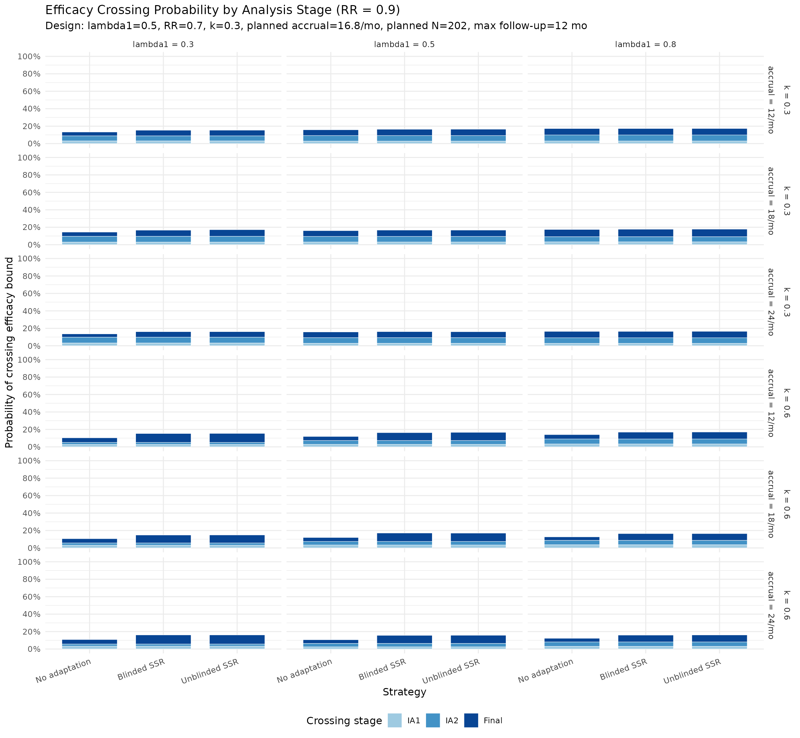

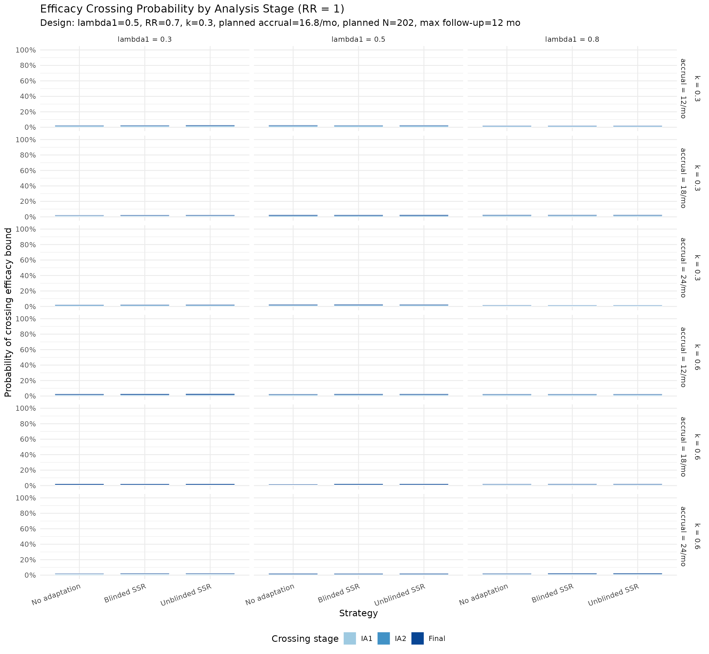

### Adapted sample size distribution

- `GeomHalfViolin`` ``<-`` ``ggplot2``::`[`ggproto`](https://ggplot2.tidyverse.org/reference/ggproto.html)`(`` `` ``"GeomHalfViolin"``,`` `` ``ggplot2``::`[`GeomViolin`](https://ggplot2.tidyverse.org/reference/Geom.html)`,`` `` draw_group ``=`` ``function``(``data``, ``...``, ``side`` ``=`` ``"l"``, ``draw_quantiles`` ``=`` ``NULL``)`` ``{`` `` ``data`` ``<-`` `[`transform`](https://rdrr.io/r/base/transform.html)`(`` `` ``data``,`` `` xminv ``=`` ``x`` ``-`` ``violinwidth`` ``*`` ``(``x`` ``-`` ``xmin``)``,`` `` xmaxv ``=`` ``x`` ``+`` ``violinwidth`` ``*`` ``(``xmax`` ``-`` ``x``)`` `` ``)`` `` ``newdata`` ``<-`` ``if`` ``(``side`` ``==`` ``"l"``)`` ``{`` `` `[`transform`](https://rdrr.io/r/base/transform.html)`(``data``, x ``=`` ``xminv``)``[`[`order`](https://rdrr.io/r/base/order.html)`(``data``$``y``)``, ``]`` `` ``}`` ``else`` ``{`` `` `[`transform`](https://rdrr.io/r/base/transform.html)`(``data``, x ``=`` ``xmaxv``)``[`[`order`](https://rdrr.io/r/base/order.html)`(``data``$``y``, decreasing ``=`` ``TRUE``)``, ``]`` `` ``}`` `` ``newdata`` ``<-`` `[`rbind`](https://rdrr.io/r/base/cbind.html)`(``newdata``[``1``, ``]``, ``newdata``, ``newdata``[`[`nrow`](https://rdrr.io/r/base/nrow.html)`(``newdata``)``, ``]``, ``newdata``[``1``, ``]``)`` `` ``ggplot2``:::``ggname``(`` `` ``"geom_half_violin"``,`` `` ``ggplot2``::`[`GeomPolygon`](https://ggplot2.tidyverse.org/reference/Geom.html)`$``draw_panel``(``newdata``, ``...``)`` `` ``)`` `` ``}`` ``)`` `` ``geom_half_violin`` ``<-`` ``function``(``mapping`` ``=`` ``NULL``, ``data`` ``=`` ``NULL``, ``stat`` ``=`` ``"ydensity"``,`` `` ``position`` ``=`` ``"identity"``, ``...``, ``side`` ``=`` `[`c`](https://rdrr.io/r/base/c.html)`(``"l"``, ``"r"``)``,`` `` ``trim`` ``=`` ``TRUE``, ``scale`` ``=`` ``"area"``, ``na.rm`` ``=`` ``FALSE``,`` `` ``show.legend`` ``=`` ``NA``, ``inherit.aes`` ``=`` ``TRUE``)`` ``{`` `` ``side`` ``<-`` `[`match.arg`](https://rdrr.io/r/base/match.arg.html)`(``side``)`` `` ``ggplot2``::`[`layer`](https://ggplot2.tidyverse.org/reference/layer.html)`(`` `` data ``=`` ``data``,`` `` mapping ``=`` ``mapping``,`` `` stat ``=`` ``stat``,`` `` geom ``=`` ``GeomHalfViolin``,`` `` position ``=`` ``position``,`` `` show.legend ``=`` ``show.legend``,`` `` inherit.aes ``=`` ``inherit.aes``,`` `` params ``=`` `[`list`](https://rdrr.io/r/base/list.html)`(``side ``=`` ``side``, trim ``=`` ``trim``, scale ``=`` ``scale``, na.rm ``=`` ``na.rm``, ``...``)`` `` ``)`` ``}`` `` ``for`` ``(``rr_val`` ``in`` ``rr_values``)`` ``{`` `` `[`cat`](https://rdrr.io/r/base/cat.html)`(`[`sprintf`](https://rdrr.io/r/base/sprintf.html)`(``"\n\n#### RR = %s\n\n"``, ``rr_val``)``)`` `` `` ``violin_dt`` ``<-`` ``dt``[``rr_true`` ``==`` ``rr_val`` ``&`` ``strategy`` `[`%in%`](https://rdrr.io/r/base/match.html)` `[`c`](https://rdrr.io/r/base/c.html)`(``"Blinded SSR"``, ``"Unblinded SSR"``)``]`` `` ``violin_dt``[``, ``strategy`` ``:=`` `[`factor`](https://rdrr.io/r/base/factor.html)`(``strategy``, levels ``=`` `[`c`](https://rdrr.io/r/base/c.html)`(``"Unblinded SSR"``, ``"Blinded SSR"``)``)``]`` `` ``violin_dt``[``, ``lambda1_label`` ``:=`` `[`paste0`](https://rdrr.io/r/base/paste.html)`(``"lambda1 = "``, ``lambda1_true``)``]`` `` ``violin_dt``[``, ``k_label`` ``:=`` `[`paste0`](https://rdrr.io/r/base/paste.html)`(``"k = "``, ``k_true``)``]`` `` ``violin_dt``[``, ``accrual_label`` ``:=`` `[`factor`](https://rdrr.io/r/base/factor.html)`(``accrual_true``)``]`` `` `` ``p`` ``<-`` `[`ggplot`](https://ggplot2.tidyverse.org/reference/ggplot.html)`(``violin_dt``, `[`aes`](https://ggplot2.tidyverse.org/reference/aes.html)`(``x ``=`` ``accrual_label``, y ``=`` ``n_adapted``)``)`` ``+`` `` ``geom_half_violin``(`` `` data ``=`` ``violin_dt``[``strategy`` ``==`` ``"Unblinded SSR"``]``,`` `` `[`aes`](https://ggplot2.tidyverse.org/reference/aes.html)`(``fill ``=`` ``strategy``, group ``=`` `[`interaction`](https://rdrr.io/r/base/interaction.html)`(``accrual_label``, ``strategy``)``)``,`` `` side ``=`` ``"l"``, alpha ``=`` ``0.7``, scale ``=`` ``"width"``, trim ``=`` ``FALSE``, color ``=`` ``NA`` `` ``)`` ``+`` `` ``geom_half_violin``(`` `` data ``=`` ``violin_dt``[``strategy`` ``==`` ``"Blinded SSR"``]``,`` `` `[`aes`](https://ggplot2.tidyverse.org/reference/aes.html)`(``fill ``=`` ``strategy``, group ``=`` `[`interaction`](https://rdrr.io/r/base/interaction.html)`(``accrual_label``, ``strategy``)``)``,`` `` side ``=`` ``"r"``, alpha ``=`` ``0.7``, scale ``=`` ``"width"``, trim ``=`` ``FALSE``, color ``=`` ``NA`` `` ``)`` ``+`` `` `[`geom_hline`](https://ggplot2.tidyverse.org/reference/geom_abline.html)`(``yintercept ``=`` ``n_planned``, linetype ``=`` ``"dashed"``, alpha ``=`` ``0.5``)`` ``+`` `` `[`geom_hline`](https://ggplot2.tidyverse.org/reference/geom_abline.html)`(``yintercept ``=`` ``n_max``, linetype ``=`` ``"dotted"``, color ``=`` ``"red"``,`` `` alpha ``=`` ``0.5``)`` ``+`` `` `[`scale_fill_manual`](https://ggplot2.tidyverse.org/reference/scale_manual.html)`(`` `` values ``=`` `[`c`](https://rdrr.io/r/base/c.html)`(``"Unblinded SSR"`` ``=`` ``"#084594"``, ``"Blinded SSR"`` ``=`` ``"#9ecae1"``)``,`` `` breaks ``=`` `[`c`](https://rdrr.io/r/base/c.html)`(``"Unblinded SSR"``, ``"Blinded SSR"``)`` `` ``)`` ``+`` `` `[`facet_grid`](https://ggplot2.tidyverse.org/reference/facet_grid.html)`(``k_label`` ``~`` ``lambda1_label``)`` ``+`` `` `[`scale_y_continuous`](https://ggplot2.tidyverse.org/reference/scale_continuous.html)`(``breaks ``=`` `[`seq`](https://rdrr.io/r/base/seq.html)`(``0``, ``n_max`` ``+`` ``50``, ``50``)``)`` ``+`` `` `[`labs`](https://ggplot2.tidyverse.org/reference/labs.html)`(`` `` title ``=`` `[`sprintf`](https://rdrr.io/r/base/sprintf.html)`(``"Adapted Sample Size at RR = %s"``, ``rr_val``)``,`` `` subtitle ``=`` `[`sprintf`](https://rdrr.io/r/base/sprintf.html)`(``"Split violins: Unblinded (left) vs Blinded (right) SSR | Dashed=planned N (%d), Red dotted=cap (%d) | %s"``,`` `` ``n_planned``, ``n_max``, ``design_note``)``,`` `` x ``=`` ``"Accrual Rate (pts/month)"``, y ``=`` ``"Adapted N"``, fill ``=`` ``"Strategy"`` `` ``)`` ``+`` `` `[`theme_minimal`](https://ggplot2.tidyverse.org/reference/ggtheme.html)`(``base_size ``=`` ``12``)`` ``+`` `` `[`theme`](https://ggplot2.tidyverse.org/reference/theme.html)`(``legend.position ``=`` ``"bottom"``)`` `` `[`print`](https://rdrr.io/r/base/print.html)`(``p``)`` `` `[`cat`](https://rdrr.io/r/base/cat.html)`(``"\n\n"``)`` ``}`
- RR = 0.5
- RR = 0.6
- RR = 0.7
- RR = 0.8
- RR = 0.9
- RR = 1


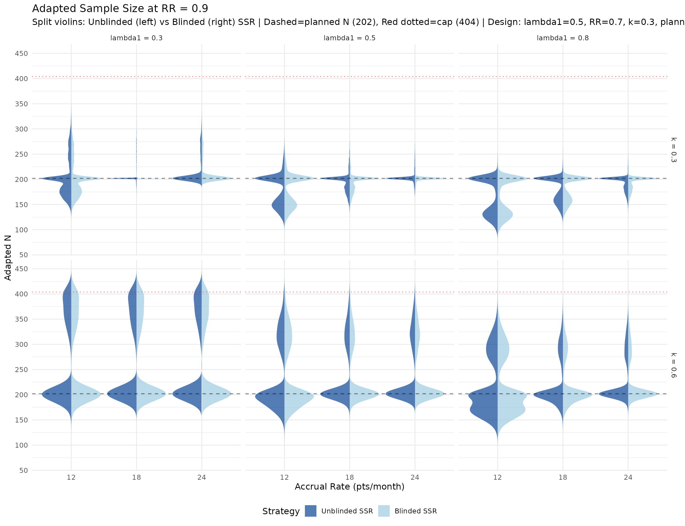

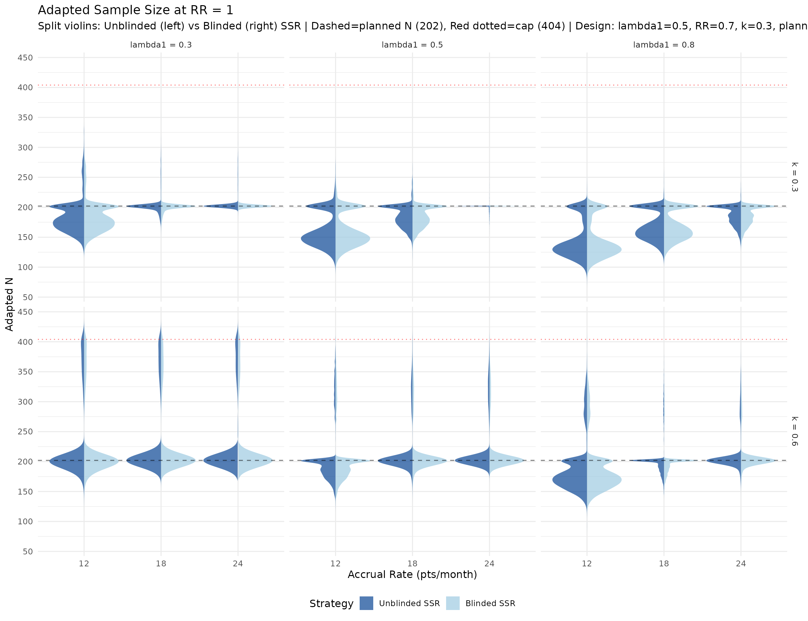

### Final information at final analysis by strategy

- `rr_values_all`` ``<-`` `[`sort`](https://rdrr.io/r/base/sort.html)`(`[`unique`](https://rdrr.io/r/base/unique.html)`(``scenarios``$``rr_true``)``)`` `` ``for`` ``(``rr_val`` ``in`` ``rr_values_all``)`` ``{`` `` `[`cat`](https://rdrr.io/r/base/cat.html)`(`[`sprintf`](https://rdrr.io/r/base/sprintf.html)`(``"\n\n#### RR = %s\n\n"``, ``rr_val``)``)`` `` `` ``info_dt`` ``<-`` ``dt``[``rr_true`` ``==`` ``rr_val`` ``&`` ``!`[`is.na`](https://rdrr.io/r/base/NA.html)`(``if_final``)``]`` `` ``if`` ``(`[`nrow`](https://rdrr.io/r/base/nrow.html)`(``info_dt``)`` ``==`` ``0``)`` ``{`` `` `[`cat`](https://rdrr.io/r/base/cat.html)`(``"No trials reached final analysis for this RR value.\n\n"``)`` `` ``next`` `` ``}`` `` ``info_dt``[``, ``strategy`` ``:=`` `[`factor`](https://rdrr.io/r/base/factor.html)`(`` `` ``strategy``,`` `` levels ``=`` `[`c`](https://rdrr.io/r/base/c.html)`(``"No adaptation"``, ``"Blinded SSR"``, ``"Unblinded SSR"``)`` `` ``)``]`` `` ``info_dt``[``, ``lambda1_label`` ``:=`` `[`paste0`](https://rdrr.io/r/base/paste.html)`(``"lambda1 = "``, ``lambda1_true``)``]`` `` ``info_dt``[``, ``k_label`` ``:=`` `[`paste0`](https://rdrr.io/r/base/paste.html)`(``"k = "``, ``k_true``)``]`` `` `` ``p`` ``<-`` `[`ggplot`](https://ggplot2.tidyverse.org/reference/ggplot.html)`(`` `` ``info_dt``,`` `` `[`aes`](https://ggplot2.tidyverse.org/reference/aes.html)`(``x ``=`` `[`factor`](https://rdrr.io/r/base/factor.html)`(``accrual_true``)``, y ``=`` ``100`` ``*`` ``if_final``, fill ``=`` ``strategy``)`` `` ``)`` ``+`` `` `[`geom_violin`](https://ggplot2.tidyverse.org/reference/geom_violin.html)`(``position ``=`` `[`position_dodge`](https://ggplot2.tidyverse.org/reference/position_dodge.html)`(``width ``=`` ``0.85``)``, alpha ``=`` ``0.7``,`` `` scale ``=`` ``"width"``, trim ``=`` ``FALSE``)`` ``+`` `` `[`geom_hline`](https://ggplot2.tidyverse.org/reference/geom_abline.html)`(``yintercept ``=`` ``100``, linetype ``=`` ``"dashed"``, color ``=`` ``"darkgreen"``,`` `` alpha ``=`` ``0.6``)`` ``+`` `` `[`facet_grid`](https://ggplot2.tidyverse.org/reference/facet_grid.html)`(``k_label`` ``~`` ``lambda1_label``)`` ``+`` `` `[`labs`](https://ggplot2.tidyverse.org/reference/labs.html)`(`` `` title ``=`` `[`sprintf`](https://rdrr.io/r/base/sprintf.html)`(``"Final Information Fraction at RR = %s"``, ``rr_val``)``,`` `` subtitle ``=`` `[`paste`](https://rdrr.io/r/base/paste.html)`(`` `` ``"Among trials reaching final analysis; dashed line = 100% target |"``,`` `` ``design_note`` `` ``)``,`` `` x ``=`` ``"Accrual Rate (pts/month)"``,`` `` y ``=`` ``"Final information fraction (%)"``,`` `` fill ``=`` ``"Strategy"`` `` ``)`` ``+`` `` `[`theme_minimal`](https://ggplot2.tidyverse.org/reference/ggtheme.html)`(``base_size ``=`` ``12``)`` ``+`` `` `[`theme`](https://ggplot2.tidyverse.org/reference/theme.html)`(``legend.position ``=`` ``"bottom"``)`` `` `[`print`](https://rdrr.io/r/base/print.html)`(``p``)`` `` `[`cat`](https://rdrr.io/r/base/cat.html)`(``"\n\n"``)`` ``}`
- RR = 0.5
- RR = 0.6
- RR = 0.7
- RR = 0.8
- RR = 0.9
- RR = 1
- RR = 1.1

    #> Warning: Groups with fewer than two datapoints have been dropped.
    #> ℹ Set `drop = FALSE` to consider such groups for position adjustment purposes.
    #> Groups with fewer than two datapoints have been dropped.
    #> ℹ Set `drop = FALSE` to consider such groups for position adjustment purposes.
    #> Groups with fewer than two datapoints have been dropped.
    #> ℹ Set `drop = FALSE` to consider such groups for position adjustment purposes.
    #> Groups with fewer than two datapoints have been dropped.
    #> ℹ Set `drop = FALSE` to consider such groups for position adjustment purposes.
    #> Groups with fewer than two datapoints have been dropped.
    #> ℹ Set `drop = FALSE` to consider such groups for position adjustment purposes.
    #> Groups with fewer than two datapoints have been dropped.
    #> ℹ Set `drop = FALSE` to consider such groups for position adjustment purposes.
    #> Warning: Computation failed in `stat_ydensity()`.
    #> Caused by error in `$<-.data.frame`:
    #> ! replacement has 1 row, data has 0
    #> Warning: Groups with fewer than two datapoints have been dropped.
    #> ℹ Set `drop = FALSE` to consider such groups for position adjustment purposes.
    #> Groups with fewer than two datapoints have been dropped.
    #> ℹ Set `drop = FALSE` to consider such groups for position adjustment purposes.
    #> Groups with fewer than two datapoints have been dropped.
    #> ℹ Set `drop = FALSE` to consider such groups for position adjustment purposes.
    #> Warning: Computation failed in `stat_ydensity()`.
    #> Caused by error in `$<-.data.frame`:
    #> ! replacement has 1 row, data has 0
    #> Warning: Groups with fewer than two datapoints have been dropped.
    #> ℹ Set `drop = FALSE` to consider such groups for position adjustment purposes.
    #> Groups with fewer than two datapoints have been dropped.
    #> ℹ Set `drop = FALSE` to consider such groups for position adjustment purposes.
    #> Groups with fewer than two datapoints have been dropped.
    #> ℹ Set `drop = FALSE` to consider such groups for position adjustment purposes.
    #> Warning: Computation failed in `stat_ydensity()`.
    #> Caused by error in `$<-.data.frame`:
    #> ! replacement has 1 row, data has 0
    #> Warning: Groups with fewer than two datapoints have been dropped.
    #> ℹ Set `drop = FALSE` to consider such groups for position adjustment purposes.
    #> Groups with fewer than two datapoints have been dropped.
    #> ℹ Set `drop = FALSE` to consider such groups for position adjustment purposes.
    #> Groups with fewer than two datapoints have been dropped.
    #> ℹ Set `drop = FALSE` to consider such groups for position adjustment purposes.
    #> Warning in min(x): no non-missing arguments to min; returning Inf
    #> Warning in max(x): no non-missing arguments to max; returning -Inf
    #> Warning in min(x): no non-missing arguments to min; returning Inf
    #> Warning in max(x): no non-missing arguments to max; returning -Inf
    #> Warning in min(x): no non-missing arguments to min; returning Inf
    #> Warning in max(x): no non-missing arguments to max; returning -Inf

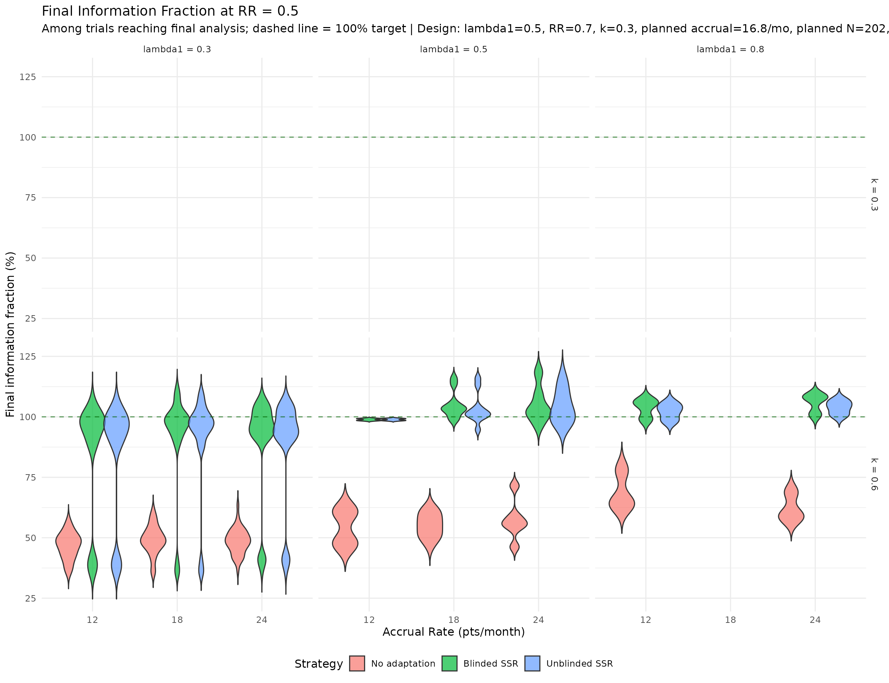

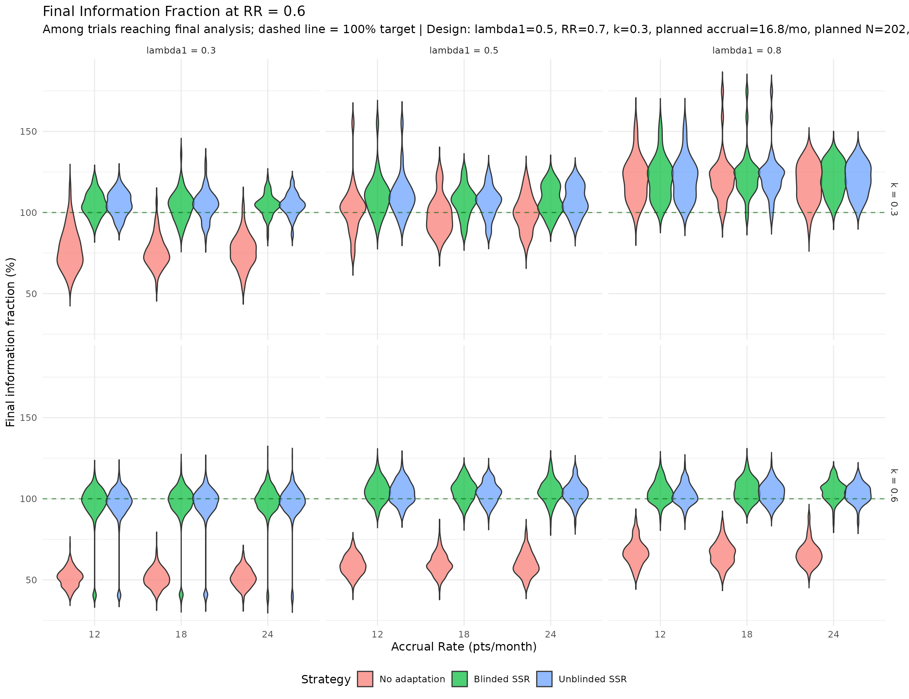

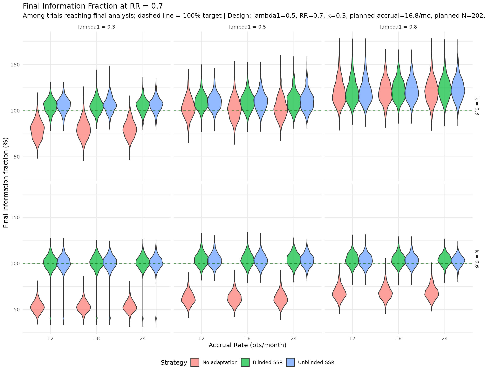

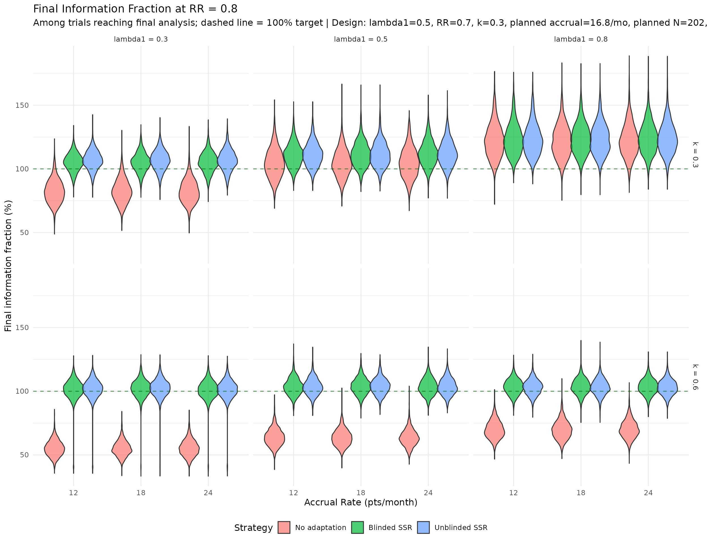

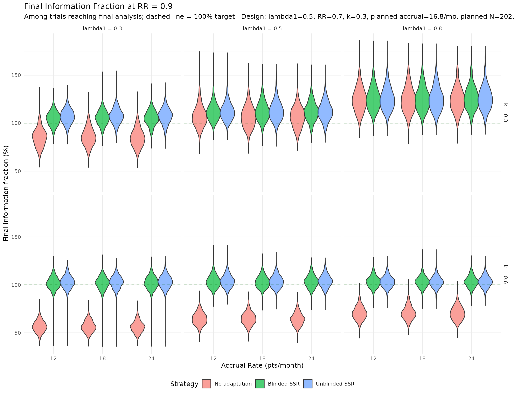

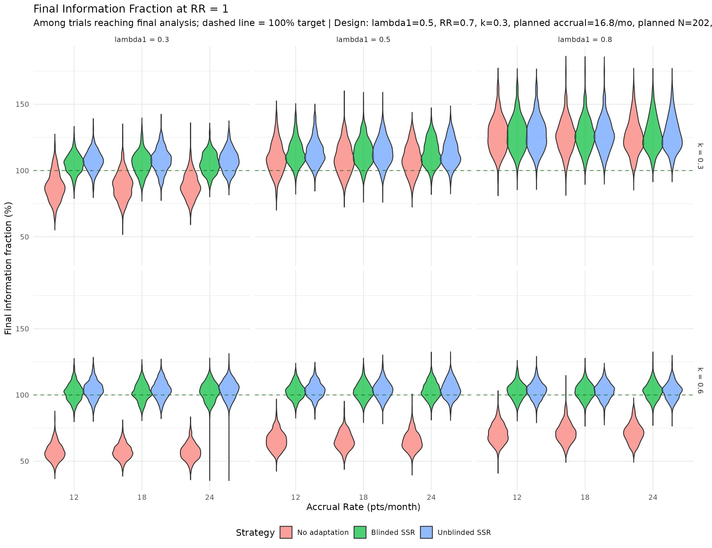

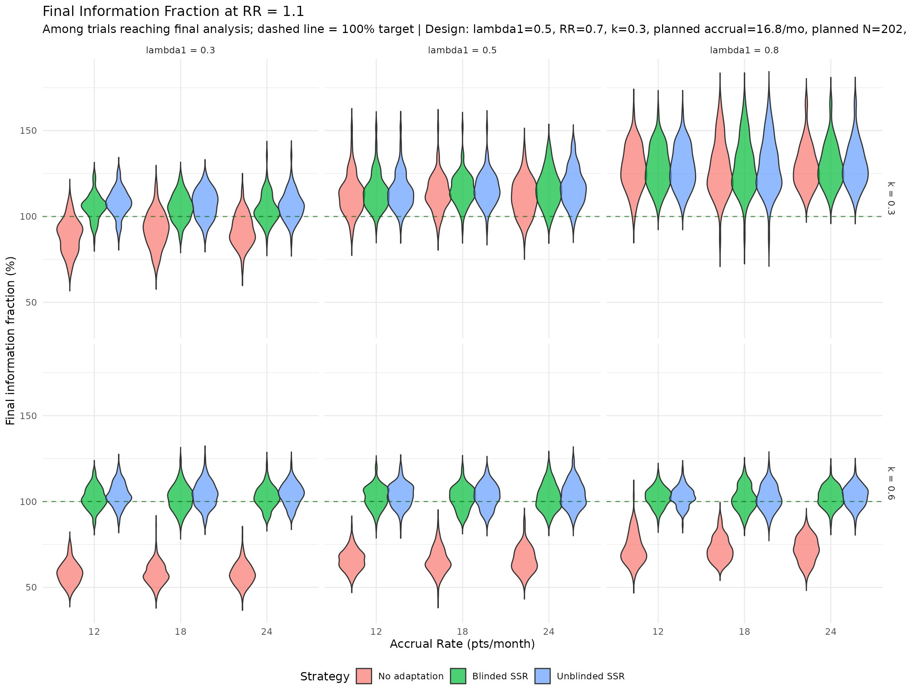

``` r
rr_diag <- dt[rr_true %in% c(0.7, 0.8) & strategy != "No adaptation", .(
  `Power` = mean(reject, na.rm = TRUE),
  `Futility stop (%)` = 100 * mean(futility, na.rm = TRUE),
  `Futility IA1 (%)` = 100 * mean(futility_stage == "IA1", na.rm = TRUE),
  `Futility IA2 (%)` = 100 * mean(futility_stage == "IA2", na.rm = TRUE),
  `Adapted (%)` = 100 * mean(adapted, na.rm = TRUE),
  `Mean adapted N` = mean(n_adapted, na.rm = TRUE),
  `Mean final IF (%)` = 100 * mean(if_final, na.rm = TRUE),
  `Mean final month` = mean(final_time, na.rm = TRUE)
), by = .(rr_true, strategy)]

rr_diag |>
  as.data.frame() |>
  dplyr::mutate(
    across(where(is.numeric), ~ round(.x, 2))
  ) |>
  gt() |>
  tab_header(
    title = "Diagnostics for RR = 0.7 vs RR = 0.8",
    subtitle = "Assessing whether lower adaptation at RR = 0.8 is driven by futility stopping"
  )
```

| Diagnostics for RR = 0.7 vs RR = 0.8                                          |               |       |                   |                  |                  |             |                |                   |                  |
|-------------------------------------------------------------------------------|---------------|-------|-------------------|------------------|------------------|-------------|----------------|-------------------|------------------|
| Assessing whether lower adaptation at RR = 0.8 is driven by futility stopping |               |       |                   |                  |                  |             |                |                   |                  |
| rr_true                                                                       | strategy      | Power | Futility stop (%) | Futility IA1 (%) | Futility IA2 (%) | Adapted (%) | Mean adapted N | Mean final IF (%) | Mean final month |
| 0.7                                                                           | Blinded SSR   | 0.91  | 6.03              | 5.41             | 0.62             | 18.34       | 224.35         | 105.73            | 30.73            |
| 0.7                                                                           | Unblinded SSR | 0.91  | 6.03              | 5.41             | 0.62             | 18.27       | 224.16         | 105.46            | 30.68            |
| 0.8                                                                           | Blinded SSR   | 0.56  | 27.06             | 22.10            | 4.96             | 32.14       | 233.62         | 107.22            | 29.52            |
| 0.8                                                                           | Unblinded SSR | 0.56  | 27.06             | 22.10            | 4.96             | 32.13       | 233.85         | 107.43            | 29.56            |

### Calendar and information at each analysis

The plots below use split (side-by-side) violin distributions for and ,
with vertical panels for IA1, IA2, and Final analysis. Panels use free
y-scales.

``` r
time_long <- dt[strategy == "No adaptation" & rr_true == rr_plan, .(
  lambda1_true, k_true, accrual_true,
  IA1 = ia1_time, IA2 = ia2_time, Final = final_time
)]
time_long <- data.table::melt(
  time_long,
  id.vars = c("lambda1_true", "k_true", "accrual_true"),
  variable.name = "analysis",
  value.name = "calendar_time"
)
time_long[, analysis := factor(analysis, levels = c("IA1", "IA2", "Final"))]
time_long[, lambda1_label := paste0("lambda1 = ", lambda1_true)]
time_long[, k_label := paste0("k = ", k_true)]

planned_time_df <- data.frame(
  analysis = factor(c("IA1", "IA2", "Final"), levels = c("IA1", "IA2", "Final")),
  planned_time = c(analysis_times_plan[1], analysis_times_plan[2], analysis_times_plan[3])
)

ggplot(time_long,
       aes(x = factor(accrual_true), y = calendar_time, fill = factor(k_true))) +
  geom_violin(position = position_dodge(width = 0.85),
              alpha = 0.7, scale = "width", trim = FALSE) +
  geom_hline(
    data = planned_time_df,
    aes(yintercept = planned_time),
    linetype = "dashed", color = "darkgreen", inherit.aes = FALSE
  ) +
  facet_grid(analysis ~ lambda1_label, scales = "free_y") +
  scale_fill_manual(values = c("0.3" = "#6BAED6", "0.6" = "#2171B5")) +
  labs(
    title = "Calendar Time Distribution by Analysis (RR = 0.7, No adaptation)",
    subtitle = paste("Dashed green = planned analysis time |", design_note),
    x = "Accrual rate (pts/month)",
    y = "Calendar month",
    fill = "k"
  ) +
  theme_minimal(base_size = 12) +
  theme(legend.position = "bottom")
#> Warning: Removed 79937 rows containing non-finite outside the scale range
#> (`stat_ydensity()`).
```


``` r
if_long <- dt[strategy == "No adaptation" & rr_true == rr_plan, .(
  lambda1_true, k_true, accrual_true,
  IA1 = 100 * if_ia1, IA2 = 100 * if_ia2, Final = 100 * if_final
)]
if_long <- data.table::melt(
  if_long,
  id.vars = c("lambda1_true", "k_true", "accrual_true"),
  variable.name = "analysis",
  value.name = "info_fraction"
)
if_long[, analysis := factor(analysis, levels = c("IA1", "IA2", "Final"))]
if_long[, lambda1_label := paste0("lambda1 = ", lambda1_true)]

planned_if_df <- data.frame(
  analysis = factor(c("IA1", "IA2", "Final"), levels = c("IA1", "IA2", "Final")),
  planned_if = 100 * c(planned_timing[1], planned_timing[2], 1)
)

ggplot(if_long,
       aes(x = factor(accrual_true), y = info_fraction, fill = factor(k_true))) +
  geom_violin(position = position_dodge(width = 0.85),
              alpha = 0.7, scale = "width", trim = FALSE) +
  geom_hline(
    data = planned_if_df,
    aes(yintercept = planned_if),
    linetype = "dashed", color = "darkgreen", inherit.aes = FALSE
  ) +
  facet_grid(analysis ~ lambda1_label, scales = "free_y") +
  scale_fill_manual(values = c("0.3" = "#6BAED6", "0.6" = "#2171B5")) +
  labs(
    title = "Information Fraction Distribution by Analysis (RR = 0.7, No adaptation)",
    subtitle = paste("Dashed green = planned information fraction |", design_note),
    x = "Accrual rate (pts/month)",
    y = "Information fraction (%)",
    fill = "k"
  ) +
  theme_minimal(base_size = 12) +
  theme(legend.position = "bottom")
#> Warning: Removed 79937 rows containing non-finite outside the scale range
#> (`stat_ydensity()`).
```


## Discussion

### Key findings

1.  **Type I error control.** Under the null (RR \geq 1.0), all
    strategies maintain the one-sided Type I error near or below 2.5%.
    For RR = 1.0, futility stopping is disabled to document Type I error
    under the non-binding futility rule.

2.  **Largest no-adaptation power deficit.** At planned RR = 0.7, the
    largest deficit from the 90% target under no adaptation is
    concentrated in scenarios with lower event rates and larger
    dispersion (see the “Power Shortfall Without Adaptation” table).

3.  **IA2-only adaptation recovers power where information is low.** In
    lower event-rate / higher-dispersion scenarios, IA2 adaptation
    raises final information and materially improves power versus no
    adaptation, while still preserving IA1-only monitoring (see “Power
    by nuisance scenario” and “Final information at final analysis by
    strategy”).

### Information-based interim timing

By triggering interims when blinded information reaches the target
fraction (rather than at fixed calendar times), the information
fractions are stabilized across scenarios. This prevents the anomaly
where high event rates cause excessive information at a fixed calendar
time, leading to overspending or premature decisions.

In this update, IA2 remains information-based while adaptation uses a
lead-time cutoff of at least 2 months before predicted enrollment close.

### Futility at low information

Futility assessment is deferred when the observed information fraction
is below 30%. The spending function approach uses \text{usTime} =
\text{lsTime} = \min(t\_{\text{planned}}, t\_{\text{actual}}) to cap
spending.

IA1 includes efficacy/futility monitoring but does not permit SSR. SSR
is attempted only at IA2. For operational feasibility, SSR uses an
adaptation cutoff at \$(, - 2 months), with enrollment fraction at or
below 100%.

When a trial stops early for futility, the reported final sample size
includes subjects enrolled by the stop analysis date plus 2 months to
reflect enrollment that continues during analysis/decision
implementation.

Futility and efficacy crossing percentages are reported separately for
IA1 and IA2 in the main simulation table.

### Blinded information fallback

When blinded information cannot be estimated at a candidate cut time,
the timing search falls back to unblinded information from
[`mutze_test()`](https://keaven.github.io/gsDesignNB/reference/mutze_test.md).
If both blinded and unblinded information fail, a user-requested
constant fallback value of `100` is used. Fallback frequencies are
reported in the simulation table.

## References

Friede, Tim, and Heinz Schmidli. 2010. “Blinded Sample Size Reestimation
with Negative Binomial Counts in Superiority and Non-Inferiority
Trials.” *Methods of Information in Medicine* 49 (06): 618–24.
<https://doi.org/10.3414/ME09-02-0060>.
