# SSR simulation study

``` r
library(gsDesignNB)
library(gsDesign)
library(data.table)
library(MASS)
library(ggplot2)
library(dplyr)
library(gt)
library(DT)
library(future)
library(future.apply)
```

## Introduction

This vignette presents a simulation study evaluating **sample size
re-estimation (SSR)** for group sequential trials with negative binomial
recurrent event endpoints. We compare three strategies:

1.  **No adaptation** – the trial proceeds with the planned sample size.
2.  **Blinded SSR** (Friede and Schmidli 2010) – nuisance parameters are
    re-estimated from pooled (treatment-blinded) interim data.
3.  **Unblinded SSR** – nuisance parameters are re-estimated from
    treatment-specific interim data.

For hypothesis testing, all interim and final analyses use the
[`mutze_test()`](https://keaven.github.io/gsDesignNB/reference/mutze_test.md)
Wald statistic. This test underpins both efficacy/futility crossing
decisions and the unblinded-information fallback used when blinded
information estimation fails.

*Note:* Much of the simulation code in this vignette was generated with
the assistance of a large language model (LLM) and then reviewed and
refined by the package authors.

Interim analyses are triggered when the **blinded statistical
information** reaches the planned fraction of the target, rather than at
fixed calendar times. This ensures analyses occur at comparable
information levels regardless of the true nuisance parameters.

## Planned trial design

``` r
lambda1_plan      <- 0.5
rr_plan           <- 0.7
lambda2_plan      <- lambda1_plan * rr_plan
k_plan            <- 0.5
power_plan        <- 0.9
alpha_plan        <- 0.025
accrual_rate_plan <- 30
accrual_scenario_plan <- 18
accrual_dur_plan  <- 12
max_followup      <- 12
trial_dur_plan    <- accrual_dur_plan + max_followup
event_gap_val     <- 20 / 30.4375  # 20-day gap between events
analysis_times_plan <- c(9, 14, 24)  # Calendar times under plan
```

### Fixed design

``` r
design_plan <- sample_size_nbinom(
  lambda1 = lambda1_plan, lambda2 = lambda2_plan,
  dispersion = k_plan, power = power_plan, alpha = alpha_plan,
  accrual_rate = accrual_rate_plan,
  accrual_duration = accrual_dur_plan,
  trial_duration = trial_dur_plan,
  max_followup = max_followup,
  event_gap = event_gap_val
)
cat("Fixed-design sample size:", design_plan$n_total, "\n")
#> Fixed-design sample size: 258
```

### Group sequential design

We use a 3-analysis group sequential design with HSD efficacy spending
and Cauchy futility spending calibrated so the futility bounds
correspond to approximately RR = 0.9 at each analysis.

Specifically, `sfl = sfCauchy` with `sflpar = c(0.4, 0.75, 0.56, 0.63)`
gives planned lower bounds that are close to declaring futility when the
observed RR is greater than about 0.9 at either interim. Because the
design uses non-binding futility (`test.type = 4`), ignoring a
lower-bound crossing does not invalidate the final efficacy decision,
which is still based on upper boundary control.

``` r
gs_plan <- design_plan |>
  gsNBCalendar(
    k = 3, test.type = 4, alpha = alpha_plan,
    sfu = sfHSD, sfupar = -2,
    sfl = sfCauchy, sflpar = c(0.4, 0.75, 0.56, 0.63),
    analysis_times = analysis_times_plan
  ) |>
  gsDesignNB::toInteger()

n_planned <- gs_plan$n_total[gs_plan$k]
target_info <- gs_plan$n.I[gs_plan$k]
planned_timing <- gs_plan$timing
gs_inflation <- n_planned / design_plan$n_total
accrual_rate_plan_eff <- n_planned / accrual_dur_plan
design_note <- paste0(
  "Design: lambda1=", lambda1_plan,
  ", RR=", rr_plan,
  ", k=", k_plan,
  ", planned accrual=", round(accrual_rate_plan_eff, 1), "/mo",
  ", planned N=", n_planned,
  ", max follow-up=", max_followup, " mo"
)
```

For **Type I sensitivity** we also calendar a group-sequential design at
**one-sided \alpha = 0.02** (same spending and nuisance assumptions as
above). Its planned maximum enrollment is **330** subjects (fixed NB
stage **274** before GS integer rounding; GS inflation factor
**1.204**). That design is used **only** for the RR = 1 non-binding Type
I tables later in this vignette; **all power** summaries still use the
\alpha = 0.025 design.

The group sequential inflation factor is 1.209, giving a planned sample
size of 312 (up from the fixed-design 258) with an effective accrual
rate of 26 patients per month.

``` r
gsBoundSummary(gs_plan,
  deltaname = "RR", logdelta = TRUE,
  Nname = "Information", timename = "Month",
  digits = 4, ddigits = 2
) |>
  as.data.frame() |>
  gt() |>
  tab_header(
    title = "Planned Group Sequential Design",
    subtitle = design_note
  ) |>
  tab_footnote(
    "Cauchy futility spending gives planned futility near observed RR > 0.9 at IA1/IA2; lower bounds are non-binding."
  ) |>
  tab_footnote(
    footnote = sprintf(
      "Planned cumulative sample size: IA1 = %.0f, IA2 = %.0f, Final = %.0f.",
      gs_plan$n_total[1], gs_plan$n_total[2], gs_plan$n_total[3]
    )
  )
```

| Planned Group Sequential Design                                                                                   |                    |          |          |
|-------------------------------------------------------------------------------------------------------------------|--------------------|----------|----------|
| Design: lambda1=0.5, RR=0.7, k=0.5, planned accrual=26/mo, planned N=312, max follow-up=12 mo                     |                    |          |          |
| Analysis                                                                                                          | Value              | Efficacy | Futility |
| IA 1: 41%                                                                                                         | Z                  | 2.5732   | 0.7060   |
| Information: 41.35                                                                                                | p (1-sided)        | 0.0050   | 0.2401   |
| Month: 9                                                                                                          | ~RR at bound       | 0.6701   | 0.8960   |
|                                                                                                                   | P(Cross) if RR=1   | 0.0050   | 0.7599   |
|                                                                                                                   | P(Cross) if RR=0.7 | 0.3897   | 0.0563   |
| IA 2: 77%                                                                                                         | Z                  | 2.2790   | 1.0491   |
| Information: 76.87                                                                                                | p (1-sided)        | 0.0113   | 0.1471   |
| Month: 14                                                                                                         | ~RR at bound       | 0.7711   | 0.8872   |
|                                                                                                                   | P(Cross) if RR=1   | 0.0138   | 0.8940   |
|                                                                                                                   | P(Cross) if RR=0.7 | 0.7984   | 0.0636   |
| Final                                                                                                             | Z                  | 2.0877   | 2.0877   |
| Information: 99.93                                                                                                | p (1-sided)        | 0.0184   | 0.0184   |
| Month: 24                                                                                                         | ~RR at bound       | 0.8115   | 0.8115   |
|                                                                                                                   | P(Cross) if RR=1   | 0.0221   | 0.9779   |
|                                                                                                                   | P(Cross) if RR=0.7 | 0.9018   | 0.0982   |
| Cauchy futility spending gives planned futility near observed RR \> 0.9 at IA1/IA2; lower bounds are non-binding. |                    |          |          |
| Planned cumulative sample size: IA1 = 129, IA2 = 240, Final = 312.                                                |                    |          |          |

### Group sequential sample size under each nuisance scenario

The figure below shows how the required group sequential sample size and
monthly enrollment rate vary with the control rate \lambda_1 and
dispersion k. Since the sample size does not depend on the enrollment
pace (accrual rate only scales enrollment duration), we show two lines –
one per k value – with \lambda_1 on the horizontal axis. The planned
design assumptions (\lambda_1 = 0.5, k = 0.5) are marked with a dashed
line.

``` r
lambda1_seq <- seq(0.2, 1.0, by = 0.1)
gs_n_grid <- expand.grid(
  lambda1_true = lambda1_seq,
  k_true = c(0.5, 1.0),
  stringsAsFactors = FALSE
)

gs_n_grid$GS_N <- sapply(seq_len(nrow(gs_n_grid)), function(i) {
  fixed_i <- tryCatch(
    sample_size_nbinom(
      lambda1 = gs_n_grid$lambda1_true[i],
      lambda2 = gs_n_grid$lambda1_true[i] * rr_plan,
      dispersion = gs_n_grid$k_true[i],
      power = power_plan, alpha = alpha_plan,
      accrual_rate = accrual_rate_plan,
      accrual_duration = accrual_dur_plan,
      trial_duration = trial_dur_plan,
      max_followup = max_followup,
      event_gap = event_gap_val
    ),
    error = function(e) NULL
  )
  if (is.null(fixed_i)) return(NA_real_)
  tryCatch({
    g <- gsNBCalendar(fixed_i, k = 3, test.type = 4, alpha = alpha_plan,
      sfu = sfHSD, sfupar = -2,
      sfl = sfCauchy, sflpar = c(0.4, 0.75, 0.56, 0.63),
      analysis_times = analysis_times_plan) |>
      gsDesignNB::toInteger()
    g$n_total[g$k]
  }, error = function(e) NA_real_)
})

gs_n_grid$Accrual_rate <- gs_n_grid$GS_N / accrual_dur_plan
gs_n_grid$k_label <- paste0("k = ", gs_n_grid$k_true)
gs_n_grid$N_label <- round(gs_n_grid$GS_N)
gs_n_grid$Rate_label <- round(gs_n_grid$Accrual_rate)

plot_n <- ggplot(gs_n_grid, aes(x = lambda1_true, y = GS_N,
                                color = k_label, linetype = k_label)) +
  geom_line(linewidth = 1) +
  geom_point(size = 2) +
  geom_text(aes(label = N_label), vjust = -0.8, size = 3.2, show.legend = FALSE) +
  geom_vline(xintercept = lambda1_plan, linetype = "dashed", alpha = 0.4) +
  labs(x = expression(lambda[1]), y = "GS sample size (N)",
       color = NULL, linetype = NULL) +
  theme_minimal(base_size = 13) +
  theme(legend.position = "bottom")

plot_rate <- ggplot(gs_n_grid, aes(x = lambda1_true, y = Accrual_rate,
                                   color = k_label, linetype = k_label)) +
  geom_line(linewidth = 1) +
  geom_point(size = 2) +
  geom_text(aes(label = Rate_label), vjust = -0.8, size = 3.2, show.legend = FALSE) +
  geom_vline(xintercept = lambda1_plan, linetype = "dashed", alpha = 0.4) +
  labs(x = expression(lambda[1]), y = "Enrollment rate (pts/mo)",
       color = NULL, linetype = NULL) +
  theme_minimal(base_size = 13) +
  theme(legend.position = "bottom")

gridExtra::grid.arrange(plot_n, plot_rate, ncol = 2,
  top = grid::textGrob(
    "GS Sample Size and Enrollment Rate by Control Rate and Dispersion",
    gp = grid::gpar(fontsize = 14, fontface = "bold")
  )
)
```

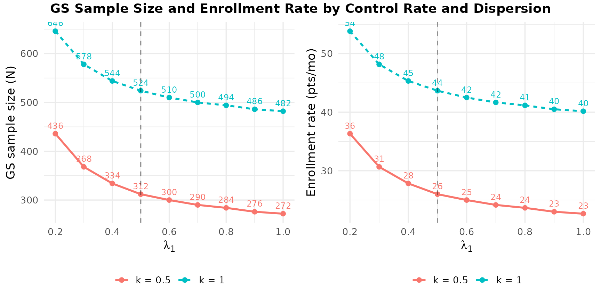

Across the range of \lambda_1 and k values considered, the required
group sequential sample size ranges from 272 to 646. Higher dispersion
(k = 1.0) consistently requires more subjects than k = 0.5, while higher
control rates reduce the required N because each subject contributes
more information. This wide range highlights why sample size
re-estimation can be valuable when nuisance parameters are uncertain.

### Expected information fraction at planned time of each interim

This table shows the expected information fraction at each planned
interim calendar time under each nuisance scenario. Under the
approximate design assumptions (bold green row), the information
fractions match the GS design reasonably well (41.4%, 76.9%).

``` r
nuisance_grid <- expand.grid(
  lambda1_true = c(0.3, 0.5, 0.8),
  k_true = c(0.5, 1.0),
  accrual_true = c(12, 18, 24),
  stringsAsFactors = FALSE
)

# Accrual scenarios use effective monthly enrollment rates directly.

for (a in 1:2) {
  col_name <- paste0("IF_analysis_", a)
  nuisance_grid[[col_name]] <- sapply(seq_len(nrow(nuisance_grid)), function(i) {
    accrual_eff <- nuisance_grid$accrual_true[i]
    info_at_t <- compute_info_at_time(
      analysis_time = analysis_times_plan[a],
      accrual_rate = accrual_eff,
      accrual_duration = accrual_dur_plan,
      lambda1 = nuisance_grid$lambda1_true[i],
      lambda2 = nuisance_grid$lambda1_true[i] * rr_plan,
      dispersion = nuisance_grid$k_true[i],
      max_followup = max_followup,
      event_gap = event_gap_val
    )
    round(100 * info_at_t / target_info, 1)
  })
}

nuisance_grid |>
  gt() |>
  tab_header(
    title = "Expected Information Fraction (%) at Planned Time of Each Interim",
    subtitle = design_note
  ) |>
  cols_label(
    lambda1_true = "lambda1",
    k_true = "k",
    accrual_true = "Accrual (pts/mo)",
    IF_analysis_1 = paste0("IA 1 (mo ", analysis_times_plan[1], ")"),
    IF_analysis_2 = paste0("IA 2 (mo ", analysis_times_plan[2], ")")
  ) |>
  tab_footnote(
    footnote = paste(
      "Computed via compute_info_at_time() divided by planned final information.",
      "Accrual values (12/18/24) are effective enrollment rates used directly.",
      "Bold green = design assumptions.",
      "With information-based timing, interims occur when blinded info reaches",
      "the target fraction, so the calendar time varies by scenario."
    )
  )
```

| Expected Information Fraction (%) at Planned Time of Each Interim                                                                                                                                                                                                                                                        |     |                  |             |              |
|--------------------------------------------------------------------------------------------------------------------------------------------------------------------------------------------------------------------------------------------------------------------------------------------------------------------------|-----|------------------|-------------|--------------|
| Design: lambda1=0.5, RR=0.7, k=0.5, planned accrual=26/mo, planned N=312, max follow-up=12 mo                                                                                                                                                                                                                            |     |                  |             |              |
| lambda1                                                                                                                                                                                                                                                                                                                  | k   | Accrual (pts/mo) | IA 1 (mo 9) | IA 2 (mo 14) |
| 0.3                                                                                                                                                                                                                                                                                                                      | 0.5 | 12               | 15.2        | 29.4         |
| 0.5                                                                                                                                                                                                                                                                                                                      | 0.5 | 12               | 19.1        | 35.5         |
| 0.8                                                                                                                                                                                                                                                                                                                      | 0.5 | 12               | 22.4        | 40.3         |
| 0.3                                                                                                                                                                                                                                                                                                                      | 1.0 | 12               | 10.7        | 19.4         |
| 0.5                                                                                                                                                                                                                                                                                                                      | 1.0 | 12               | 12.5        | 21.9         |
| 0.8                                                                                                                                                                                                                                                                                                                      | 1.0 | 12               | 13.9        | 23.7         |
| 0.3                                                                                                                                                                                                                                                                                                                      | 0.5 | 18               | 22.8        | 44.2         |
| 0.5                                                                                                                                                                                                                                                                                                                      | 0.5 | 18               | 28.6        | 53.3         |
| 0.8                                                                                                                                                                                                                                                                                                                      | 0.5 | 18               | 33.6        | 60.4         |
| 0.3                                                                                                                                                                                                                                                                                                                      | 1.0 | 18               | 16.1        | 29.2         |
| 0.5                                                                                                                                                                                                                                                                                                                      | 1.0 | 18               | 18.8        | 32.9         |
| 0.8                                                                                                                                                                                                                                                                                                                      | 1.0 | 18               | 20.8        | 35.5         |
| 0.3                                                                                                                                                                                                                                                                                                                      | 0.5 | 24               | 30.4        | 58.9         |
| 0.5                                                                                                                                                                                                                                                                                                                      | 0.5 | 24               | 38.2        | 71.0         |
| 0.8                                                                                                                                                                                                                                                                                                                      | 0.5 | 24               | 44.8        | 80.5         |
| 0.3                                                                                                                                                                                                                                                                                                                      | 1.0 | 24               | 21.4        | 38.9         |
| 0.5                                                                                                                                                                                                                                                                                                                      | 1.0 | 24               | 25.1        | 43.9         |
| 0.8                                                                                                                                                                                                                                                                                                                      | 1.0 | 24               | 27.8        | 47.4         |
| Computed via compute_info_at_time() divided by planned final information. Accrual values (12/18/24) are effective enrollment rates used directly. Bold green = design assumptions. With information-based timing, interims occur when blinded info reaches the target fraction, so the calendar time varies by scenario. |     |                  |             |              |

## Scenario grid

``` r
scenarios <- expand.grid(
  lambda1_true = c(0.3, 0.5, 0.8),
  k_true = c(0.5, 1.0),
  accrual_true = c(12, 18, 24),
  rr_true = c(0.6, 0.7, 0.85, 1.0, 1.1),
  stringsAsFactors = FALSE
)

n_sims_initial <- 50
n_sims_production_power <- 3600L
n_sims_production_type1 <- 20000L
n_sims_production_rr_gt1 <- 1000L
use_production <- identical(Sys.getenv("GSDESIGNNB_PRODUCTION_SSR"), "true")
# Production rep counts for Type I (non-binding) tables only, without re-running the full power grid:
use_production_type1 <- use_production ||
  identical(Sys.getenv("GSDESIGNNB_PRODUCTION_TYPE1"), "true")

scenarios$n_sims <- if (use_production) {
  as.integer(ifelse(
    scenarios$rr_true == 1,
    n_sims_production_type1,
    ifelse(scenarios$rr_true > 1, n_sims_production_rr_gt1, n_sims_production_power)
  ))
} else {
  rep(as.integer(n_sims_initial), length.out = nrow(scenarios))
}
scenarios$accrual_eff <- scenarios$accrual_true

n_max <- 2 * n_planned
min_if_futility <- 0.3
target_if <- planned_timing  # Target IF for each analysis
# IA2 adaptation gate (less strict than prior 80% / 2 months setting)
max_enrollment_frac_for_ia2 <- 1.00
min_months_to_close_for_adapt <- 2
analysis_lag_months <- 2

# Optional precomputed outputs for fast vignette builds
precomputed_basename <- "ssr_sim_vignette_outputs.rds"
project_root <- if (file.exists("DESCRIPTION")) "." else
  if (file.exists("../DESCRIPTION")) ".." else "."
precomputed_source_path <- file.path(
  project_root, "inst", "extdata", precomputed_basename
)
precomputed_file <- system.file("extdata", precomputed_basename, package = "gsDesignNB")
if (precomputed_file == "" && file.exists(precomputed_source_path)) {
  precomputed_file <- precomputed_source_path
}
force_rerun <- identical(Sys.getenv("GSDESIGNNB_FORCE_SSR_SIM"), "true")
use_precomputed <- (!use_production) && !force_rerun && nzchar(precomputed_file)
save_precomputed <- identical(Sys.getenv("GSDESIGNNB_SAVE_SSR_OUTPUTS"), "true")
save_precomputed_path <- precomputed_source_path
# Re-run Type I (non-binding) sims even if RDS cache exists (see inst/extdata/ssr_type1_null_*.rds)
force_type1_sim <- identical(Sys.getenv("GSDESIGNNB_FORCE_TYPE1_SIM"), "true")
type1_cache_dir <- dirname(save_precomputed_path)

cat("Scenarios:", nrow(scenarios), "| Replicates:", sum(scenarios$n_sims), "\n")
#> Scenarios: 90 | Replicates: 4500
cat("Accrual rates used in simulation:", paste(round(sort(unique(scenarios$accrual_true)), 1), collapse = ", "),
    "/month\n")
#> Accrual rates used in simulation: 12, 18, 24 /month
cat(
  "IA2 SSR gate: adaptation uses cutoff at min(IA2 time, predicted close - ",
  min_months_to_close_for_adapt,
  " months); enrollment cap <= ",
  100 * max_enrollment_frac_for_ia2,
  "%.\n",
  sep = ""
)
#> IA2 SSR gate: adaptation uses cutoff at min(IA2 time, predicted close - 2 months); enrollment cap <= 100%.
cat("Futility-stop sample size counts enrollment through +",
    analysis_lag_months, " months after stop.\n", sep = "")
#> Futility-stop sample size counts enrollment through +2 months after stop.
cat("Production plan:", n_sims_production_power,
    "reps per scenario for RR < 1 (power);",
    n_sims_production_type1, "reps per scenario for RR = 1.0 (Type I);",
    n_sims_production_rr_gt1, "reps per scenario for RR > 1.\n")
#> Production plan: 3600 reps per scenario for RR < 1 (power); 20000 reps per scenario for RR = 1.0 (Type I); 1000 reps per scenario for RR > 1.
cat("separate RR = 1 non-binding futility check uses", n_sims_production_type1, "reps per k.\n")
#> separate RR = 1 non-binding futility check uses 20000 reps per k.
if (use_precomputed) cat("Using precomputed outputs:", precomputed_file, "\n")
#> Using precomputed outputs: /home/runner/work/_temp/Library/gsDesignNB/extdata/ssr_sim_vignette_outputs.rds
cat(
  "Type I (RR=1, non-binding) per-alpha cache: inst/extdata/ssr_type1_null_alpha025.rds,",
  "ssr_type1_null_alpha020.rds; set GSDESIGNNB_FORCE_TYPE1_SIM=true to rebuild.\n"
)
#> Type I (RR=1, non-binding) per-alpha cache: inst/extdata/ssr_type1_null_alpha025.rds, ssr_type1_null_alpha020.rds; set GSDESIGNNB_FORCE_TYPE1_SIM=true to rebuild.
cat(
  "Production Type I reps only (keep precomputed power grid):",
  "GSDESIGNNB_PRODUCTION_TYPE1=true\n"
)
#> Production Type I reps only (keep precomputed power grid): GSDESIGNNB_PRODUCTION_TYPE1=true
```

## Simulation engine

The reusable adaptive-trial logic now lives in
[`sim_ssr_nbinom()`](https://keaven.github.io/gsDesignNB/reference/sim_ssr_nbinom.md).
This vignette keeps the **scenario grid**, **caching**, and
**visualization** layers, but delegates the actual SSR simulation engine
to the package.

Interim analyses are information-based and use dynamic spending:

1.  **IA1 (~40% IF)**: efficacy/futility only; no SSR adaptation.
2.  **IA2 (target ~76% IF)**: efficacy/futility evaluated using observed
    IF and spending.
3.  **SSR at IA2 only**: nuisance estimates for adaptation use an IA2
    adaptation cutoff time at \min(\text{IA2 time},\\ \text{predicted
    enrollment close} - 2 \text{ months}), enforcing at least 2 months
    of operational lead-time. The enrollment-fraction cap is set in the
    scenario setup.

At each analysis, bounds are recalculated from observed information and
spending time. The blinded NB information estimate from
[`calculate_blinded_info()`](https://keaven.github.io/gsDesignNB/reference/calculate_blinded_info.md)
is used to determine interim timing. If this estimate is unavailable or
non-positive, timing falls back to unblinded information from
[`mutze_test()`](https://keaven.github.io/gsDesignNB/reference/mutze_test.md)
(tracked as fallback counts in the results table).

``` r
make_enroll_rate <- function(accrual_eff) {
  data.frame(rate = accrual_eff, duration = n_max / accrual_eff)
}

make_fail_rate <- function(lambda1_true, rr_true, k_true) {
  data.frame(
    treatment = c("Control", "Experimental"),
    rate = c(lambda1_true, lambda1_true * rr_true),
    dispersion = k_true
  )
}

dropout_rate_sim <- data.frame(
  treatment = c("Control", "Experimental"),
  rate = c(0, 0),
  duration = c(100, 100)
)

run_scenario <- function(sc_idx) {
  sc <- scenarios[sc_idx, ]
  message(sprintf(
    "Starting scenario %d / %d: RR=%.2f, lambda1=%.2f, k=%.2f, accrual=%.1f",
    sc_idx, nrow(scenarios), sc$rr_true, sc$lambda1_true, sc$k_true, sc$accrual_true
  ))

  sim_res <- sim_ssr_nbinom(
    n_sims = sc$n_sims,
    enroll_rate = make_enroll_rate(sc$accrual_eff),
    fail_rate = make_fail_rate(sc$lambda1_true, sc$rr_true, sc$k_true),
    dropout_rate = dropout_rate_sim,
    max_followup = max_followup,
    design = gs_plan,
    n_max = n_max,
    min_if_futility = min_if_futility,
    max_enrollment_frac_for_adapt = max_enrollment_frac_for_ia2,
    min_months_to_close_for_adapt = min_months_to_close_for_adapt,
    analysis_lag_months = analysis_lag_months,
    event_gap = event_gap_val,
    ignore_futility = FALSE,
    metadata = list(
      lambda1_true = sc$lambda1_true,
      k_true = sc$k_true,
      accrual_true = sc$accrual_true,
      accrual_eff = sc$accrual_eff,
      rr_true = sc$rr_true
    ),
    seed = 1000 + sc_idx
  )

  sim_res$trial_results
}

run_null_type1_sims <- function(gs_plan_x, alpha_plan_x, null_n) {
  null_all <- vector("list", length(null_k_scenarios))

  for (i in seq_along(null_k_scenarios)) {
    k_null <- null_k_scenarios[i]
    sim_res <- sim_ssr_nbinom(
      n_sims = null_n,
      enroll_rate = make_enroll_rate(accrual_scenario_plan),
      fail_rate = make_fail_rate(lambda1_plan, 1.0, k_null),
      dropout_rate = dropout_rate_sim,
      max_followup = max_followup,
      design = gs_plan_x,
      n_max = n_max,
      min_if_futility = min_if_futility,
      max_enrollment_frac_for_adapt = max_enrollment_frac_for_ia2,
      min_months_to_close_for_adapt = min_months_to_close_for_adapt,
      analysis_lag_months = analysis_lag_months,
      event_gap = event_gap_val,
      ignore_futility = TRUE,
      metadata = list(k_true = k_null),
      seed = 5000 + i
    )
    null_all[[i]] <- sim_res$trial_results
  }

  null_all <- Filter(Negate(is.null), null_all)
  if (length(null_all) == 0) {
    return(data.table(
      k_true = numeric(0), strategy = character(0),
      n_sims = integer(0), type1_error = numeric(0),
      cross_ia1 = numeric(0), cross_ia2 = numeric(0), cross_final = numeric(0),
      mean_n = numeric(0), adapted_rate = numeric(0)
    ))
  }

  null_dt <- rbindlist(null_all)
  sm <- summarize_ssr_sim(null_dt, by = c("k_true", "strategy"))$trial_summary
  sm <- as.data.frame(sm)
  sm$type1_error <- sm$rejection_rate
  sm$adapted_rate <- sm$pct_adapted / 100
  sm[, c(
    "k_true", "strategy", "n_sims", "type1_error",
    "cross_ia1", "cross_ia2", "cross_final", "mean_n", "adapted_rate"
  )]
}
```

## Running simulations

``` r
precomputed_outputs <- NULL
if (use_precomputed) {
  precomputed_outputs <- readRDS(precomputed_file)
  all_results <- as.data.frame(precomputed_outputs$plot_data)
  sim_runtime_seconds <- precomputed_outputs$sim_runtime_seconds
  workers <- if (!is.null(precomputed_outputs$workers)) {
    as.integer(precomputed_outputs$workers)
  } else {
    max(1L, future::availableCores() - 1L)
  }
  sim_mode <- "Loaded precomputed outputs"
} else {
  sim_start <- Sys.time()
  workers <- max(1L, future::availableCores() - 1L)
  old_plan <- future::plan()
  future::plan(future::multisession, workers = workers)

  all_results <- lapply(seq_len(nrow(scenarios)), run_scenario)

  future::plan(old_plan)
  all_results <- Filter(Negate(is.null), all_results)
  all_results <- do.call(rbind, all_results)
  sim_runtime_seconds <- as.numeric(difftime(Sys.time(), sim_start, units = "secs"))
  sim_mode <- "Fresh simulation"
}

# Backward-compatible defaults for precomputed files from older vignette versions
required_cols <- c(
  "ia2_adapt_cut_time",
  "ia2_enroll_frac", "ia2_months_to_close_pred",
  "ia2_adapt_allowed", "ia2_adapt_applied"
)
missing_cols <- setdiff(required_cols, names(all_results))
if (length(missing_cols) > 0) {
  for (nm in missing_cols) all_results[[nm]] <- NA
}

cat("Simulation mode:", sim_mode, "\n")
#> Simulation mode: Loaded precomputed outputs
cat("Workers:", workers, "\n")
#> Workers: 11
cat("Rows:", nrow(all_results), "\n")
#> Rows: 13500
if (!is.null(sim_runtime_seconds) && is.finite(sim_runtime_seconds)) {
  cat(sprintf("Simulation wall time: %.2f minutes (%.1f seconds)\n",
              sim_runtime_seconds / 60, sim_runtime_seconds))
}
#> Simulation wall time: 5.65 minutes (339.1 seconds)

# RR = 1.0 non-binding futility check (Type I), for nominal alpha = 0.025 and 0.02 designs.
# Power simulations elsewhere use alpha_plan (0.025) only.
# Results cache: inst/extdata/ssr_type1_null_alpha025.rds and ssr_type1_null_alpha020.rds
# Re-run after changing sim logic or rep count: Sys.setenv(GSDESIGNNB_FORCE_TYPE1_SIM = "true")
null_nonbinding_n <- if (use_production_type1) n_sims_production_type1 else n_sims_initial
null_k_scenarios <- c(k_plan, 1.0)

type1_designs <- list(
  list(
    key = "alpha025",
    label = "0.025",
    gs_plan = gs_plan,
    n_planned = n_planned,
    target_info = target_info,
    planned_timing = planned_timing,
    gs_inflation = gs_inflation,
    alpha_plan = alpha_plan
  ),
  list(
    key = "alpha020",
    label = "0.02",
    gs_plan = gs_plan_type1_sens,
    n_planned = n_planned_type1_sens,
    target_info = target_info_type1_sens,
    planned_timing = planned_timing_type1_sens,
    gs_inflation = gs_inflation_type1_sens,
    alpha_plan = alpha_plan_type1_sens
  )
)

null_nonbinding_by_alpha <- list()
null_nonbinding_runtime_by_alpha <- list()
null_nonbinding_mode_by_alpha <- list()

bundle_type1_ok <- isTRUE(use_precomputed) &&
  is.list(precomputed_outputs$null_nonbinding_by_alpha) &&
  all(c("0.025", "0.02") %in% names(precomputed_outputs$null_nonbinding_by_alpha))

if (bundle_type1_ok) {
  null_nonbinding_by_alpha[["0.025"]] <-
    as.data.table(precomputed_outputs$null_nonbinding_by_alpha[["0.025"]])
  null_nonbinding_by_alpha[["0.02"]] <-
    as.data.table(precomputed_outputs$null_nonbinding_by_alpha[["0.02"]])
  br <- precomputed_outputs$null_nonbinding_runtime_by_alpha
  if (!is.null(br)) {
    null_nonbinding_runtime_by_alpha <- as.list(br)
  } else {
    null_nonbinding_runtime_by_alpha <- list(
      "0.025" = precomputed_outputs$null_nonbinding_runtime_seconds,
      "0.02" = NA_real_
    )
  }
  null_nonbinding_mode_by_alpha <- list("0.025" = "Precomputed bundle", "0.02" = "Precomputed bundle")
} else {
  dir.create(type1_cache_dir, recursive = TRUE, showWarnings = FALSE)
  for (td in type1_designs) {
    cache_path <- file.path(type1_cache_dir, paste0("ssr_type1_null_", td$key, ".rds"))
    loaded <- FALSE
    if (!force_type1_sim && file.exists(cache_path)) {
      cr <- tryCatch(readRDS(cache_path), error = function(e) NULL)
      same_n <- is.list(cr) && isTRUE(
        as.integer(cr$null_nonbinding_n) == as.integer(null_nonbinding_n)
      )
      if (same_n) {
        null_nonbinding_by_alpha[[td$label]] <- as.data.table(cr$summary)
        null_nonbinding_runtime_by_alpha[[td$label]] <- cr$runtime_seconds
        null_nonbinding_mode_by_alpha[[td$label]] <- "Cached RDS"
        loaded <- TRUE
      }
    }
    if (!loaded && td$key == "alpha025" && isTRUE(use_precomputed) &&
        !is.null(precomputed_outputs$null_nonbinding_summary)) {
      null_nonbinding_by_alpha[[td$label]] <-
        as.data.table(precomputed_outputs$null_nonbinding_summary)
      null_nonbinding_runtime_by_alpha[[td$label]] <-
        precomputed_outputs$null_nonbinding_runtime_seconds
      null_nonbinding_mode_by_alpha[[td$label]] <- "Precomputed bundle (legacy)"
      loaded <- TRUE
    }
    if (!loaded) {
      cat("Running Type I (non-binding) sims: design alpha =", td$label, "\n")
      t0 <- Sys.time()
      sm <- run_null_type1_sims(td$gs_plan, td$alpha_plan, null_nonbinding_n)
      rt <- as.numeric(difftime(Sys.time(), t0, units = "secs"))
      null_nonbinding_by_alpha[[td$label]] <- sm
      null_nonbinding_runtime_by_alpha[[td$label]] <- rt
      null_nonbinding_mode_by_alpha[[td$label]] <- "Fresh simulation"
      saveRDS(
        list(
          summary = as.data.frame(sm),
          runtime_seconds = rt,
          null_nonbinding_n = null_nonbinding_n,
          alpha_design = td$alpha_plan,
          generated_at = as.character(Sys.time())
        ),
        cache_path
      )
      cat("  Saved:", cache_path, "\n")
    }
  }
}

null_nonbinding_summary <- null_nonbinding_by_alpha[["0.025"]]
null_nonbinding_runtime_seconds <- null_nonbinding_runtime_by_alpha[["0.025"]]
null_nonbinding_mode <- paste0(
  "0.025: ", null_nonbinding_mode_by_alpha[["0.025"]],
  " | 0.02: ", null_nonbinding_mode_by_alpha[["0.02"]]
)

cat("RR=1 non-binding Type I modes:", null_nonbinding_mode, "\n")
#> RR=1 non-binding Type I modes: 0.025: Precomputed bundle | 0.02: Precomputed bundle
cat("RR=1 non-binding replications per k:", null_nonbinding_n, "\n")
#> RR=1 non-binding replications per k: 50
cat("k scenarios:", paste(null_k_scenarios, collapse = ", "), "\n")
#> k scenarios: 0.5, 1
```

## Results

``` r
dt <- as.data.table(all_results)
summary_dt <- summarize_ssr_sim(
  dt,
  by = c("lambda1_true", "k_true", "accrual_true", "rr_true", "strategy")
)$trial_summary |>
  as.data.table()
```

``` r
plot_data <- dt[, .(
  lambda1_true, k_true, accrual_true, rr_true, strategy,
  reject, futility, reject_stage, futility_stage,
  n_adapted, adapted,
  participants_with_events_stop, events_observed_stop,
  if_ia1, if_ia2, if_final,
  ia1_time, ia2_time, final_time,
  ia1_fallback, ia2_fallback,
  participants_with_events_ia1, participants_with_events_ia2,
  participants_with_events_final,
  events_observed_ia1, events_observed_ia2, events_observed_final,
  adapt_cut_time, adapt_enroll_frac, adapt_months_to_close_pred,
  adapt_allowed, adapt_applied,
  ia2_adapt_cut_time,
  ia2_enroll_frac, ia2_months_to_close_pred,
  ia2_adapt_allowed, ia2_adapt_applied
)]

dir.create(dirname(save_precomputed_path), recursive = TRUE, showWarnings = FALSE)
saveRDS(
  list(
    plot_data = as.data.frame(plot_data),
    sim_runtime_seconds = sim_runtime_seconds,
    workers = workers,
    null_nonbinding_summary = as.data.frame(null_nonbinding_summary),
    null_nonbinding_by_alpha = lapply(null_nonbinding_by_alpha, as.data.frame),
    null_nonbinding_n = null_nonbinding_n,
    null_nonbinding_runtime_seconds = null_nonbinding_runtime_seconds,
    null_nonbinding_runtime_by_alpha = null_nonbinding_runtime_by_alpha,
    generated_at = as.character(Sys.time()),
    settings = list(
      n_sims_initial = n_sims_initial,
      n_sims_production_power = n_sims_production_power,
      n_sims_production_type1 = n_sims_production_type1,
      n_sims_production_rr_gt1 = n_sims_production_rr_gt1,
      use_production = use_production,
      use_production_type1 = use_production_type1,
      design_note = design_note
    )
  ),
  save_precomputed_path
)
cat("Saved precomputed vignette outputs to:", save_precomputed_path, "\n")
```

``` r
runtime_df <- data.frame(
  Metric = c("Simulation mode", "Workers", "Scenarios", "Replicates", "Rows", "Wall time (minutes)"),
  Value = c(
    sim_mode,
    as.character(workers),
    nrow(scenarios),
    sum(scenarios$n_sims),
    nrow(all_results),
    if (!is.null(sim_runtime_seconds) && is.finite(sim_runtime_seconds))
      sprintf("%.2f", sim_runtime_seconds / 60) else "NA"
  )
)

runtime_df |>
  gt() |>
  tab_header(
    title = "Simulation Runtime",
    subtitle = "Use precomputed outputs to avoid rerunning on pkgdown/CI/CRAN builds"
  )
```

| Simulation Runtime                                                   |                            |
|----------------------------------------------------------------------|----------------------------|
| Use precomputed outputs to avoid rerunning on pkgdown/CI/CRAN builds |                            |
| Metric                                                               | Value                      |
| Simulation mode                                                      | Loaded precomputed outputs |
| Workers                                                              | 11                         |
| Scenarios                                                            | 90                         |
| Replicates                                                           | 4500                       |
| Rows                                                                 | 13500                      |
| Wall time (minutes)                                                  | 5.65                       |

``` r
# Two designs: nominal one-sided alpha = 0.025 (main power sims) vs 0.02 (Type I sensitivity).
for (alab in c("0.025", "0.02")) {
  cat("\n\n### Type I error table: nominal design alpha = ", alab, "\n\n", sep = "")
  null_df <- as.data.frame(null_nonbinding_by_alpha[[alab]])
  if (!"k_true" %in% names(null_df)) null_df$k_true <- NA_real_
  rt_min <- null_nonbinding_runtime_by_alpha[[alab]]
  rt_str <- if (is.finite(rt_min)) paste0(round(rt_min / 60, 2), " min") else "NA"
  null_display <- null_df |>
    dplyr::transmute(
      k = k_true,
      Strategy = strategy,
      `Type I error` = round(type1_error, 4),
      `IA1` = round(cross_ia1, 4),
      `IA2` = round(cross_ia2, 4),
      `Final` = round(cross_final, 4),
      `Mean N` = round(mean_n, 1),
      `SSR applied (%)` = round(100 * adapted_rate, 1)
    )

  tab <- null_display |>
    gt() |>
    tab_header(
      title = "Type I Error Under RR = 1.0 (Non-binding Futility)",
      subtitle = paste0(
        "Replications per k: ", null_nonbinding_n,
        " | ", null_nonbinding_mode_by_alpha[[alab]],
        " | Runtime: ", rt_str
      )
    ) |>
    tab_spanner(label = "Efficacy crossing at", columns = c("IA1", "IA2", "Final")) |>
    tab_footnote(
      paste(
        "Futility stopping is ignored (non-binding) so all trials continue to",
        "the final analysis unless stopped for efficacy.",
        "'SSR applied' is the percentage of trials where the adapted N exceeded",
        "the planned N (planning k =", k_plan, ").",
        "Under the null, SSR may still increase N because",
        "nuisance parameter estimates can differ from planning values.",
        "Each table uses the group-sequential design built at the stated nominal alpha;",
        "power results elsewhere use alpha = 0.025 only."
      )
    )
  print(tab)
}
```

### Type I error table: nominal design alpha = 0.025

[TABLE]

### Type I error table: nominal design alpha = 0.02

[TABLE]

### Power by rate ratio and SSR strategy

``` r
power_avg <- dt[rr_true < 1.0, .(
  power = mean(reject, na.rm = TRUE),
  mean_final_if = mean(if_final, na.rm = TRUE),
  mean_final_month = mean(final_time, na.rm = TRUE)
), by = .(rr_true, strategy)]

ggplot(power_avg, aes(x = rr_true, y = power,
                       color = strategy, linetype = strategy)) +
  geom_line(linewidth = 1) +
  geom_point(size = 2.5) +
  geom_hline(yintercept = power_plan, linetype = "dashed", alpha = 0.4) +
  scale_y_continuous(
    limits = c(0, 1),
    breaks = seq(0, 1, 0.2),
    labels = scales::percent
  ) +
  scale_x_continuous(breaks = seq(0.5, 0.9, 0.1)) +
  labs(
    title = "Power by Rate Ratio and SSR Strategy",
    subtitle = paste("Averaged across nuisance scenarios |", design_note),
    x = "True Rate Ratio", y = "Power",
    color = "Strategy", linetype = "Strategy"
  ) +
  theme_minimal(base_size = 13) +
  theme(legend.position = "bottom")
```

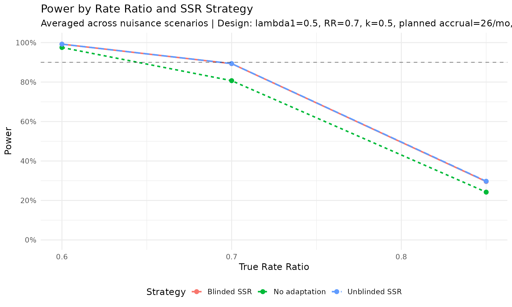

``` r
power_rr_plan <- summary_dt[
  rr_true == rr_plan &
    strategy %in% c("No adaptation", "Blinded SSR", "Unblinded SSR")
]
power_rr_plan[, strategy := factor(strategy,
  levels = c("No adaptation", "Blinded SSR", "Unblinded SSR"))]
power_rr_plan[, k_label := paste0("k = ", k_true)]
power_rr_plan[, accrual_label := paste0(accrual_true, " pts/mo")]

ggplot(power_rr_plan,
       aes(x = lambda1_true, y = rejection_rate,
           color = strategy, shape = strategy)) +
  geom_line(linewidth = 0.9) +
  geom_point(size = 2.5) +
  geom_hline(yintercept = power_plan, linetype = "dashed", alpha = 0.4) +
  facet_grid(k_label ~ accrual_label) +
  scale_y_continuous(limits = c(0, 1), breaks = seq(0, 1, 0.2),
                     labels = scales::percent) +
  labs(
    title = sprintf("Power at Planned RR (%.1f) by Nuisance Scenario", rr_plan),
    subtitle = paste("Dashed line = target power", scales::percent(power_plan),
                     "|", design_note),
    x = expression(lambda[1]~(true)), y = "Power",
    color = "Strategy", shape = "Strategy"
  ) +
  theme_minimal(base_size = 12) +
  theme(legend.position = "bottom")
```

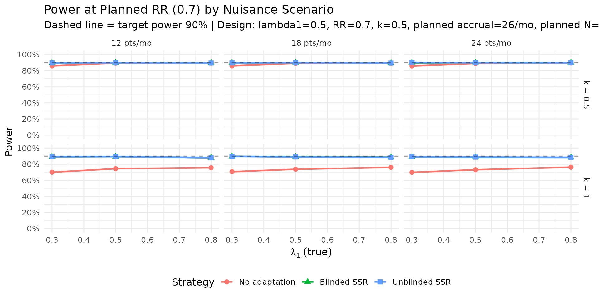

### Power by nuisance scenario

- RR = 0.6
- RR = 0.7
- RR = 0.85
- RR = 1

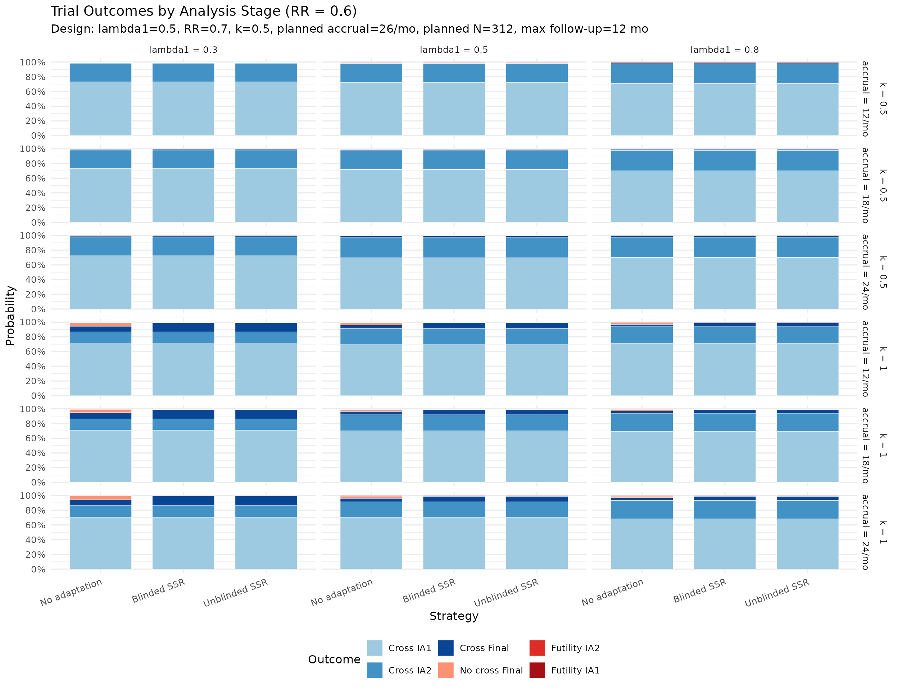

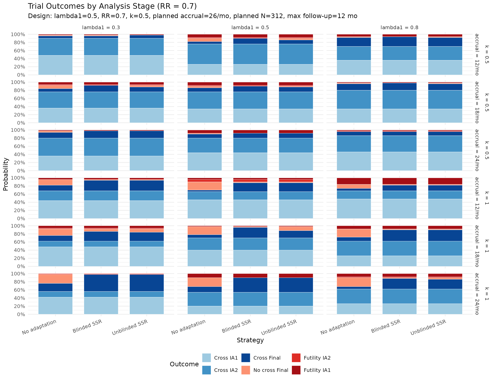

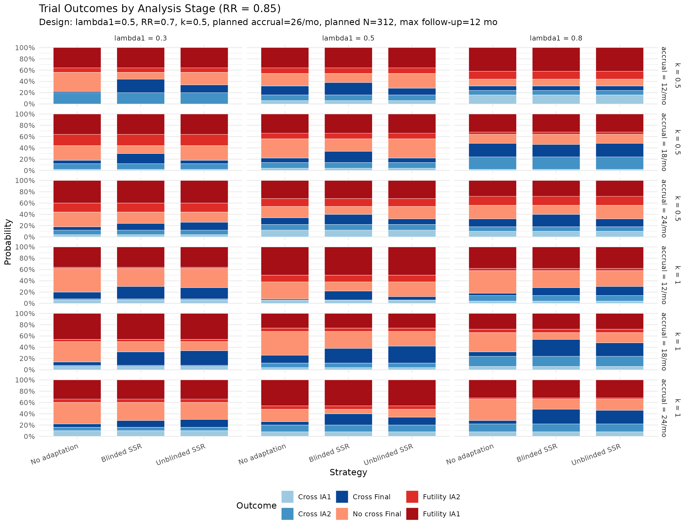

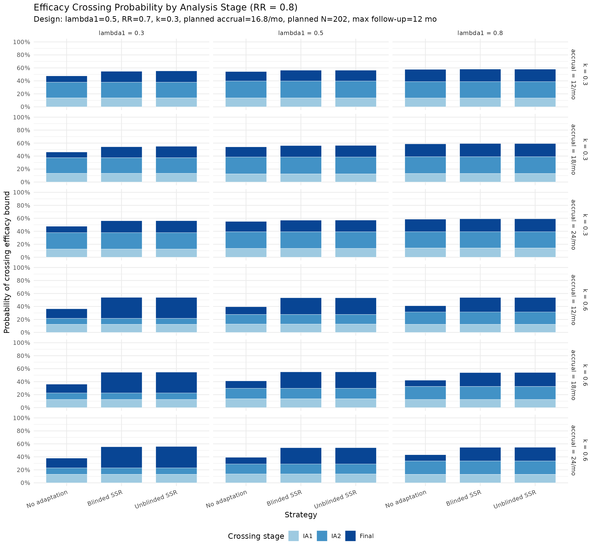

### Adapted sample size distribution

- RR = 0.6
- RR = 0.7
- RR = 0.85
- RR = 1

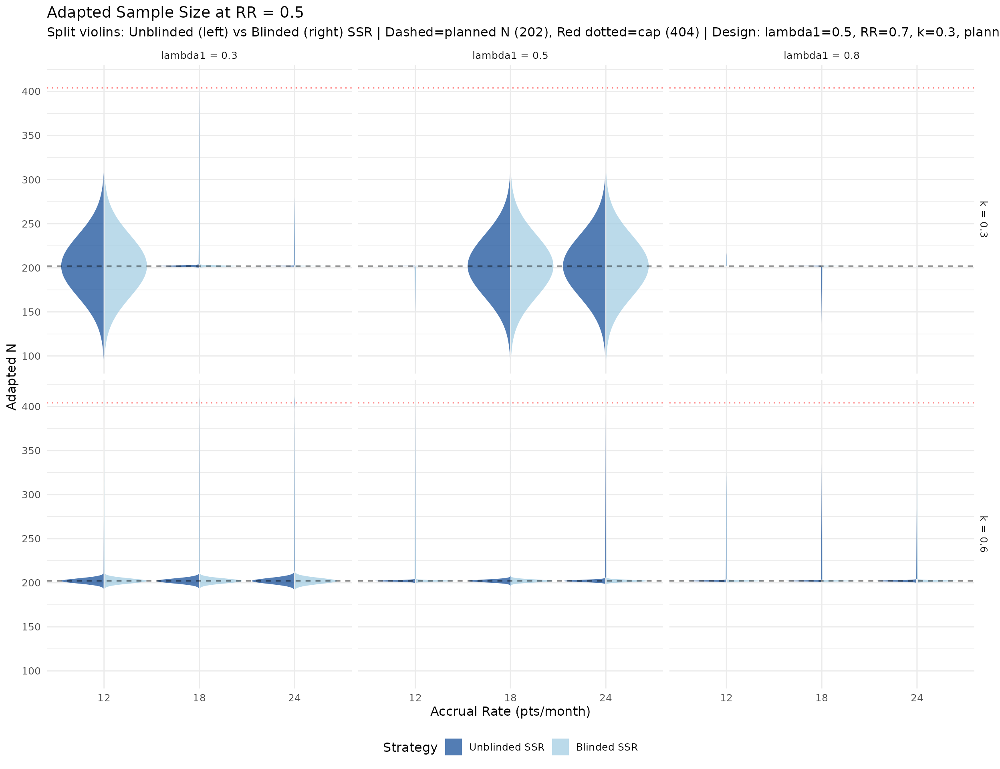

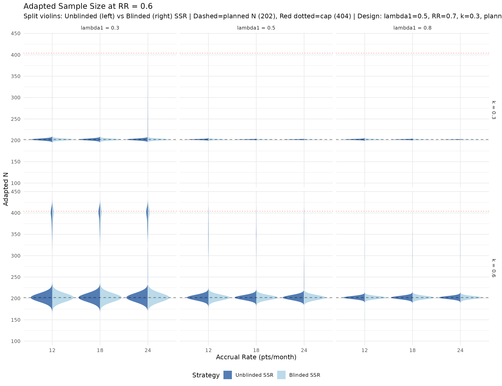

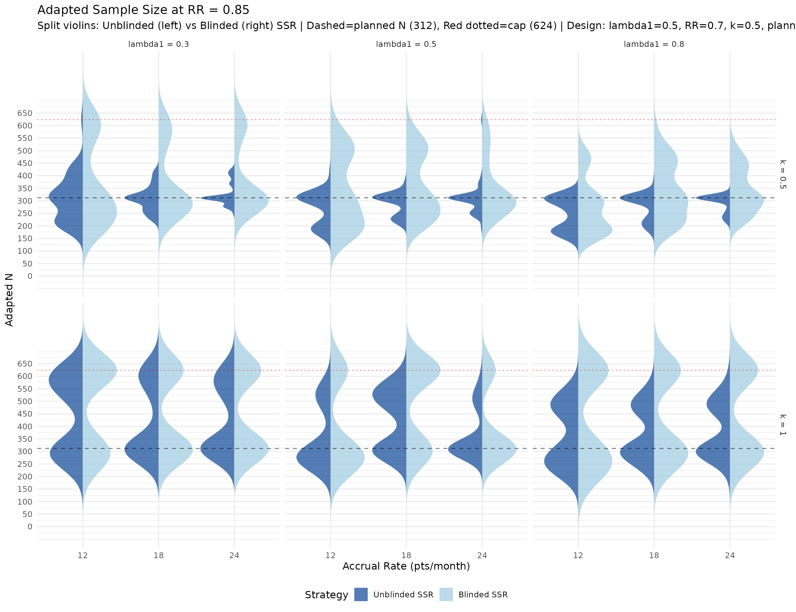

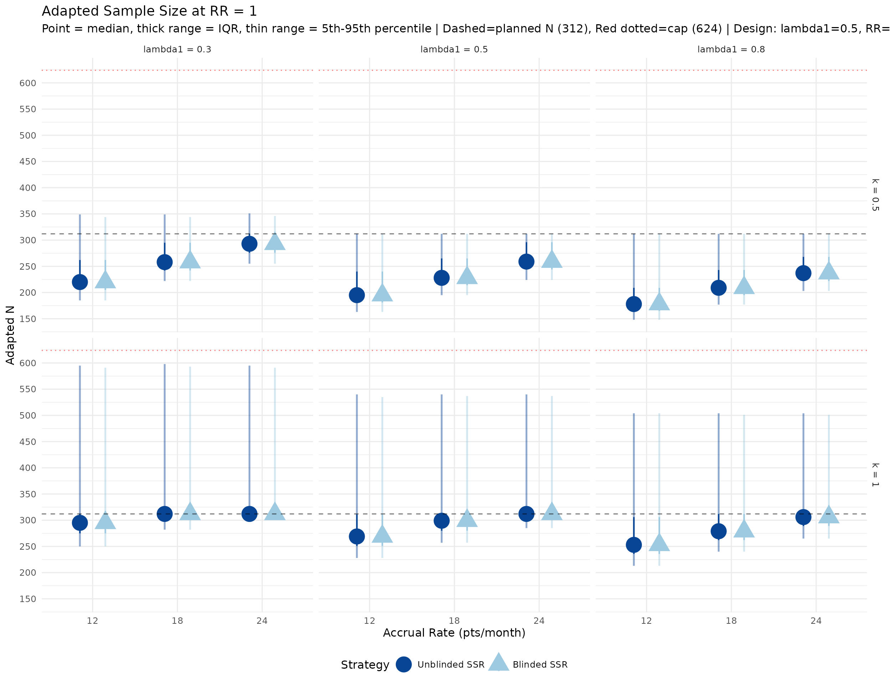

### Expected sample size at study stop

- RR = 0.6
- RR = 0.7
- RR = 0.85
- RR = 1

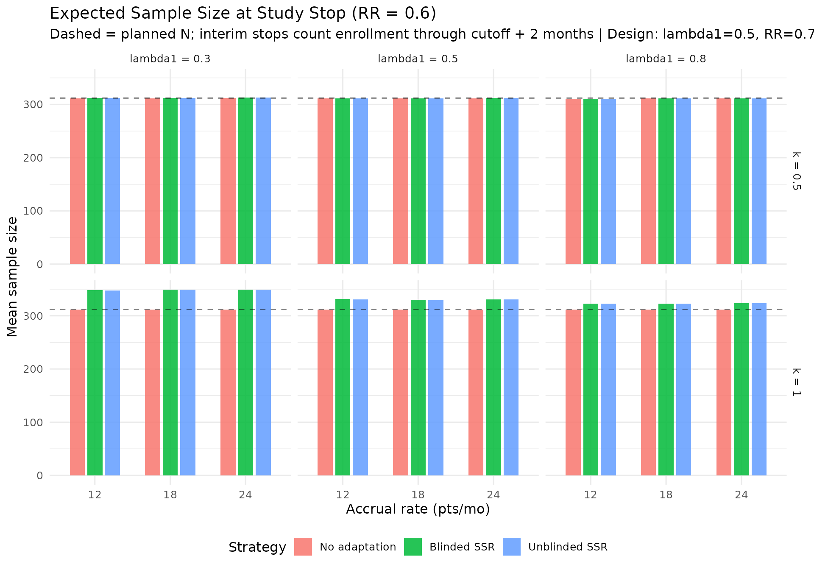

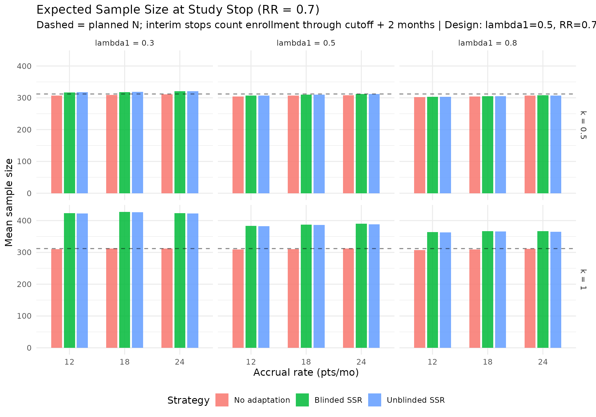

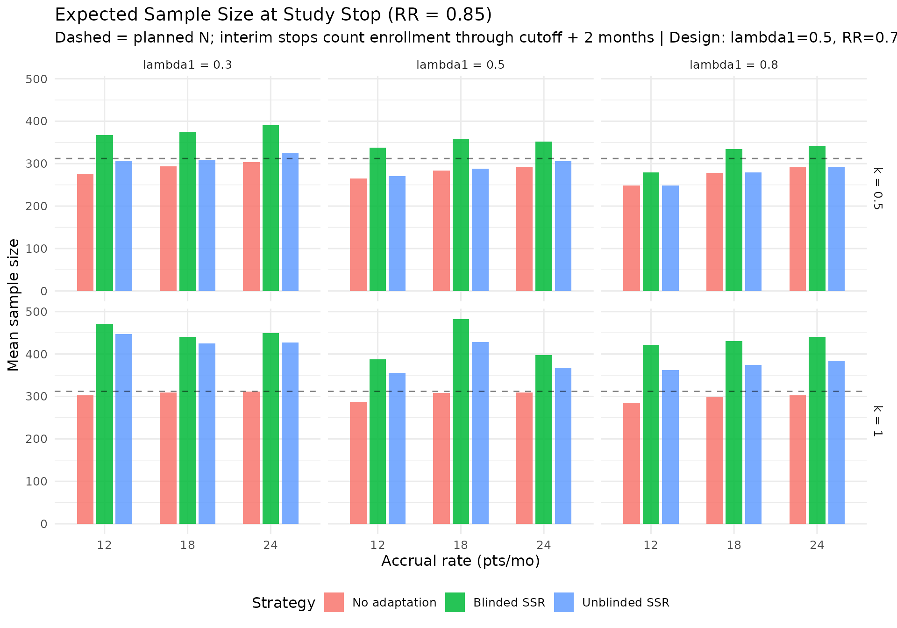

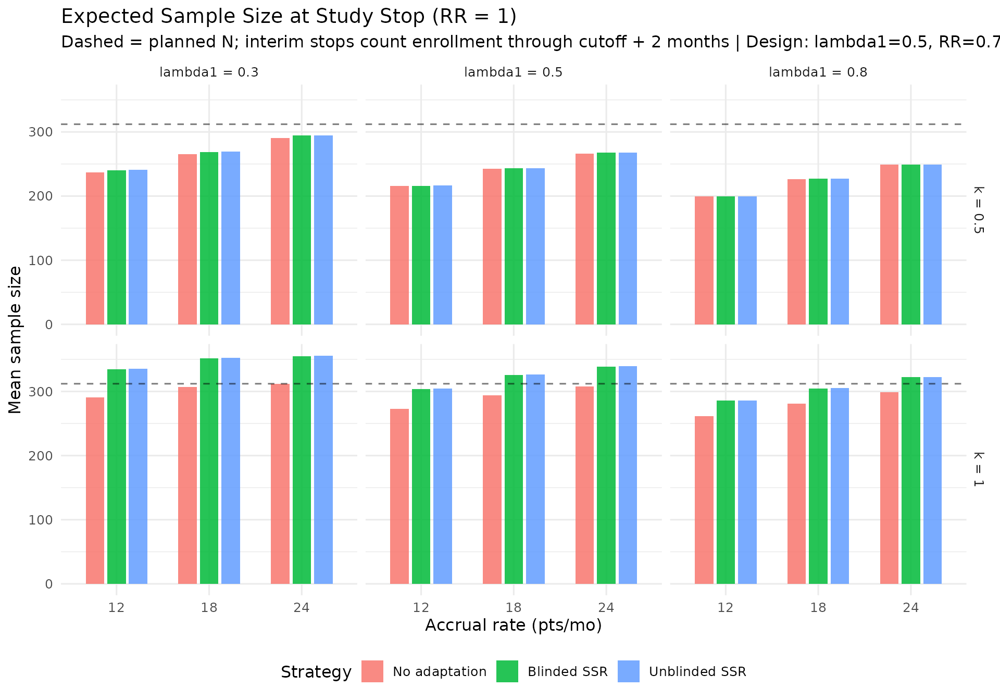

### Calendar and information at each analysis

The plots below use split (side-by-side) violin distributions for k =
0.5 and k = 1.0, with vertical panels for IA1, IA2, and Final analysis.
Panels use free y-scales.

``` r
time_long <- dt[strategy == "No adaptation" & rr_true == rr_plan, .(
  lambda1_true, k_true, accrual_true,
  IA1 = ia1_time, IA2 = ia2_time, Final = final_time
)]
time_long <- data.table::melt(
  time_long,
  id.vars = c("lambda1_true", "k_true", "accrual_true"),
  variable.name = "analysis",
  value.name = "calendar_time"
)
time_long[, analysis := factor(analysis, levels = c("IA1", "IA2", "Final"))]
time_long[, lambda1_label := paste0("lambda1 = ", lambda1_true)]
time_long[, k_label := paste0("k = ", k_true)]

planned_time_df <- data.frame(
  analysis = factor(c("IA1", "IA2", "Final"), levels = c("IA1", "IA2", "Final")),
  planned_time = c(analysis_times_plan[1], analysis_times_plan[2], analysis_times_plan[3])
)

ggplot(time_long,
       aes(x = factor(accrual_true), y = calendar_time, fill = factor(k_true))) +
  geom_violin(position = position_dodge(width = 0.85),
              alpha = 0.7, scale = "width", trim = FALSE) +
  geom_hline(
    data = planned_time_df,
    aes(yintercept = planned_time),
    linetype = "dashed", color = "darkgreen", inherit.aes = FALSE
  ) +
  facet_grid(analysis ~ lambda1_label, scales = "free_y") +
  scale_fill_manual(values = c("0.5" = "#6BAED6", "1" = "#2171B5")) +
  labs(
    title = "Calendar Time Distribution by Analysis (RR = 0.7, No adaptation)",
    subtitle = paste("Dashed green = planned analysis time |", design_note),
    x = "Accrual rate (pts/month)",
    y = "Calendar month",
    fill = "k"
  ) +
  theme_minimal(base_size = 12) +
  theme(legend.position = "bottom")
#> Warning: Removed 1093 rows containing non-finite outside the scale range
#> (`stat_ydensity()`).
```

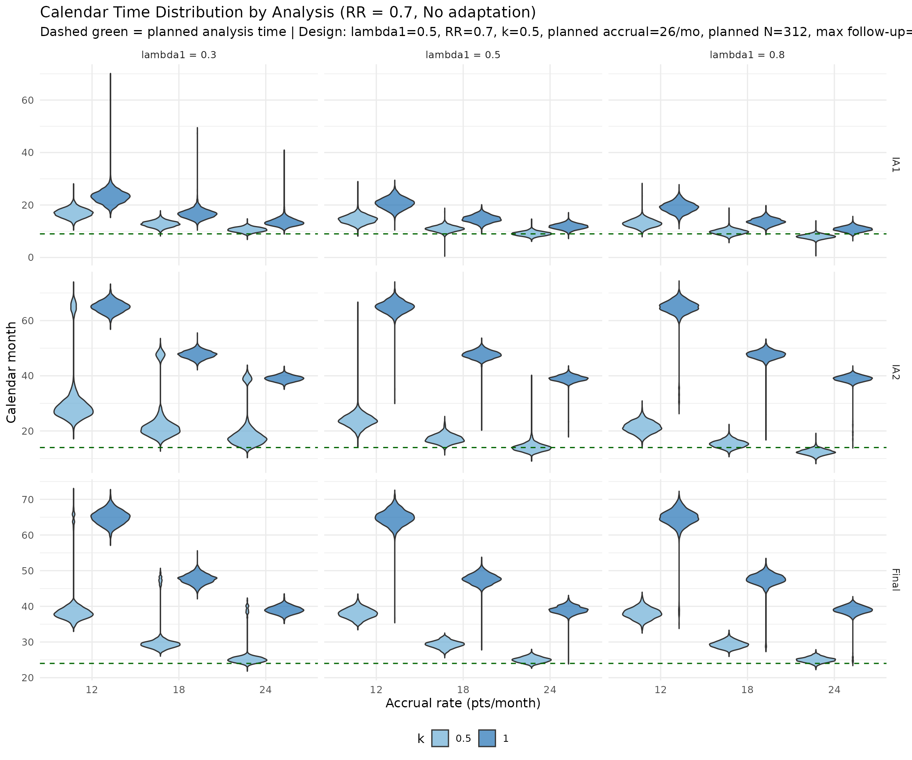

``` r
if_long <- dt[strategy == "No adaptation" & rr_true == rr_plan, .(
  lambda1_true, k_true, accrual_true,
  IA1 = 100 * if_ia1, IA2 = 100 * if_ia2, Final = 100 * if_final
)]
if_long <- data.table::melt(
  if_long,
  id.vars = c("lambda1_true", "k_true", "accrual_true"),
  variable.name = "analysis",
  value.name = "info_fraction"
)
if_long[, analysis := factor(analysis, levels = c("IA1", "IA2", "Final"))]
if_long[, lambda1_label := paste0("lambda1 = ", lambda1_true)]

planned_if_df <- data.frame(
  analysis = factor(c("IA1", "IA2", "Final"), levels = c("IA1", "IA2", "Final")),
  planned_if = 100 * c(planned_timing[1], planned_timing[2], 1)
)

ggplot(if_long,
       aes(x = factor(accrual_true), y = info_fraction, fill = factor(k_true))) +
  geom_violin(position = position_dodge(width = 0.85),
              alpha = 0.7, scale = "width", trim = FALSE) +
  geom_hline(
    data = planned_if_df,
    aes(yintercept = planned_if),
    linetype = "dashed", color = "darkgreen", inherit.aes = FALSE
  ) +
  facet_grid(analysis ~ lambda1_label, scales = "free_y") +
  scale_fill_manual(values = c("0.5" = "#6BAED6", "1" = "#2171B5")) +
  labs(
    title = "Information Fraction Distribution by Analysis (RR = 0.7, No adaptation)",
    subtitle = paste("Dashed green = planned information fraction |", design_note),
    x = "Accrual rate (pts/month)",
    y = "Information fraction (%)",
    fill = "k"
  ) +
  theme_minimal(base_size = 12) +
  theme(legend.position = "bottom")
#> Warning: Removed 1093 rows containing non-finite outside the scale range
#> (`stat_ydensity()`).
```

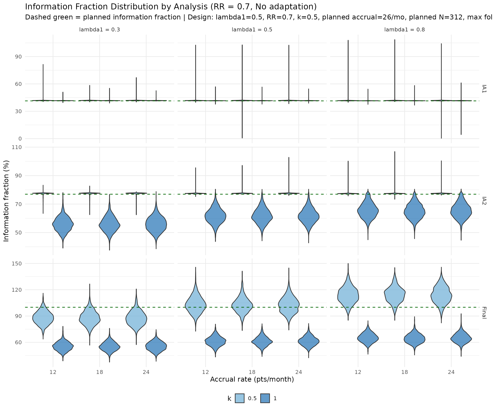

## Discussion

### Key findings

1.  **Type I error.** Under the null (RR \geq 1.0), nominal one-sided
    control is 2.5%. In **production** runs we use 20 000 replicates for
    each main-grid scenario with RR = 1.0; at that count, Monte Carlo
    error around 2.5% is only on the order of \pm 0.2 percentage points
    (roughly 95%). In **most** nuisance/strategy combinations the
    estimated Type I error **exceeds** that band—i.e., it is inflated
    relative to what sampling fluctuation alone would typically explain.
    (Default pkgdown/CRAN builds use far fewer replicates for speed;
    rely on production output for quantitative Type I conclusions.) For
    RR = 1.0, futility stopping is also evaluated with futility ignored
    (non-binding supplement) in the dedicated tables above. A parallel
    table uses a group-sequential design planned at **nominal \alpha =
    0.02** to illustrate how a more conservative boundary calibration
    affects simulated Type I error (power simulations still use \alpha =
    0.025).

2.  **Largest no-adaptation power deficit.** At planned RR = 0.7, the
    largest deficit from the 90% target under no adaptation is
    concentrated in scenarios with lower event rates and larger
    dispersion (see the “Power Shortfall Without Adaptation” table).

3.  **IA2-only adaptation recovers power where information is low.** In
    lower event-rate / higher-dispersion scenarios, IA2 adaptation
    raises final information and materially improves power versus no
    adaptation, while still preserving IA1-only monitoring (see “Power
    by nuisance scenario” and “Final information at final analysis by
    strategy”).

### Information-based interim timing

By triggering interims when blinded information reaches the target
fraction (rather than at fixed calendar times), the information
fractions are stabilized across scenarios. This prevents the anomaly
where high event rates cause excessive information at a fixed calendar
time, leading to overspending or premature decisions.

In this update, IA2 remains information-based while adaptation uses a
lead-time cutoff of at least 2 months before predicted enrollment close.

### Futility at low information

Futility assessment is deferred when the observed information fraction
is below 30%. The spending function approach uses \text{usTime} =
\text{lsTime} = \min(t\_{\text{planned}}, t\_{\text{actual}}) to cap
spending.

IA1 includes efficacy/futility monitoring but does not permit SSR. SSR
is attempted only at IA2. For operational feasibility, SSR uses an
adaptation cutoff at \min(\text{IA2 time},\\ \text{predicted enrollment
close} - 2 \text{ months}), with enrollment fraction at or below 100%.

When a trial stops early for futility, the reported final sample size
includes subjects enrolled by the stop analysis date plus 2 months to
reflect enrollment that continues during analysis/decision
implementation.

Futility and efficacy crossing percentages are reported separately for
IA1 and IA2 in the main simulation table.

### Blinded information fallback

At each candidate cut time the simulation first attempts to estimate
blinded statistical information via
[`calculate_blinded_info()`](https://keaven.github.io/gsDesignNB/reference/calculate_blinded_info.md).
If the blinded estimate is unavailable or non-positive (e.g., too few
events for the NB model to converge), the simulation falls back to
unblinded information from
[`mutze_test()`](https://keaven.github.io/gsDesignNB/reference/mutze_test.md)
(\mathcal{I} = 1/\text{SE}^2). If both methods fail, a hard-coded
constant of 100 is used as a last-resort placeholder so that the search
does not stall. The simulation results table reports the number of
trials that required this fallback at each interim analysis.

### Computational considerations

Production-scale runs use 3 600 replicates per scenario for RR \< 1
(power), 20 000 for each scenario with RR = 1.0 (Type I), and 1 000 for
RR \> 1 (interior null, lower priority for precision), plus 20 000
replicates per k in the separate RR = 1 non-binding futility check;
these are computationally intensive. Parallel execution via the `future`
/ `future.apply` framework is essential. The simulation runtime table
above reports the wall-clock time and number of workers used for the
current build. For reference, a production run on a Mac Studio with an
M4 chip using 11 of 12 available cores completed in approximately 2–3
hours.

## References

Friede, Tim, and Heinz Schmidli. 2010. “Blinded Sample Size Reestimation
with Negative Binomial Counts in Superiority and Non-Inferiority
Trials.” *Methods of Information in Medicine* 49 (06): 618–24.
<https://doi.org/10.3414/ME09-02-0060>.
