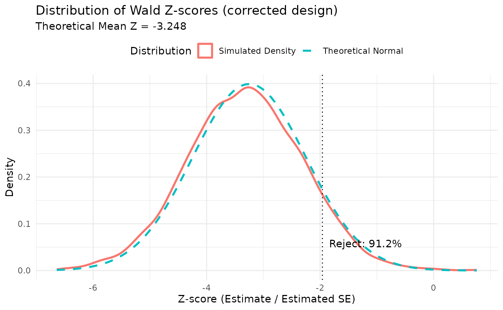
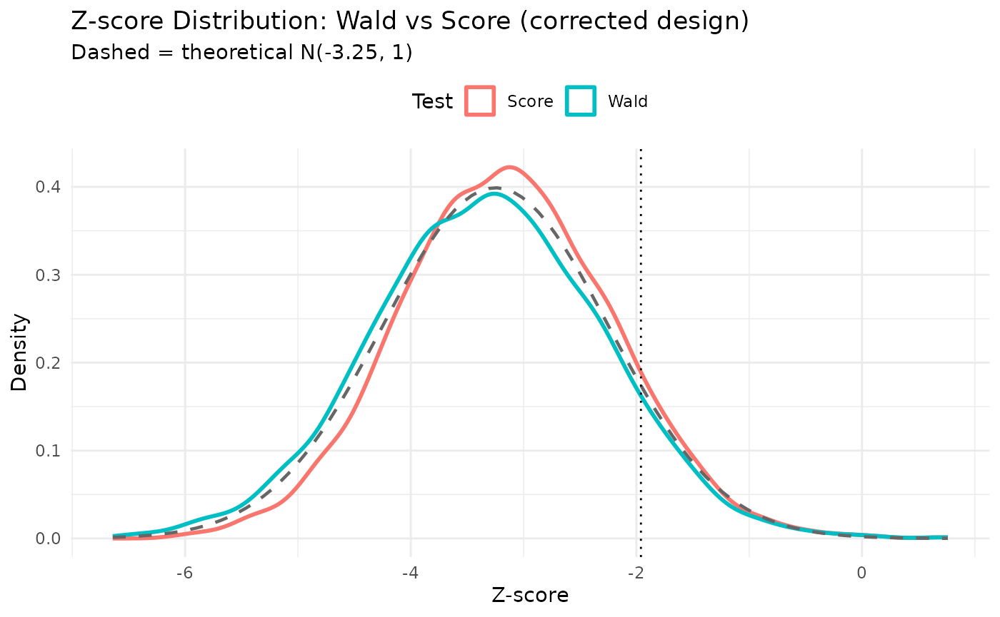
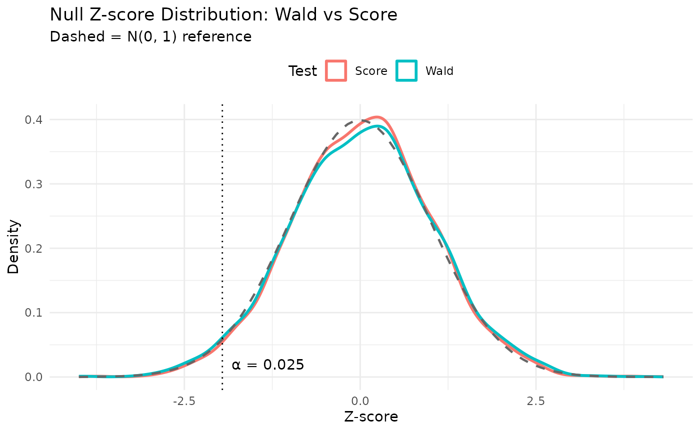

# Verification of sample size calculation via simulation

``` r

library(gsDesignNB)
library(data.table)
library(ggplot2)
library(gt)
```

## Introduction

This vignette verifies the accuracy of the
[`sample_size_nbinom()`](https://keaven.github.io/gsDesignNB/reference/sample_size_nbinom.md)
function by comparing its theoretical predictions for average exposure,
statistical information, and power against results from a large-scale
simulation study.

We specifically test a scenario with:

- Piecewise constant accrual rates.
- Piecewise exponential dropout (constant in this example).
- Negative binomial outcomes.
- Event gaps (dead time after each event).
- Fixed follow-up design.

The simulation uses the corrected sample size (\\n = 436\\) computed by
[`sample_size_nbinom()`](https://keaven.github.io/gsDesignNB/reference/sample_size_nbinom.md),
which includes the second-order Taylor correction for Jensen’s
inequality in the event gap effective rate (see
[`vignette("sample-size-nbinom")`](https://keaven.github.io/gsDesignNB/articles/sample-size-nbinom.md)).
Results for the first \\n = 422\\ subjects are also extracted from each
simulation to compare with the uncorrected (naive) sample size.

## Simulation design

### Parameters

- **Rates**: \\\lambda_1 = 0.4\\ (Control), \\\lambda_2 = 0.3\\
  (Experimental).
- **Dispersion**: \\k = 0.5\\.
- **Power**: 90%.
- **Alpha**: 0.025 (one-sided).
- **Dropout**: 10% per year adjusted to monthly rate (\\\delta = 0.1 /
  12\\).
- **Trial duration**: 24 months.
- **Max follow-up**: 12 months.
- **Event gap**: 20 days.
- **Accrual**: Piecewise ramp-up over 12 months (Rate \\R\\ for 0-6mo,
  \\2R\\ for 6-12mo).

### Theoretical calculation

First, we calculate the required sample size and expected properties
using
[`sample_size_nbinom()`](https://keaven.github.io/gsDesignNB/reference/sample_size_nbinom.md).

``` r

# Parameters
lambda1 <- 0.4
lambda2 <- 0.3
dispersion <- 0.5
power <- 0.9
alpha <- 0.025
dropout_rate <- 0.1 / 12
max_followup <- 12
trial_duration <- 24
event_gap <- 20 / 30.42 # 20 days

# Accrual targeting 90% power
accrual_rate_rel <- c(1, 2)
accrual_duration <- c(6, 6)

design <- sample_size_nbinom(
  lambda1 = lambda1, lambda2 = lambda2, dispersion = dispersion,
  power = power,
  alpha = alpha, sided = 1,
  accrual_rate = accrual_rate_rel,
  accrual_duration = accrual_duration,
  trial_duration = trial_duration,
  dropout_rate = dropout_rate,
  max_followup = max_followup,
  event_gap = event_gap
)

print(design)
#> Sample size for negative binomial outcome
#> ==========================================
#> 
#> Sample size:     n1 = 218, n2 = 218, total = 436
#> Expected events: 1304.3 (n1: 723.4, n2: 580.9)
#> Power: 90%, Alpha: 0.025 (1-sided)
#> Rates: control = 0.4000, treatment = 0.3000 (RR = 0.7500)
#> Dispersion: 0.5000, Avg exposure (calendar): 11.42
#> Avg exposure (at-risk): n1 = 9.04, n2 = 9.54
#> Event gap: 0.66
#> Dropout rate: 0.0083
#> Accrual: 12.0, Trial duration: 24.0
#> Max follow-up: 12.0
```

## Simulation results

We simulated 3,600 trials at the corrected sample size (\\n = 436\\).
For each trial, we also analyzed the first \\n = 422\\ subjects to
provide a comparison with the naive (uncorrected) sample size. This
number of simulations achieves a standard error for the power estimate
of approximately 0.005 when the true power is 90% (\\\sqrt{0.9 \times
0.1 / 3600} = 0.005\\). The simulation script is located in
`data-raw/generate_simulation_data.R`.

``` r

# Load pre-computed simulation results
results_file <- system.file("extdata", "simulation_results.rds", package = "gsDesignNB")

if (results_file == "" && file.exists("../inst/extdata/simulation_results.rds")) {
  results_file <- "../inst/extdata/simulation_results.rds"
}

if (results_file != "") {
  sim_data <- readRDS(results_file)
  results <- sim_data$results
  results_naive <- sim_data$results_naive
  design_ref <- sim_data$design
  n_full <- sim_data$n_full
  n_naive <- sim_data$n_naive
} else {
  warning("Simulation results not found. Skipping verification plots.")
  results <- NULL
  results_naive <- NULL
  design_ref <- design
  n_full <- design$n_total
  n_naive <- 422L
}
```

### Power comparison

The key question is whether the corrected sample size achieves the
nominal 90% power.

``` r

power_full <- mean(results$p_value < alpha, na.rm = TRUE)
power_naive <- mean(results_naive$p_value < alpha, na.rm = TRUE)
power_full_score <- mean(results$p_value_score < alpha, na.rm = TRUE)
power_naive_score <- mean(results_naive$p_value_score < alpha, na.rm = TRUE)

ci_full <- binom.test(sum(results$p_value < alpha, na.rm = TRUE), nrow(results))$conf.int
ci_naive <- binom.test(sum(results_naive$p_value < alpha, na.rm = TRUE), nrow(results_naive))$conf.int
ci_full_score <- binom.test(sum(results$p_value_score < alpha, na.rm = TRUE), nrow(results))$conf.int
ci_naive_score <- binom.test(sum(results_naive$p_value_score < alpha, na.rm = TRUE), nrow(results_naive))$conf.int

power_df <- data.frame(
  Design = c(
    paste0("Corrected (n = ", n_full, ")"),
    paste0("Naive (n = ", n_naive, ")"),
    paste0("Corrected (n = ", n_full, ")"),
    paste0("Naive (n = ", n_naive, ")")
  ),
  Test = c("Wald", "Wald", "Score", "Score"),
  Theoretical = rep(design_ref$power, 4),
  Empirical = c(power_full, power_naive, power_full_score, power_naive_score),
  CI_Lower = c(ci_full[1], ci_naive[1], ci_full_score[1], ci_naive_score[1]),
  CI_Upper = c(ci_full[2], ci_naive[2], ci_full_score[2], ci_naive_score[2])
)

power_df |>
  gt() |>
  tab_header(
    title = md("**Power Comparison: Wald vs Score Test**"),
    subtitle = paste0("Based on ", nrow(results), " simulated trials")
  ) |>
  fmt_number(columns = c(Theoretical, Empirical, CI_Lower, CI_Upper), decimals = 4) |>
  cols_label(
    Design = "Design",
    Test = "Test",
    Theoretical = "Target",
    Empirical = "Empirical",
    CI_Lower = "95% CI Lower",
    CI_Upper = "95% CI Upper"
  )
```

| **Power Comparison: Wald vs Score Test** |  |  |  |  |  |
|----|----|----|----|----|----|
| Based on 3600 simulated trials |  |  |  |  |  |
| Design | Test | Target | Empirical | 95% CI Lower | 95% CI Upper |
| Corrected (n = 436) | Wald | 0.9000 | 0.9122 | 0.9025 | 0.9213 |
| Naive (n = 422) | Wald | 0.9000 | 0.9039 | 0.8938 | 0.9133 |
| Corrected (n = 436) | Score | 0.9000 | 0.8964 | 0.8860 | 0.9062 |
| Naive (n = 422) | Score | 0.9000 | 0.8872 | 0.8764 | 0.8974 |

### Summary of verification results (corrected design)

We compare the theoretical predictions from
[`sample_size_nbinom()`](https://keaven.github.io/gsDesignNB/reference/sample_size_nbinom.md)
with the observed simulation results at the corrected sample size.

**Key distinction: Total Exposure vs Exposure at Risk**

- **Total Exposure** (`tte_total`): The calendar time a subject is on
  study, from randomization to the analysis cut date (or censoring).
  This is the same for both treatment arms by design.
- **Exposure at Risk** (`tte`): The time during which a subject can
  experience a *new* event. After each event, there is an “event gap”
  period during which new events are not counted (e.g., representing
  recovery time or treatment effect). This differs by treatment group
  because the group with more events loses more time to gaps.

``` r

# ---- Compute all metrics ----

# Number of simulations
n_sims <- sum(!is.na(results$estimate))

# Total Exposure (calendar follow-up time)
theo_exposure <- design_ref$exposure[1]

obs_exposure_ctrl <- mean(results$exposure_total_control)
obs_exposure_exp <- mean(results$exposure_total_experimental)
obs_exposure_at_risk_ctrl <- mean(results$exposure_at_risk_control)
obs_exposure_at_risk_exp <- mean(results$exposure_at_risk_experimental)

# Exposure at risk (time at risk excluding event gaps)
theo_exposure_at_risk_ctrl <- design_ref$exposure_at_risk_n1
theo_exposure_at_risk_exp <- design_ref$exposure_at_risk_n2

# Events by treatment group
theo_events_ctrl <- design_ref$events_n1
theo_events_exp <- design_ref$events_n2
obs_events_ctrl <- mean(results$events_control)
obs_events_exp <- mean(results$events_experimental)

# Treatment effect
true_rr <- lambda2 / lambda1
true_log_rr <- log(true_rr)
mean_log_rr <- mean(results$estimate, na.rm = TRUE)

# Variance
theo_var <- design_ref$variance
median_se_sq <- median(results$se^2, na.rm = TRUE)
emp_var <- var(results$estimate, na.rm = TRUE)

# Power
theo_power <- design_ref$power
emp_power <- mean(results$p_value < design_ref$inputs$alpha, na.rm = TRUE)

n_sim_total <- design_ref$n_total

# ---- Build summary table ----
summary_df <- data.frame(
  Metric = c(
    "Total Exposure (months) - Control",
    "Total Exposure (months) - Experimental",
    "Exposure at Risk (months) - Control",
    "Exposure at Risk (months) - Experimental",
    "Events per Subject - Control",
    "Events per Subject - Experimental",
    "Treatment Effect: log(RR)",
    "Variance of log(RR)",
    "Power"
  ),
  Theoretical = c(
    theo_exposure,
    theo_exposure,
    theo_exposure_at_risk_ctrl,
    theo_exposure_at_risk_exp,
    theo_events_ctrl / (n_sim_total / 2),
    theo_events_exp / (n_sim_total / 2),
    true_log_rr,
    theo_var,
    theo_power
  ),
  Simulated = c(
    obs_exposure_ctrl,
    obs_exposure_exp,
    obs_exposure_at_risk_ctrl,
    obs_exposure_at_risk_exp,
    obs_events_ctrl / (n_sim_total / 2),
    obs_events_exp / (n_sim_total / 2),
    mean_log_rr,
    median_se_sq,
    emp_power
  ),
  stringsAsFactors = FALSE
)

summary_df$Difference <- summary_df$Simulated - summary_df$Theoretical
summary_df$Rel_Diff_Pct <- 100 * summary_df$Difference / abs(summary_df$Theoretical)

summary_df |>
  gt() |>
  tab_header(
    title = md("**Verification of sample_size_nbinom() Predictions**"),
    subtitle = paste0("Based on ", n_sims, " simulated trials (n = ", n_sim_total, ")")
  ) |>
  tab_row_group(
    label = md("**Power**"),
    rows = Metric == "Power"
  ) |>
  tab_row_group(
    label = md("**Variance**"),
    rows = Metric == "Variance of log(RR)"
  ) |>
  tab_row_group(
    label = md("**Treatment Effect**"),
    rows = Metric == "Treatment Effect: log(RR)"
  ) |>
  tab_row_group(
    label = md("**Events**"),
    rows = grepl("Events", Metric)
  ) |>
  tab_row_group(
    label = md("**Exposure**"),
    rows = grepl("Exposure", Metric)
  ) |>
  row_group_order(groups = c("**Exposure**", "**Events**", "**Treatment Effect**",
                              "**Variance**", "**Power**")) |>
  fmt_number(columns = c(Theoretical, Simulated, Difference), decimals = 4) |>
  fmt_number(columns = Rel_Diff_Pct, decimals = 2) |>
  cols_label(
    Metric = "",
    Theoretical = "Theoretical",
    Simulated = "Simulated",
    Difference = "Difference",
    Rel_Diff_Pct = "Rel. Diff (%)"
  ) |>
  sub_missing(missing_text = "—")
```

| **Verification of sample_size_nbinom() Predictions** |  |  |  |  |
|----|----|----|----|----|
| Based on 3600 simulated trials (n = 436) |  |  |  |  |
|  | Theoretical | Simulated | Difference | Rel. Diff (%) |
| **Exposure** |  |  |  |  |
| Total Exposure (months) - Control | 11.4195 | 11.4142 | −0.0053 | −0.05 |
| Total Exposure (months) - Experimental | 11.4195 | 11.4134 | −0.0061 | −0.05 |
| Exposure at Risk (months) - Control | 9.0417 | 9.2563 | 0.2146 | 2.37 |
| Exposure at Risk (months) - Experimental | 9.5382 | 9.6883 | 0.1501 | 1.57 |
| **Events** |  |  |  |  |
| Events per Subject - Control | 3.3185 | 3.3788 | 0.0603 | 1.82 |
| Events per Subject - Experimental | 2.6646 | 2.7013 | 0.0367 | 1.38 |
| **Treatment Effect** |  |  |  |  |
| Treatment Effect: log(RR) | −0.2877 | −0.2878 | −0.0001 | −0.03 |
| **Variance** |  |  |  |  |
| Variance of log(RR) | 0.0078 | 0.0075 | −0.0003 | −3.96 |
| **Power** |  |  |  |  |
| Power | 0.9000 | 0.9122 | 0.0122 | 1.36 |

**Notes:**

- **Total Exposure** is the average calendar follow-up time per subject.
  The theoretical value is the same for both arms (symmetric design),
  while simulated values may differ slightly due to sampling variability
  in enrollment and dropout.
- **Exposure at Risk** is the time during which new events can occur,
  after subtracting the “event gap” periods following each event. The
  control group has lower exposure at risk because it experiences more
  events (higher rate), each followed by a gap period.
- **Events per Subject** is the mean number of events per subject in
  each treatment group.
- **Variance** uses the median of the estimated variances (SE²) from
  each simulation, which is robust to outliers from unstable model fits.

### Distribution of the test statistic

Here we plot the density of the Wald Z-scores from the simulation and
compare it to the expected normal distribution centered at the
theoretical mean Z-score.

``` r

z_scores <- results$estimate / results$se

theo_se <- sqrt(theo_var)
theo_mean_z <- log(lambda2 / lambda1) / theo_se
crit_val <- qnorm(design_ref$inputs$alpha)
prop_reject <- mean(z_scores < crit_val, na.rm = TRUE)

ggplot(data.frame(z = z_scores), aes(x = z)) +
  geom_density(aes(color = "Simulated Density"), linewidth = 1) +
  stat_function(
    fun = dnorm,
    args = list(mean = theo_mean_z, sd = 1),
    aes(color = "Theoretical Normal"),
    linewidth = 1,
    linetype = "dashed"
  ) +
  geom_vline(xintercept = crit_val, linetype = "dotted", color = "black") +
  annotate(
    "text",
    x = crit_val, y = 0.05,
    label = paste0("  Reject: ", round(prop_reject * 100, 1), "%"),
    hjust = 0, vjust = 0
  ) +
  labs(
    title = "Distribution of Wald Z-scores (corrected design)",
    subtitle = paste("Theoretical Mean Z =", round(theo_mean_z, 3)),
    x = "Z-score (Estimate / Estimated SE)",
    y = "Density",
    color = "Distribution"
  ) +
  theme_minimal() +
  theme(legend.position = "top")
```



### Wald vs score Z-score comparison

``` r

z_wald <- results$estimate / results$se
z_score <- results$z_score

z_df <- data.frame(
  z = c(z_wald, z_score),
  Test = rep(c("Wald", "Score"), each = length(z_wald))
)

ggplot(z_df, aes(x = z, color = Test)) +
  geom_density(linewidth = 1) +
  stat_function(
    fun = dnorm,
    args = list(mean = theo_mean_z, sd = 1),
    linewidth = 0.8,
    linetype = "dashed",
    color = "grey40"
  ) +
  geom_vline(xintercept = crit_val, linetype = "dotted", color = "black") +
  labs(
    title = "Z-score Distribution: Wald vs Score (corrected design)",
    subtitle = paste0("Dashed = theoretical N(", round(theo_mean_z, 2), ", 1)"),
    x = "Z-score",
    y = "Density",
    color = "Test"
  ) +
  theme_minimal() +
  theme(legend.position = "top")
```



### Distribution statistics for log(RR)

``` r

theo_mean_log_rr <- log(lambda2 / lambda1)
theo_sd_log_rr <- sqrt(theo_var)
emp_mean_log_rr <- mean(results$estimate, na.rm = TRUE)
emp_sd_log_rr <- sd(results$estimate, na.rm = TRUE)
emp_median_log_rr <- median(results$estimate, na.rm = TRUE)

ests <- results$estimate[!is.na(results$estimate)]
q_low <- quantile(ests, 0.01)
q_high <- quantile(ests, 0.99)
ests_trimmed <- ests[ests >= q_low & ests <= q_high]
n_trimmed <- length(ests_trimmed)
m3 <- sum((ests_trimmed - mean(ests_trimmed))^3) / n_trimmed
m4 <- sum((ests_trimmed - mean(ests_trimmed))^4) / n_trimmed
s2 <- sum((ests_trimmed - mean(ests_trimmed))^2) / n_trimmed
emp_skew_log_rr <- m3 / s2^(3/2)
emp_kurt_log_rr <- m4 / s2^2

comparison_log_rr <- data.frame(
  Metric = c("Mean", "SD", "Median", "Skewness (trimmed)", "Kurtosis (trimmed)"),
  Theoretical = c(theo_mean_log_rr, theo_sd_log_rr, theo_mean_log_rr, 0, 3),
  Simulated = c(emp_mean_log_rr, emp_sd_log_rr, emp_median_log_rr, emp_skew_log_rr, emp_kurt_log_rr),
  Difference = c(
    emp_mean_log_rr - theo_mean_log_rr,
    emp_sd_log_rr - theo_sd_log_rr,
    emp_median_log_rr - theo_mean_log_rr,
    emp_skew_log_rr - 0,
    emp_kurt_log_rr - 3
  )
)
comparison_log_rr |>
  gt() |>
  tab_header(title = md("**Comparison of log(RR) Statistics**")) |>
  fmt_number(columns = where(is.numeric), decimals = 4)
```

| **Comparison of log(RR) Statistics** |             |           |            |
|--------------------------------------|-------------|-----------|------------|
| Metric                               | Theoretical | Simulated | Difference |
| Mean                                 | −0.2877     | −0.2878   | −0.0001    |
| SD                                   | 0.0886      | 0.0876    | −0.0010    |
| Median                               | −0.2877     | −0.2874   | 0.0002     |
| Skewness (trimmed)                   | 0.0000      | 0.0056    | 0.0056     |
| Kurtosis (trimmed)                   | 3.0000      | 2.5476    | −0.4524    |

## Type I error: Wald vs score test

A well-calibrated test should reject at most \\\alpha = 0.025\\ under
the null (\\\text{RR} = 1\\). We simulated trials under the null
hypothesis using the same design parameters (accrual, dropout,
dispersion, sample size) but with \\\lambda_2 = \lambda_1\\ in both
arms. The Wald test (based on the ML estimate under the alternative)
tends to be slightly anti-conservative in finite samples, while the
score test (evaluated entirely under \\H_0\\) is expected to be better
calibrated.

``` r

null_file <- system.file("extdata", "null_simulation_results.rds", package = "gsDesignNB")
if (null_file == "" && file.exists("../inst/extdata/null_simulation_results.rds")) {
  null_file <- "../inst/extdata/null_simulation_results.rds"
}
has_null <- null_file != ""
if (has_null) {
  null_data <- readRDS(null_file)
  results_null <- null_data$results_null
}
```

``` r

type1_wald <- mean(results_null$p_value_wald < alpha, na.rm = TRUE)
type1_score <- mean(results_null$p_value_score < alpha, na.rm = TRUE)

n_null <- sum(!is.na(results_null$p_value_wald))
ci_wald <- binom.test(sum(results_null$p_value_wald < alpha, na.rm = TRUE), n_null)$conf.int
ci_score <- binom.test(sum(results_null$p_value_score < alpha, na.rm = TRUE), n_null)$conf.int

type1_df <- data.frame(
  Test = c("Wald (ML)", "Score (null model)"),
  Nominal = c(alpha, alpha),
  Empirical = c(type1_wald, type1_score),
  CI_Lower = c(ci_wald[1], ci_score[1]),
  CI_Upper = c(ci_wald[2], ci_score[2])
)

type1_df |>
  gt() |>
  tab_header(
    title = md("**Type I Error: Wald vs Score Test Under RR = 1**"),
    subtitle = paste0("Based on ", n_null, " simulated null trials (n = ", null_data$n_total, ")")
  ) |>
  fmt_number(columns = c(Nominal, Empirical, CI_Lower, CI_Upper), decimals = 4) |>
  cols_label(
    Test = "Test",
    Nominal = "Nominal α",
    Empirical = "Empirical",
    CI_Lower = "95% CI Lower",
    CI_Upper = "95% CI Upper"
  )
```

| **Type I Error: Wald vs Score Test Under RR = 1** |  |  |  |  |
|----|----|----|----|----|
| Based on 3600 simulated null trials (n = 436) |  |  |  |  |
| Test | Nominal α | Empirical | 95% CI Lower | 95% CI Upper |
| Wald (ML) | 0.0250 | 0.0258 | 0.0209 | 0.0316 |
| Score (null model) | 0.0250 | 0.0200 | 0.0157 | 0.0251 |

``` r

z_null_df <- data.frame(
  z = c(results_null$z_wald, results_null$z_score),
  Test = rep(c("Wald", "Score"), each = nrow(results_null))
)

ggplot(z_null_df, aes(x = z, color = Test)) +
  geom_density(linewidth = 1) +
  stat_function(
    fun = dnorm, args = list(mean = 0, sd = 1),
    linewidth = 0.8, linetype = "dashed", color = "grey40"
  ) +
  geom_vline(xintercept = qnorm(alpha), linetype = "dotted", color = "black") +
  annotate("text", x = qnorm(alpha), y = 0.02,
           label = paste0("  α = ", alpha), hjust = 0) +
  labs(
    title = "Null Z-score Distribution: Wald vs Score",
    subtitle = "Dashed = N(0, 1) reference",
    x = "Z-score",
    y = "Density",
    color = "Test"
  ) +
  theme_minimal() +
  theme(legend.position = "top")
```



## Scenario sweep: impact of the Jensen correction

The Jensen correction for event gaps only applies when both the
dispersion (\\k \> 0\\) and the event gap (\\g \> 0\\) are nonzero. When
either is zero, the corrected and naive formulas produce identical
sample sizes.

To assess the correction’s impact across a range of realistic parameter
combinations, we ran a simulation sweep with 10,000 replicates per
scenario. For each scenario, trials were simulated at the corrected
sample size (\\n\_\text{corr}\\), and results were also extracted for
the first \\n\_\text{naive}\\ subjects (the uncorrected sample size).
Because both analyses use the same simulated data, the **paired**
comparison is very precise.

``` r

sweep_file <- system.file("extdata", "scenario_sweep_results.rds", package = "gsDesignNB")
if (sweep_file == "" && file.exists("../inst/extdata/scenario_sweep_results.rds")) {
  sweep_file <- "../inst/extdata/scenario_sweep_results.rds"
}
has_sweep <- sweep_file != ""
if (has_sweep) {
  sweep <- readRDS(sweep_file)
}
```

``` r

sweep_display <- data.frame(
  Scenario = sprintf("k = %.1f, gap = %d days", sweep$k, sweep$gap_days),
  `n (corrected)` = sweep$n_corrected,
  `n (naive)` = sweep$n_naive,
  `Extra subjects` = sweep$n_diff,
  `Power (corrected)` = sweep$power_corrected,
  `Power (naive)` = sweep$power_naive,
  `Difference` = sprintf("%.2f ± %.2f", 100 * sweep$power_diff, 100 * 1.96 * sweep$power_diff_se),
  check.names = FALSE
)

sweep_display |>
  gt() |>
  tab_header(
    title = md("**Impact of Jensen Correction Across Scenarios**"),
    subtitle = "10,000 replicates per scenario; power difference is paired (95% CI)"
  ) |>
  fmt_number(columns = c(`Power (corrected)`, `Power (naive)`), decimals = 4) |>
  cols_label(
    Scenario = "Scenario",
    `n (corrected)` = "n (corr.)",
    `n (naive)` = "n (naive)",
    `Extra subjects` = "Δn",
    `Power (corrected)` = "Power (corr.)",
    `Power (naive)` = "Power (naive)",
    Difference = "Diff (pp) ± 95% CI"
  )
```

``` r

cat("**Key findings:**\n\n")
cat("*   The corrected design achieves power at or above the 90% target in **all** scenarios.\n")
cat("*   The naive design falls below 90% in **three of four** scenarios, with the shortfall increasing as $k$ and $g$ grow.\n")
cat(sprintf("*   The largest paired power difference is %.1f percentage points ($k = %.1f$, gap = %d days), ",
    100 * sweep$power_diff[which.max(sweep$power_diff)],
    sweep$k[which.max(sweep$power_diff)],
    sweep$gap_days[which.max(sweep$power_diff)]))
cat(sprintf("where the corrected design adds %d subjects.\n",
    sweep$n_diff[which.max(sweep$power_diff)]))
cat(sprintf("*   All paired differences are statistically significant (discordant pair ratios range from %.1f:1 to %.1f:1 in favor of the corrected design).\n",
    min(sweep$corr_only / sweep$naive_only),
    max(sweep$corr_only / sweep$naive_only)))
```

## Discussion: why we apply the correction

In the primary verification scenario above (\\k = 0.5\\, gap = 20 days),
the corrected design slightly overshoots the 90% target while the naive
design is very close to 90%. This pattern — where the naive formula
appears well-calibrated — reflects a **partial cancellation of two
biases**:

1.  **Design-stage bias** (hurts power): The naive effective rate
    \\\lambda/(1+\lambda g)\\ overestimates the true population-level
    effective rate, leading to an underestimated variance and thus a
    sample size that is too small.

2.  **Analysis-stage bias** (helps power): The model-based standard
    error from
    [`MASS::glm.nb()`](https://rdrr.io/pkg/MASS/man/glm.nb.html) tends
    to slightly underestimate the true standard deviation of
    \\\hat\theta\\, making the Wald test slightly anti-conservative
    (z-statistic too extreme, more rejections).

These biases act in opposite directions. In the \\k = 0.5\\, gap = 20
day scenario, they happen to nearly cancel, giving the naive design the
appearance of correct calibration.

We apply the Jensen correction despite this for several reasons:

- **The cancellation is fragile.** It depends on the specific test
  statistic (NB Wald via `glm.nb`). A different analysis method —
  sandwich standard errors, bootstrap, permutation test, or a different
  link function — would change the analysis-stage bias while the
  design-stage bias remains, breaking the cancellation.

- **The correction is conservative.** It produces power at or slightly
  above 90% rather than at or slightly below. For a pivotal trial, a
  slight overshoot of the power target is preferable to a slight
  undershoot.

- **The correction is principled.** It fixes the effective rate
  approximation by accounting for the known distributional assumption
  (Gamma frailty). The remaining small overshoot is a separate
  finite-sample phenomenon.

- **The scenario sweep demonstrates the benefit.** As the table above
  shows, the naive formula increasingly underpowers as \\k\\ and \\g\\
  grow, while the corrected formula maintains nominal or conservative
  power across all scenarios tested.

- **The cost is modest.** The extra subjects required by the correction
  range from 14 to 40 (3–6% of total), a small price for reliable power.
